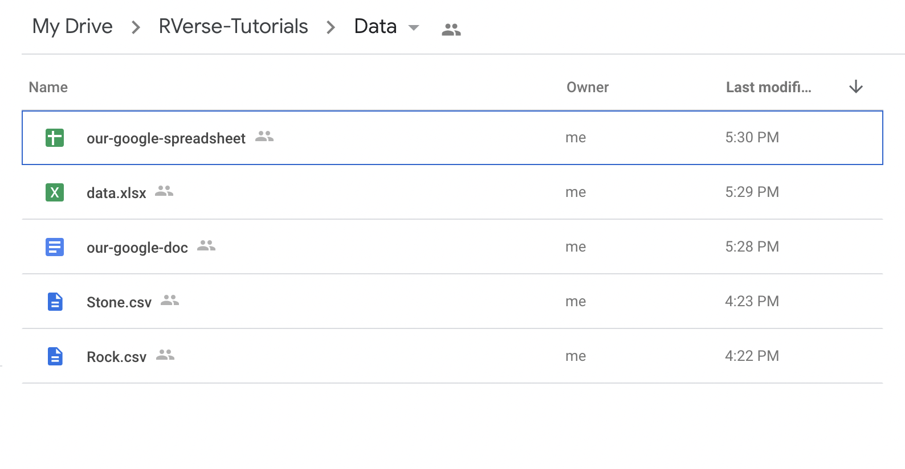

# Overview

This tutorial will use 4 functions within the
[{googledrive}](https://googledrive.tidyverse.org/) package:

-   `drive_auth()` Authorize {googledrive} to access your Google Drive
-   `drive_ls()` List contents of a folder or shared drive
-   `drive_download()` Download a Drive file
-   `drive_upload()` Upload a Drive file

This code is designed to be run locally (meaning on someone’s computer
manually). If the Google Drive folder is private, you need to run the
authentication code first before you knit the Rmd file.

Below are examples using a NOAA Google Drive folder.

# Set-up

## 1. Install **googledrive** package (if needed)

    install.packages("googledrive")

## 2. Create a folder on Google Drive (if needed)

I have created a Google Drive folder in my NOAA account. It is only
viewable if you are in NOAA, and is only editable by the creator (Eli).
It has the following sample files:

## 3. Copy the url to the Google Drive folder location\*

\*Only people with a NOAA email will be able to see this folder

    url_googledrive <- "https://drive.google.com/drive/folders/11WnXxs56jORbLkD1mFTZxwSaShex3Sse"
    id_googledrive <- "11WnXxs56jORbLkD1mFTZxwSaShex3Sse"

# Download files

## List files in a google drive folder

All files.

    dir_files <- googledrive::drive_ls(path = url_googledrive)
    dir_files$name

    ## [1] "example.docx"           "example2.docx"          "our-google-spreadsheet"
    ## [4] "data.xlsx"              "our-google-doc"         "Stone.csv"             
    ## [7] "Rock.csv"

All csv files.

    dir_files <- googledrive::drive_ls(path = url_googledrive, type="csv")
    dir_files$name

    ## [1] "Stone.csv" "Rock.csv"

All Excel files.

    dir_files <- googledrive::drive_ls(path = url_googledrive, type="xlsx")
    dir_files$name

    ## [1] "data.xlsx"

All Google Spreadsheets.

    dir_files <- googledrive::drive_ls(path = url_googledrive, type="spreadsheet")
    dir_files$name

    ## [1] "our-google-spreadsheet"

All Google Documents.

    dir_files <- googledrive::drive_ls(path = url_googledrive, type="document")
    dir_files$name

    ## [1] "our-google-doc"

## Download a file

First get the files in the folder.

    a <- googledrive::drive_ls(path = url_googledrive)

### Download one Excel file

Download from Google Drive and save to a folder called `data`.

    file_name <- "data.xlsx"
    # find the id of that file
    file_id <- a$id[which(a$name==file_name)]
    # download the file and save to data folder
    googledrive::drive_download(file=file_id, overwrite = TRUE, path = file.path("data", file_name))

    ## File downloaded:

    ## • 'data.xlsx' <id: 1FL9HBcSh9QjELpiMYoR5PPEi1CIIx8g9>

    ## Saved locally as:

    ## • 'data/data.xlsx'

Read that file in using the **readxl** package.

    tmp <- readxl::read_excel(file.path(here::here(), "data", "data.xlsx"))
    tmp

    ## # A tibble: 6 × 2
    ##    year count
    ##   <dbl> <dbl>
    ## 1  1990    10
    ## 2  1991    20
    ## 3  1992    10
    ## 4  1993    30
    ## 5  1994    40
    ## 6  1995    50

## Download one csv file

Download from Google Drive and save to a folder called `data`.

    file_name <- "Stone.csv"
    file_id <- a$id[which(a$name==file_name)]
    googledrive::drive_download(file=file_id, overwrite = TRUE, path = file.path("data", file_name))

    ## File downloaded:

    ## • 'Stone.csv' <id: 15nK21BniTuMpAhEXXAnsHwopOXOEcnzf>

    ## Saved locally as:

    ## • 'data/Stone.csv'

Read that file in. The first 2 lines are metadata and are skipped.

    tmp <- read.csv(file.path(here::here(), "data", file_name), skip=2)
    tmp

    ##   year count
    ## 1 1990    10
    ## 2 1991    20
    ## 3 1992    10
    ## 4 1993    30
    ## 5 1994    40
    ## 6 1995    50

### Download csv files

Download all csv files and save to a folder called `data`.

    a <- googledrive::drive_ls(path = url_googledrive, type = "csv")
    for (i in 1:nrow(a)){
      googledrive::drive_download(a$id[i], overwrite = TRUE, path = file.path("data", a$name[i]))
    }

    ## File downloaded:

    ## • 'Stone.csv' <id: 15nK21BniTuMpAhEXXAnsHwopOXOEcnzf>

    ## Saved locally as:

    ## • 'data/Stone.csv'

    ## File downloaded:

    ## • 'Rock.csv' <id: 1-dz_3QUqmzuXtWXfCcZUowUhZI1x9XAb>

    ## Saved locally as:

    ## • 'data/Rock.csv'

### Download Google Spreadsheets

    a <- googledrive::drive_ls(path = url_googledrive, type = "spreadsheet")
    for (i in 1:nrow(a)){
      googledrive::drive_download(a$id[i], type = "csv", overwrite = TRUE, path = file.path("data", a$name[i]))
    }

    ## File downloaded:

    ## • 'our-google-spreadsheet' <id: 1plRbVAZJ_bkGFw9Y54u57eFxL-F5zaXG8elFm3r9BXs>

    ## Saved locally as:

    ## • 'data/our-google-spreadsheet.csv'

## Pushing results up to GitHub

Here I show how you might use the
[**gert**](https://CRAN.R-project.org/package=gert) package. Note this
works because I am doing it within RStudio and my RStudio set-up has
permission to push to this repo. If you don’t have RStudio set-up to
push to GitHub, then you need to set that up first. Also you need to be
working in the local repo of the GitHub repo that your are pushing to.
This sounds more complicated than it is.

    gert::git_add(file.path("data", "Stone.csv"))
    gert::git_commit("Adding a file", author = "Eli Holmes <eli.holmes@noaa.gov>")
    gert::git_push(remote = "origin", repo = ".")

You can also use these set ups to set up your code to run from GitHub
via GitHub Actions. If the Google Drive is not publicly viewable, then
you’ll need to research how to set up authorization in a deployed
application [read
this](https://gargle.r-lib.org/articles/non-interactive-auth.html). But
if the Google Drive is publicly viewable, then it is fairly easy to set
up a Google Action that is triggered on a schedule or triggered by an
outside event. [Read about how to do that
here](https://docs.github.com/en/actions/learn-github-actions/events-that-trigger-workflows).

# Upload Files

## Authorize google drive to connect

For this example, you will need to set authorization to allow uploading
files. Run Steps 1-3 in the authorization section below with this scope.

    googledrive::drive_auth(scopes = "https://www.googleapis.com/auth/drive", email = "eli.holmes@noaa.gov")

Only a person who has permission to edit the folder will be able to
upload to it. See the Rmd file for this section to see how the header
information is set.

### Save a table to Google Drive

Here we have an example data set of daily air quality measurements in
New York, May to September 1973. We are going to save this table and
share it back to Google Drive.

Create table.

    airquality <- datasets::airquality
    head(airquality)

    ##   Ozone Solar.R Wind Temp Month Day
    ## 1    41     190  7.4   67     5   1
    ## 2    36     118  8.0   72     5   2
    ## 3    12     149 12.6   74     5   3
    ## 4    18     313 11.5   62     5   4
    ## 5    NA      NA 14.3   56     5   5
    ## 6    28      NA 14.9   66     5   6

    fil <- file.path(here::here(), "data", "airquality.csv")
    write.csv(x = airquality, file = fil)

Upload table to Google Drive.

    googledrive::drive_upload(media = fil, path = googledrive::as_id(id_googledrive), overwrite = TRUE)

    ## File trashed:

    ## • 'airquality.csv' <id: 104JClM466deu24G8XuycbRYjAaYCHbbp>

    ## Local file:

    ## • '/Users/eli.holmes/Documents/GitHub/RVerse-Tutorials/GoogleDrive1/data/airquality.csv'

    ## Uploaded into Drive file:

    ## • 'airquality.csv' <id: 1zOiAkKTK5kMf-vjQoeI04kIURMBWBR1V>

    ## With MIME type:

    ## • 'text/csv'

### Save an image to Google Drive

Create image.

    fil <- file.path(here::here(), "data", "airquality_plot.jpeg")
    jpeg(file=fil)
    hist(airquality$Temp, main = "Temperature Histogram", ylab = "Temperatures")
    dev.off()

    ## quartz_off_screen 
    ##                 2

Upload image to Google Drive.

    googledrive::drive_upload(media = fil, path = googledrive::as_id(id_googledrive), overwrite = TRUE)

    ## Local file:

    ## • '/Users/eli.holmes/Documents/GitHub/RVerse-Tutorials/GoogleDrive1/data/airquality_plot.jpeg'

    ## Uploaded into Drive file:

    ## • 'airquality_plot.jpeg' <id: 1-0Hx-voNL5EmlfpZFFGHzBiI8Nbpwwli>

    ## With MIME type:

    ## • 'image/jpeg'

# Word to Rmd

This Rmd will download Word (`docx`) files from a Google Drive folder
and convert to Rmds.

## Download all the Word files

This will download the files from the folder and save to a folder called
`data`.

    a <- googledrive::drive_ls(path = url_googledrive, type = "docx")
    for (i in 1:nrow(a)){
      googledrive::drive_download(a$id[i], overwrite = TRUE, path = file.path("data", a$name[i]))
    }

## Convert the Word files to Rmd

Converting Word to Rmd works well if your Word document is simple and
all the text has style of “Normal”. Click the Style pane from the Home
tab in Word to see the style applied to text. Real-world Word files
don’t convert so well but at least you get the text. Tables are
particularly badly converted.

Note, read up on the [options in
Pandoc](https://pandoc.org/MANUAL.html#options). You can tell it how to
deal with track changes in the document.

    for (i in 1:nrow(a)){
      fil <- file.path(here::here(), "data", a$name[i])
      outfil <- file.path(here::here(), "data", paste0(stringr::str_sub(a$name[i], 1, -5), "Rmd"))
      rmarkdown::pandoc_convert(fil, to="markdown", output = outfil, options=c("--wrap=none", "--extract-media=."))
    }

# Authorizing Google Drive

If you are just running code at the command line, then run steps 1 and 2
*once*. If you are running code in an Rmd, then run Steps 1-2 from the
command line *once* and then follow the instructions in Step 3 to see
what code you need to add to your Rmd file.

## Step 1. Tell `drive_auth()` where to put the token. You maybe can leave off the email bit.

    options(
      gargle_oauth_cache = ".secrets",
      gargle_oauth_email = "eli.holmes@noaa.gov"
    )

## Step 2. Run the authorization code once

This would set the authorization to readonly.

    googledrive::drive_auth(scopes = "https://www.googleapis.com/auth/drive.readonly", email = "eli.holmes@noaa.gov")

This would set the authorization to full control (read, edit, upload and
delete).

    googledrive::drive_auth(scopes = "https://www.googleapis.com/auth/drive", email = "eli.holmes@noaa.gov")

Run that once from the command line, before knitting the Rmd. You’ll get
a pop-up window asking permission for access.

## Step 3. Then at the top of your Rmd file add these lines.

Use `echo=FALSE` so that users don’t see this. This tells Rmd where to
find the cached token to use for authorization. Obviously, add your
email not the one here. Note, the [gargle help
file](https://gargle.r-lib.org/articles/non-interactive-auth.html)
doesn’t say that this is what you should do but this is what worked for
me.

    options(
      gargle_oauth_cache = ".secrets",
      gargle_oauth_email = "eli.holmes@noaa.gov"
    )
    googledrive::drive_deauth()
    googledrive::drive_auth(scopes = "https://www.googleapis.com/auth/drive.readonly", email="eli.holmes@noaa.gov")

If you look at the Rmd file for this document, you’ll see this code at
the top with `include=FALSE` so it doesn’t show in the output. Make sure
the `scopes` part matches whatever you used in Step 2.

Make sure `.secrets` is in your `.github` file. Don’t push that up to
GitHub. Maybe you even want to delete that folder automatically on
signing out.
