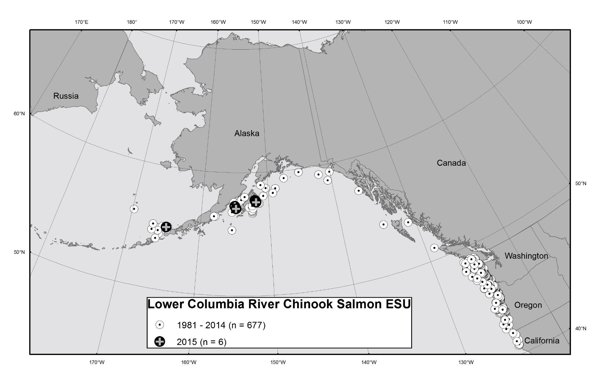
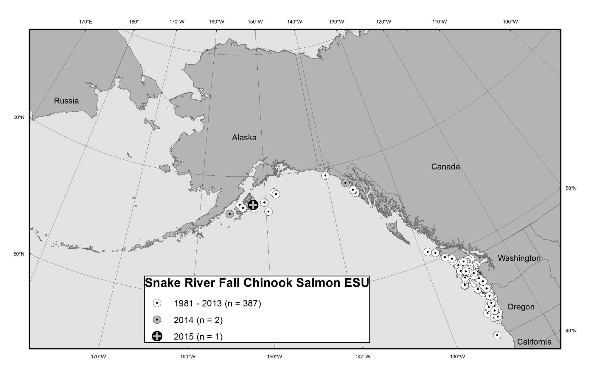
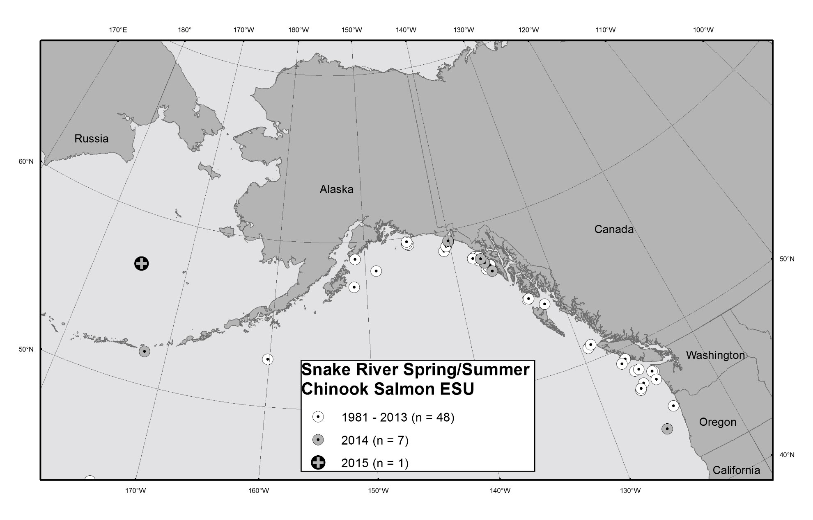
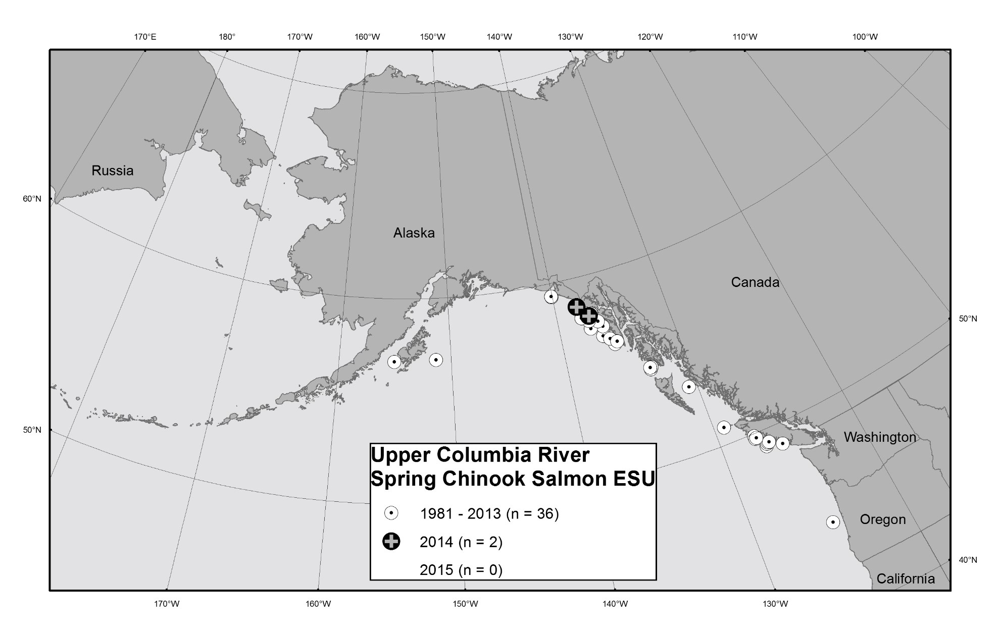
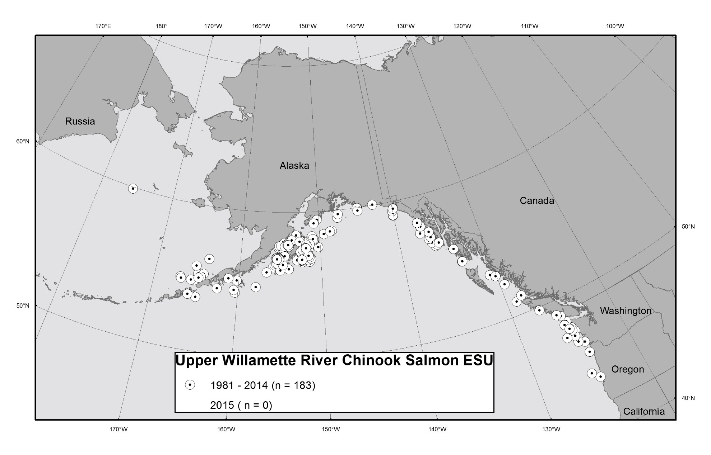
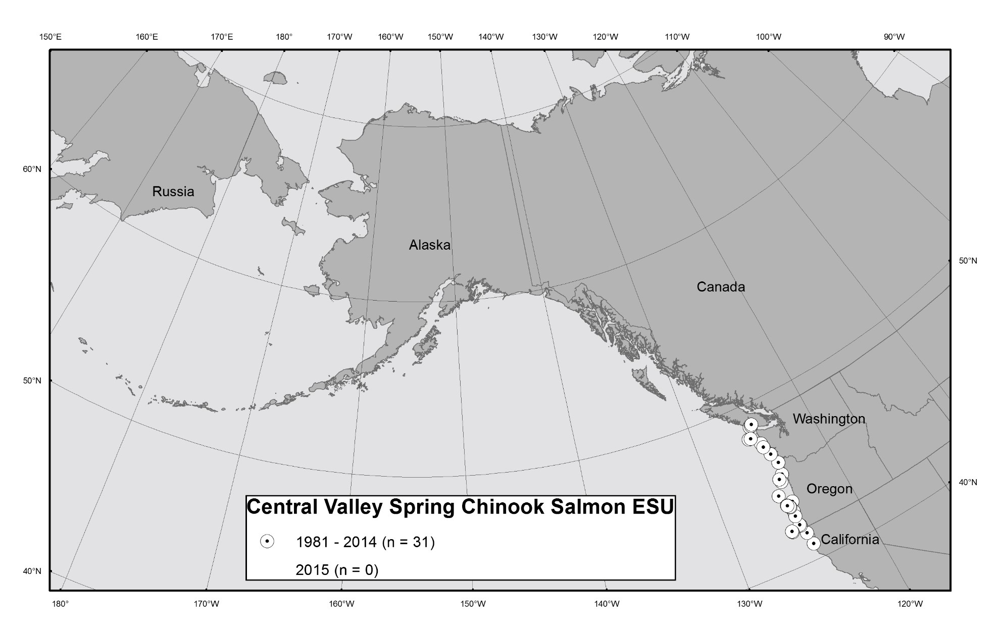

> **Table of Contents**

[Sampling for Coded-wire Tagged Chinook Salmon in the Gulf of Alaska 1](#sampling-for-coded-wire-tagged-chinook-salmon-in-the-gulf-of-alaska)

[Sampling for Coded-wire Tagged Chinook Salmon in the Bering Sea-Aleutian Islands 1](#sampling-for-coded-wire-tagged-chinook-salmon-in-the-bering-sea-aleutian-islands)

[Coded-wire Tagged Chinook Salmon Releases from ESA-listed ESUs 2](#coded-wire-tagged-chinook-salmon-releases-from-esa-listed-esus)

[RESULTS 2](#results)

[Origins of Coded-wire Tagged Chinook Salmon in the Gulf of Alaska 2](#origins-of-coded-wire-tagged-chinook-salmon-in-the-gulf-of-alaska)

[Origins of Coded-wire Tagged Chinook Salmon in the Bering Sea-Aleutian Islands 3](#origins-of-coded-wire-tagged-chinook-salmon-in-the-bering-sea-aleutian-islands)

[Occurrence of Chinook Salmon from ESA-listed ESUs in the Gulf of Alaska and Bering Sea-](#occurrence-of-chinook-salmon-from-esa-listed-esus-in-the-gulf-of-alaska-and-bering)

[Aleutian Islands 3](#sea-aleutian-islands)

[Ocean Distribution of Chinook Salmon from ESA-listed ESUs, 1981--2015 4](#ocean-distribution-of-chinook-salmon-from-esa-listed-esus-19812015)

[ACKNOWLEDGMENTS 4](#acknowledgments)

[REFERENCES 5](#references)

[Appendix 1 42](#table-1.)

[Recovery Estimation Technique by Adrian Celewycz 42](#recovery-estimation-technique-by-adrian-celewycz)

[Appendix 2 45](#appendix-2)

[Excerpts from "Analysis of Recoveries of Coded-Wire Tags (CWTs) from Chinook Salmon in the Gulf of Alaska (GOA) and Bering Sea-Aleutian Islands (BSAI), 2012 and 2013" by Adrian Celewycz 45](#excerpts-from-analysis-of-recoveries-of-coded-wire-tags-cwts-from-chinook-salmon-in-the-gulf-of-alaska-goa-and-bering-sea-aleutian-islands-bsai-2012-and-2013-by-adrian-celewycz)

[Processing Snouts for Coded-Wire Tags (CWTs) at Auke Bay Laboratories CWT Lab at TSMRI 45](#processing-snouts-for-coded-wire-tags-cwts-at-auke-bay-laboratories-cwt-lab-at-tsmri)

[The CWT Program in the Greater Pacific Region of North America 45](#the-cwt-program-in-the-greater-pacific-region-of-north-america)

[Sampling for CWTs 46](#sampling-for-cwts)

[CWT Expansions 46](#cwt-expansions)

# Sampling for Coded-wire Tagged Chinook Salmon in the Gulf of Alaska 

In the 2015 Gulf of Alaska (GOA) groundfish trawl fisheries, snout collection for coded- wire tagged salmon was conducted by at-sea and plant observers of the North Pacific Groundfish and Halibut Observer Program (Observer Program). Snout collection for coded-wire tags (CWTs) was based on visual detection only of a clipped adipose fin. Observers sampled 2,645[^1] Chinook salmon and collected snouts from 326[^2] fish with clipped adipose fins (Table 1). Of the snouts examined, 102 had readable CWTs (Table 1).

Also in 2015, electronic detection of CWTs in the salmon bycatch of the GOA rockfish trawl fishery was conducted by Alaska Groundfish Data Bank, and nearly all of the Chinook salmon bycatch were scanned with CWT detection wands. Of the 638 Chinook salmon scanned with handheld wands and visually inspected for clipped adipose fins, 100 (15.7%) had clipped adipose fins, and 27 (4.2%) had readable CWTs (Table 1). Of the 27 fish with readable CWTs, 22 (81.5%) had clipped adipose fins, and 5 (18.5%) had no fin clip (Table 1).

In the 2014 U.S. trawl research conducted by the National Marine Fisheries Service (NMFS) and directed at juvenile salmon in the GOA, electronic detection was used to scan all salmon for CWTs. All salmon were also visually inspected for presence of an adipose fin clip. Researchers sampled 241 Chinook salmon, of which 133 (55.2%) had a clipped adipose fin, and 46 (19.1%) had readable CWTs (Table 1). Of the 46 fish with readable CWTs, 37 (80.4%) had a clipped adipose fin, and 9 (19.6%) had no fin clip (Table 1).

# Sampling for Coded-wire Tagged Chinook Salmon in the Bering Sea-Aleutian Islands 

In the 2015 Bering Sea-Aleutian Islands (BSAI) groundfish trawl fisheries, sampling for CWTs continued under a systematic sampling design recommended by Pella and Geiger (2009), and implemented by the Observer Program in 2011, for collecting genetic samples from 1 out of every 10 Chinook salmon encountered in the bycatch. Snout collection for CWTs was based on visual detection only of a clipped adipose fin in every 10^th^ Chinook salmon encountered and sampled for genetics. In 2015, observers sampled 1,962[^3] Chinook salmon in the BSAI and collected 31[^4] snouts from fish with clipped adipose fins (Table 1). Of the snouts examined, 10 had readable CWTs (Table 1).

In 2015, electronic detection of CWTs in the BSAI salmon bycatch was conducted by the North Pacific Fisheries Research Foundation in salmon excluder device (SED) testing directed at pollock. The goal of the SED is to reduce the amount of salmon bycatch in trawl catches by allowing salmon to exit the trawl while groundfish are retained. Of the 444 Chinook salmon scanned with handheld CWT detection wands, 3 (0.7%) had readable CWTs (Table 1). Of the 3 fish with readable CWTs, all 3 (100%) had a clipped adipose fin (Table 1).

In the 2015 U.S. trawl research conducted by NMFS and directed at juvenile salmon in the northern Bering Sea, electronic detection was used to scan all salmon for CWTs. Researchers sampled 358 Chinook salmon, of which 5 (1.4%) had readable CWTs (Table 1). Of the 5 fish with readable CWTs, all had a clipped adipose fin.

In August 2015, two Chinook salmon with clipped adipose fins were recovered by scientists aboard the Japanese vessel Hokko-maru on a research cruise in the Bering Sea (Table 1). The two snouts were sent to the Auke Bay Laboratories, and one had a readable CWT (Table 1).

# Coded-wire Tagged Chinook Salmon Releases from ESA-listed ESUs 

The North Pacific Fishery Management Council contracted Cramer Fish Sciences to compile a database of coded-wire tagged release groups of West Coast salmon and steelhead listed under the Endangered Species Act (ESA); this database was last updated in June 2016 (Caldwell, 2016). The database was compiled using the Pacific States Marine Fisheries Commission Regional Mark Information System CWT database and a list of artificial propagation programs determined by NMFS to be included in ESA-listed evolutionarily significant units (ESUs). We determined from this database the coded-wire tagged Chinook salmon recovered in the GOA and BSAI that originated from ESA-listed ESUs.

# RESULTS 

Results in this report are summarized over two time periods. For the GOA fisheries, results are summarized for periods 2001--2011 and 2012--2015 because of the implementation of a revised genetic sampling protocol by the Observer Program in 2012 and increased CWT recoveries by electronic detection programs beginning in 2012. For the BSAI fisheries, results are summarized for periods 2001--2010 and 2011--2015 because a revised genetic sampling protocol was instituted in 2011.

## Origins of Coded-wire Tagged Chinook Salmon in the Gulf of Alaska 

Coded-wire tagged Chinook salmon recovered as bycatch in the GOA are comprised of stocks originating from Alaska, British Columbia, Washington, Idaho, and Oregon. Recoveries of coded-wire tagged Chinook salmon in the bycatch of the GOA groundfish fisheries are summarized by state or province of origin for 2001--2015 (Table 2). Tagged Alaska Chinook salmon harvested in the GOA have historically originated from two regions, Cook Inlet and Southeast Alaska, with most of the coded-wire tagged Alaska Chinook salmon originating from Southeast Alaska (Table 3). Since the Alaska Department of Fish and Game (ADF&G) ended the tagging of Cook Inlet Chinook salmon with CWTs after the 2008 brood year (2010 release), all coded-wire tagged Alaska Chinook salmon harvested in the GOA in 2012--2015 have originated from Southeast Alaska (Table 3).

Most of the Chinook salmon represented by CWTs and harvested in the GOA originated from hatchery production (Table 4), a reflection that wild stocks of Chinook salmon are underrepresented by CWTs, especially outside of Alaskan production. Chinook salmon recovered in the GOA are comprised of a variety of run types (Table 5) that are designated by the tagging agency. Chinook salmon recovered in the GOA are also comprised of a variety of age classes (Table 6). Total age of each fish was calculated by subtracting the brood year of the coded-wire tagged recovery from the recovery year which includes freshwater and saltwater residency.

## Origins of Coded-wire Tagged Chinook Salmon in the Bering Sea-Aleutian Islands 

Coded-wire tagged Chinook salmon recovered as bycatch in the BSAI are comprised of stocks originating from Alaska, the Yukon Territory, British Columbia, Washington, and Oregon. Recoveries of coded-wire tagged Chinook salmon in the bycatch of the BSAI groundfish fisheries are summarized by state or province of origin for 2001--2015 (Table 7). Starting in 2011, sampling expansion factors were calculated for coded-wire tagged recoveries in the bycatch of the BSAI groundfish fisheries. Total estimated numbers by state or province of origin are shown for 2011--2015 (Table 8). Tagged Alaska Chinook salmon harvested in the BSAI have historically originated from two regions, Cook Inlet and Southeast Alaska (Table 9). Since ADF&G ended the tagging of Cook Inlet Chinook salmon with CWTs after the 2008 brood year (2010 release), all coded-wire tagged Alaska Chinook salmon harvested in the BSAI in 2011--2015 have originated from Southeast Alaska (Table 9).

Most of the Chinook salmon represented by CWTs and harvested in the BSAI originated from hatchery production (Table 10), a reflection that wild stocks of Chinook salmon are underrepresented by CWTs, especially outside of Alaskan production. Chinook salmon recovered in the BSAI are comprised of a variety of run types (Table 11) that are designated by the tagging agency.

## Occurrence of Chinook Salmon from ESA-listed ESUs in the Gulf of Alaska and Bering 

## Sea-Aleutian Islands 

Coded-wire tagged Chinook salmon from ESA-listed ESUs have been recovered in GOA and BSAI trawl fisheries (Tables 12 and 13). Since 1981, coded-wire tagged Chinook salmon have been recovered in the GOA trawl fisheries from the Lower Columbia River (LCR), Puget Sound (PS), Snake River fall-run (SRf), Snake River spring/summer-run (SRss), Upper Columbia River spring-run (UCRs), and the Upper Willamette River (UWR) ESUs: 30 LCR, 1 PS, 10 SRf, 2 SRss, 2 UCRs, and 130 UWR Chinook salmon (Tables 12 and 13). Coded-wire tagged Chinook salmon have been recovered in the BSAI trawl fisheries from the Lower Columbia River, Snake River spring/summer-run, and the Upper Willamette River ESUs: 11 LCR, 1 SRss, and 13 UWR Chinook salmon (Tables 12 and 13). By applying a total mark expansion factor to account for the wild, untagged component of each ESU (see Appendix 1), the estimated numbers are 139.6 LCR, 1.1 PS, 20.4 SRf, 4.0 SRss, 2.2 UCRs, and 484.5 UWR Chinook salmon in the GOA trawl fisheries and 12.4 LCR, 2.6 SRss, and 76.7 UWR Chinook salmon in the BSAI trawl fisheries (Tables 12 and 13).

U.S. trawl research directed at juvenile salmon has also documented the occurrence of Chinook salmon from ESA-listed ESUs in the GOA. Since 1996, trawl research in the GOA has recovered coded-wire tagged Chinook salmon from ESA-listed ESUs: 7 LCR, 1 PS, 5 SRf, 32 SRss, 21 UCRs, and 23 UWR Chinook salmon (Tables 14 and 15). By applying a total mark expansion factor to account for the wild, untagged component of each ESU (see Appendix 1), the estimated numbers from U.S. trawl research are 19.4 LCR, 1.1 PS, 8.1 SRf, 151.2 SRss, 43.0 UCRs, and 86.5 UWR Chinook salmon in the GOA (Tables 14 and 15). No ESA-listed, coded-wire tagged Chinook salmon have been recovered in U.S. trawl research surveys in the BSAI.

Japanese research in the Bering Sea documented the occurrence of one ESA-listed Chinook salmon (Table 16). Of the two Chinook salmon recovered with clipped adipose fins, one had a CWT and originated from SRss (Table 16).

## Ocean Distribution of Chinook Salmon from ESA-listed ESUs, 1981--2015 

Maps of the ocean distribution of coded-wire tagged Chinook salmon from ESA-listed ESUs are shown (Figures 1--7). These maps were compiled from the historical database of CWT recoveries (1981--2015) from high seas commercial fisheries: GOA groundfish trawl fisheries, BSAI groundfish trawl fisheries, at-sea Pacific hake trawl fishery off the U.S. West Coast, and the West Coast groundfish trawl fishery, as well as domestic and foreign research surveys in the North Pacific Ocean, GOA, and BSAI. The maps show the ocean distribution of coded-wire tagged

Chinook salmon recoveries from ESA-listed ESUs from the Pacific Northwest from 1981--2015.

# ACKNOWLEDGMENTS 

Fishermen, processors, observers, contractors, and scientists who participated in the high seas CWT recovery program are gratefully acknowledged, especially Alaska Groundfish Data Bank and North Pacific Fisheries Research Foundation, including Ken Hansen, John Gauvin, Cory Lescher, Katy McGauley, and Brian Lynch. Sarah Ballard dissected salmon snouts, decoded CWTs, and entered CWT recovery data in an electronic database.

# REFERENCES 

ADF&G Chinook Salmon Research Team. 2013. Chinook salmon stock assessment and research plan, 2013. Alaska Department of Fish and Game, Special Publication No.

> 13-01, Anchorage. 56 p. (Available at
>
> http://www.adfg.alaska.gov/index.cfm?adfg=chinook_efforts_symposium.research \_plan).

Caldwell, L. 2016. Phase II: updated database of CWT release groups (final version). Technical Memorandum: Cramer Fish Sciences, 600 NW Fariss Rd., Gresham, OR 97030, 4 p.

Johnson, K. J. 2004. Regional overview of coded wire tagging of anadromous salmon and steelhead in Northwest America: Regional Mark Processing Center, Pacific States Marine Fisheries Commission, Portland, Oregon.

Joint Columbia River Management Staff. 2013. 2013 Joint staff report: stock status and fisheries for spring Chinook, summer Chinook, Sockeye, Steelhead, and other species, and miscellaneous regulations. Oregon Department of Fish & Wildlife, Washington Department of Fish & Wildlife. 88 p. (Available at [[http://wdfw.wa.gov/publications/01452/wdfw01452.pdf]{.ul})](http://wdfw.wa.gov/publications/01452/wdfw01452.pdf).

LaVoy, L. 2013a. NOAA Fisheries ([Larrie.Lavoy\@NOAA.GOV]{.ul}). Personal communication, March 28, 2013.

LaVoy, L. 2013b. NOAA Fisheries ([Larrie.Lavoy\@NOAA.GOV]{.ul}). Personal communication, March 12, 2013.

Nandor, G. F., Longwill, J. R., and Webb, D. L. 2010. Overview of the coded wire tag program in the Greater Pacific Region of North America, *in* Wolf, K.S. and O\'Neal, J.S., eds., PNAMP Special Publication: Tagging, Telemetry and Marking Measures for Monitoring Fish Populations---A compendium of new and recent science for use in informing technique and decision modalities: Pacific Northwest Aquatic Monitoring Partnership Special Publication 2010-002, Chap. 2, p. 5--46. (Available at [[http://www.rmpc.org/publications.html]{.ul})](http://www.rmpc.org/publications.html).

Pella, J., and Geiger, H. J. 2009. Sampling considerations for estimating geographic origins of Chinook salmon bycatch in the Bering Sea pollock fishery. Alaska Department of Fish and Game Special Publication No. SP 09-08. 58 p.

Vaughan, J. 2011. Production of stream type (spring-run) Chinook salmon from ESAlisted ESUs originating in Washington, Oregon, and Idaho. Technical

> Memorandum: Cramer Fish Sciences, 600 NW Fariss Rd., Gresham, OR 97030, 8 p.
>
> Table 1. Number of Chinook salmon sampled, number with clipped adipose fins (ad-clipped), and number with readable coded-wire tags (CWTs) in the various sampling programs in the Gulf of Alaska (GOA) and the Bering Sea-Aleutian Islands (BSAI) in 2014 and 2015. The number of Chinook salmon with readable CWTs that were also ad-clipped is in parentheses. Only sampling programs based on electronic detection can be expected to recover CWTs from fish that are not ad-clipped.

+--------------+----------+---------------------------------------+---------------------------------------------+-----------------------+---------------------+-------------------------------+-----------+
| > **Region** | **Year** | **Fishery and gear Sampling program** | **Detection method**                        | **Number sampled**    | **Number**          | **Number with readable CWTs** |           |
|              |          |                                       |                                             |                       |                     |                               |           |
|              |          |                                       |                                             |                       | **ad-clipped^1\ ^** |                               |           |
+==============+==========+=======================================+=============================================+=======================+=====================+===============================+===========+
| GOA          | > 2014   | Research trawl                        | > National Marine Fisheries Service         | Electronic and visual | 241                 | 133                           | 46 (37)   |
+--------------+----------+---------------------------------------+---------------------------------------------+-----------------------+---------------------+-------------------------------+-----------+
|              |          |                                       |                                             |                       |                     |                               |           |
+--------------+----------+---------------------------------------+---------------------------------------------+-----------------------+---------------------+-------------------------------+-----------+
| GOA          | > 2015   | Groundfish trawl                      | Observer program                            | Visual                | 2,6452,3            | 3263                          | 102 (102) |
+--------------+----------+---------------------------------------+---------------------------------------------+-----------------------+---------------------+-------------------------------+-----------+
|              |          | Rockfish trawl                        | Alaska Groundfish Data Bank                 | > Electronic          | 638                 | 100                           | 27 (22)   |
+--------------+----------+---------------------------------------+---------------------------------------------+-----------------------+---------------------+-------------------------------+-----------+
|              |          |                                       |                                             |                       |                     |                               |           |
+--------------+----------+---------------------------------------+---------------------------------------------+-----------------------+---------------------+-------------------------------+-----------+
| BSAI         | > 2015   | Groundfish trawl                      | Observer program                            | Visual                | 1,9623,4            | 313                           | 10 (10)   |
+--------------+----------+---------------------------------------+---------------------------------------------+-----------------------+---------------------+-------------------------------+-----------+
|              |          | Salmon excluder device trawl          | North Pacific Fisheries Research Foundation | > Electronic          | 444                 | \-                            | 3 (3)     |
+--------------+----------+---------------------------------------+---------------------------------------------+-----------------------+---------------------+-------------------------------+-----------+
|              |          | Research trawl                        | > National Marine Fisheries Service         | > Electronic          | 358                 | \-                            | 5 (5)     |
+--------------+----------+---------------------------------------+---------------------------------------------+-----------------------+---------------------+-------------------------------+-----------+
|              |          | > Japanese research                   | Fisheries Research Agency, Sapporo, Japan   | Visual                | \-                  | 25                            | 1(1)      |
+--------------+----------+---------------------------------------+---------------------------------------------+-----------------------+---------------------+-------------------------------+-----------+

> ^1^Number of ad-clipped salmon in the sample was not always available.
>
> ^2^Number of Chinook salmon sampled for genetics in the pollock and non-pollock fisheries.
>
> ^3^Number from the Fisheries Monitoring and Analysis Division of the Alaska Fisheries Science Center.
>
> ^4^Number of Chinook salmon sampled for length in the pollock and non-pollock fisheries. ^5^Snouts provided by Shunpei Sato, Fisheries Research Agency, Sapporo, Japan.
>
> Table 2. Observed numbers and CWT mark expanded numbers of coded-wire tagged Chinook salmon captured in the bycatch of the GOA groundfish fisheries (including augmented sampling in the rockfish trawl fishery, 2013--2015), by run year and state or province of origin: A) 2001--2011 and B) 2012--2015. Average numbers and percentages of the total averaged over years are reported.

A)  2001--2011

                                       **Alaska**            **British Columbia**           **Idaho**             **Oregon**                     **Washington**        **Total**                                                                                                                                                      
  ------------------------------------ --------------------- ------------------------------ --------------------- ------------------------------ --------------------- ------------------------------ --------------------- ------------------------------ --------------------- ------------------------------ --------------------- ------------------------------
  **Run year**                         **Observed number**   **CWT mark expanded number**   **Observed number**   **CWT mark expanded number**   **Observed number**   **CWT mark expanded number**   **Observed number**   **CWT mark expanded number**   **Observed number**   **CWT mark expanded number**   **Observed number**   **CWT mark expanded number**
  2001                                 10                    100.2                          6                     74.8                           0                     0                              12                    16.5                           4                     4.0                            **32**                **195.6**
  2002                                 10                    47.2                           5                     113.0                          0                     0                              4                     4.3                            3                     3.7                            **22**                **168.2**
  2003                                 2                     22.4                           2                     28.6                           0                     0                              4                     8.3                            1                     1.0                            **9**                 **60.3**
  2004                                 3                     30.5                           4                     22.0                           0                     0                              5                     16.9                           1                     1.1                            **13**                **70.6**
  2005                                 3                     33.6                           4                     86.5                           0                     0                              2                     3.1                            2                     2.2                            **11**                **125.4**
  2006                                 10                    58.3                           7                     158.3                          0                     0                              2                     2.1                            5                     14.5                           **24**                **233.1**
  2007                                 13                    99.1                           3                     50.9                           0                     0                              2                     2.1                            5                     21.3                           **23**                **173.3**
  2008                                 6                     52.3                           1                     1.0                            0                     0                              3                     9.3                            12                    12.9                           **22**                **75.5**
  2009                                 5                     41.4                           2                     5.2                            0                     0                              2                     2.8                            4                     4.5                            **13**                **53.9**
  2010                                 10                    81.3                           4                     4.0                            0                     0                              10                    25.9                           12                    23.7                           **36**                **135.0**
  2011                                 3                     32.3                           1                     51.4                           0                     0                              2                     13.4                           2                     2.0                            **8**                 **99.2**
  **Mean**                             **6.8**               **54.4**                       **3.5**               **54.2**                       **0**                 **0**                          **4.4**               **9.5**                        **4.6**               **8.3**                        **19.4**              **126.4**
  **% of total averaged over years**   **34%**               **46%**                        **20%**               **38%**                        **0%**                **0%**                         **23%**               **9%**                         **23%**               **7%**                                               

> Table 2. Continued.

B)  2012--2015

                                       **Alaska**            **British Columbia**           **Idaho**             **Oregon**                     **Washington**        **Total**                                                                                                                                                      
  ------------------------------------ --------------------- ------------------------------ --------------------- ------------------------------ --------------------- ------------------------------ --------------------- ------------------------------ --------------------- ------------------------------ --------------------- ------------------------------
  **Run year**                         **Observed number**   **CWT mark expanded number**   **Observed number**   **CWT mark expanded number**   **Observed number**   **CWT mark expanded number**   **Observed number**   **CWT mark expanded number**   **Observed number**   **CWT mark expanded number**   **Observed number**   **CWT mark expanded number**
  2012                                 11                    78.0                           13                    34.7                           1                     2.0                            25                    135.1                          30                    59.2                           **80**                **309.0**
  2013                                 12                    68.2                           24                    136.0                          6                     9.4                            41                    216.3                          97                    165.4                          **180**               **595.3**
  2014                                 10                    105.0                          12                    54.2                           1                     1.0                            24                    113.4                          10                    13.4                           **57**                **287.0**
  2015                                 30                    381.0                          32                    193.2                          1                     2.0                            28                    55.8                           38                    58.6                           **129**               **690.6**
  **Mean**                             **15.8**              **158.1**                      **20.3**              **104.5**                      **2.3**               **3.6**                        **29.5**              **130.1**                      **43.8**              **74.1**                       **111.5**             **470.5**
  **% of total averaged over years**   **15%**               **32%**                        **19%**               **20%**                        **2%**                **1%**                         **29%**               **32%**                        **35%**               **15%**                                              

> Table 3. Observed numbers and CWT mark expanded numbers of coded-wire tagged, Alaska-origin Chinook salmon captured in the bycatch of the GOA groundfish fisheries (including augmented sampling in the rockfish trawl fishery, 2013--2015) by run year and release region: A) 2001-- 2011 and B) 2012--2015. Average numbers are reported. The Chinook salmon tagging program in the Cook Inlet, Alaska region ended with the 2008 brood year.

A.  2001--2011

                 **Cook Inlet, Alaska**   **Southeast Alaska**           **Alaska Total**                                                           
  -------------- ------------------------ ------------------------------ --------------------- ------------------------------ --------------------- ------------------------------
  **Run year**   **Observed number**      **CWT mark expanded number**   **Observed number**   **CWT mark expanded number**   **Observed number**   **CWT mark expanded number**
  2001           2                        2.0                            8                     98.2                           **10**                **100.2**
  2002           1                        1.0                            9                     46.2                           **10**                **47.2**
  2003           0                        0                              2                     22.4                           **2**                 **22.4**
  2004           0                        0                              3                     30.5                           **3**                 **30.5**
  2005           0                        0                              3                     33.6                           **3**                 **33.6**
  2006           0                        0                              10                    58.3                           **10**                **58.3**
  2007           0                        0                              13                    99.1                           **13**                **99.1**
  2008           2                        2.0                            4                     50.3                           **6**                 **52.3**
  2009           1                        1.0                            4                     40.4                           **5**                 **41.4**
  2010           0                        0                              10                    81.3                           **10**                **81.3**
  2011           0                        0                              3                     32.3                           **3**                 **32.3**
  **Mean**       **0.5**                  **0.5**                        **6.3**               **53.9**                       **6.8**               **54.4**

B.  2012--2015

                 **Cook Inlet, Alaska**   **Southeast Alaska**           **Alaska Total**                                                           
  -------------- ------------------------ ------------------------------ --------------------- ------------------------------ --------------------- ------------------------------
  **Run year**   **Observed number**      **CWT mark expanded number**   **Observed number**   **CWT mark expanded number**   **Observed number**   **CWT mark expanded number**
  2012           0                        0                              11                    78.0                           **11**                **78.0**
  2013           0                        0                              12                    68.2                           **12**                **68.2**
  2014           0                        0                              10                    123.2                          **10**                **123.2**
  2015           0                        0                              30                    381.0                          **30**                **381.0**
  **Mean**       **0**                    **0**                          **15.8**              **162.6**                      **15.8**              **162.6**

> Table 4. Observed numbers of coded-wire tagged Chinook salmon captured in the bycatch of the GOA groundfish fisheries (including augmented sampling in the rockfish trawl fishery, 2013--2015) by rearing type and state or province of origin: A) 2001-- 2011 and B) 2012--2015. Percentages of the total are reported.

A.  2001--2011

+------------------+--------------+------------------+----------+
|                  |              | **Rearing type** |          |
+==================+==============+==================+==========+
| **Origin**       | **Hatchery** | **Mixed**        | **Wild** |
+------------------+--------------+------------------+----------+
| > Alaska         | 59           | 0                | 6        |
+------------------+--------------+------------------+----------+
| > British        | 33           | 0                | 0        |
| >                |              |                  |          |
| > Columbia       |              |                  |          |
+------------------+--------------+------------------+----------+
| > Idaho          | 0            | 0                | 0        |
+------------------+--------------+------------------+----------+
| > Oregon         | 36           | 0                | 0        |
+------------------+--------------+------------------+----------+
| > Washington     | 35           | 10               | 2        |
+------------------+--------------+------------------+----------+
| > **% of total** | **90%**      | **6%**           | **4%**   |
+------------------+--------------+------------------+----------+

B.  2012--2015

+------------------+--------------+------------------+----------+
|                  |              | **Rearing type** |          |
+==================+==============+==================+==========+
| **Origin**       | **Hatchery** | **Mixed**        | **Wild** |
+------------------+--------------+------------------+----------+
| > Alaska         | 59           | 0                | 4        |
+------------------+--------------+------------------+----------+
| > British        | 81           | 0                | 0        |
| >                |              |                  |          |
| > Columbia       |              |                  |          |
+------------------+--------------+------------------+----------+
| > Idaho          | 9            | 0                | 0        |
+------------------+--------------+------------------+----------+
| > Oregon         | 116          | 0                | 2        |
+------------------+--------------+------------------+----------+
| > Washington     | 172          | 0                | 3        |
+------------------+--------------+------------------+----------+
| > **% of total** | **98%**      | **0%**           | **2%**   |
+------------------+--------------+------------------+----------+

Table 5. Observed numbers of coded-wire tagged Chinook salmon captured in the

> bycatch of the GOA groundfish fisheries (including augmented sampling in the rockfish trawl fishery, 2013--2015) by run type and state or province of origin: A) 2001--2011 and B) 2012--2015. Percentages of the total are reported.

A.  2001--2011

+----------------+------------+--------------+----------+------------------------------+
|                |            | **Run type** |          |                              |
+================+============+==============+==========+==============================+
| **Origin**     | **Spring** | > **Summer** | **Fall** | **Late fall upriver bright** |
+----------------+------------+--------------+----------+------------------------------+
| Alaska         | 67         | 0            | 0        | 0                            |
+----------------+------------+--------------+----------+------------------------------+
| British        | 7          | 12           | 20       | 0                            |
|                |            |              |          |                              |
| Columbia       |            |              |          |                              |
+----------------+------------+--------------+----------+------------------------------+
| Idaho          | 0          | 0            | 0        | 0                            |
+----------------+------------+--------------+----------+------------------------------+
| Oregon         | 20         | 0            | 25       | 3                            |
+----------------+------------+--------------+----------+------------------------------+
| Washington     | 1          | 18           | 29       | 3                            |
+----------------+------------+--------------+----------+------------------------------+
| **% of total** | **46%**    | **15%**      | **36%**  | **3%**                       |
+----------------+------------+--------------+----------+------------------------------+

B.  2012--2015

+----------------+------------+--------------+----------+------------------------------+
|                |            | **Run type** |          |                              |
+================+============+==============+==========+==============================+
| **Origin**     | **Spring** | > **Summer** | **Fall** | **Late fall upriver bright** |
+----------------+------------+--------------+----------+------------------------------+
| Alaska         | 54         | 0            | 0        | 0                            |
|                |            |              |          |                              |
| British        |            |              |          |                              |
|                |            |              |          |                              |
| Columbia       |            |              |          |                              |
|                |            |              |          |                              |
| Idaho          |            |              |          |                              |
|                |            |              |          |                              |
| Oregon         |            |              |          |                              |
|                |            |              |          |                              |
| Washington     |            |              |          |                              |
+----------------+------------+--------------+----------+------------------------------+
|                | 3          | 57           | 21       | 0                            |
+----------------+------------+--------------+----------+------------------------------+
|                | 0          | 1            | 0        | 8                            |
+----------------+------------+--------------+----------+------------------------------+
|                | 44         | 0            | 64       | 10                           |
+----------------+------------+--------------+----------+------------------------------+
|                | 3          | 41           | 103      | 28                           |
+----------------+------------+--------------+----------+------------------------------+
| **% of total** | **24%**    | **23%**      | **43%**  | **11%**                      |
+----------------+------------+--------------+----------+------------------------------+

> Table 6. Observed numbers of coded-wire tagged Chinook salmon captured in the bycatch of the GOA groundfish fisheries (including augmented sampling in the rockfish trawl fishery, 2013--2015) and the BSAI groundfish fisheries (including the salmon excluder device project in 2015) by age during different time periods. Age was calculated by subtracting the brood year of the coded-wire tagged recovery from the recovery year which includes freshwater and saltwater residency. Percentages are in parentheses.

+-------------+-------------------+------------+-------------+-------------+---------+--------+
|             |                   |            |             | **Age**     |         |        |
+=============+===================+============+=============+=============+=========+========+
| **Fishery** | > **Time period** | **2**      | **3**       | **4**       | **5**   | **6**  |
+-------------+-------------------+------------+-------------+-------------+---------+--------+
| GOA         | 2001--2011        | 14 (7%)    | 89 (42%)    | 92 (43%)    | 16 (8%) | 2 (1%) |
+-------------+-------------------+------------+-------------+-------------+---------+--------+
|             | 2012--2015        | > 63 (14%) | > 243 (55%) | > 119 (27%) | 20 (4%) | 0 (0%) |
+-------------+-------------------+------------+-------------+-------------+---------+--------+
| BSAI        | 2001--2010        | > 34 (12%) | > 141 (49%) | 92 (32%)    | 20 (7%) | 2 (1%) |
+-------------+-------------------+------------+-------------+-------------+---------+--------+
|             | 2011--2015        | 0 (0%)     | 12 (41%)    | 13 (45%)    | 3 (10%) | 1 (3%) |
+-------------+-------------------+------------+-------------+-------------+---------+--------+

> Table 7. Observed numbers and CWT mark expanded numbers of coded-wire tagged Chinook salmon captured in the bycatch of the BSAI groundfish fisheries (including the salmon excluder device project in 2015) by run year and state or province of origin: A) 2001--2010 and B) 2011--2015. Average numbers and percentages of the total averaged over years are reported.

A.  2001--2010

<table><thead><tr class="header"><th></th><th><strong>Alaska</strong></th><th>
<strong>British</strong>

<strong>Columbia</strong>
</th><th><strong>Oregon</strong></th><th><strong>Washington</strong></th><th>
<strong>Yukon</strong>

<strong>Territory</strong>
</th><th><strong>Total</strong></th><th></th><th></th><th></th><th></th><th></th><th></th></tr></thead><tbody><tr class="odd"><td><strong>Run year</strong></td><td>
<strong>Obser ved</strong>

<strong>numb er</strong>
</td><td>
<strong>CWT mark expan ded</strong>
<blockquote>
<strong>numbe</strong>
</blockquote>
<strong>r</strong>
</td><td>
<strong>Obser ved</strong>

<strong>numb er</strong>
</td><td>
<strong>CWT mark expan ded</strong>
<blockquote>
<strong>numbe</strong>
</blockquote>
<strong>r</strong>
</td><td>
<strong>Obser ved</strong>

<strong>numb er</strong>
</td><td>
<strong>CWT mark expan ded</strong>
<blockquote>
<strong>numbe</strong>
</blockquote>
<strong>r</strong>
</td><td>
<strong>Obser ved</strong>

<strong>numb er</strong>
</td><td>
<strong>CWT mark expan ded</strong>
<blockquote>
<strong>numbe</strong>
</blockquote>
<strong>r</strong>
</td><td>
<strong>Obser ved</strong>

<strong>numb er</strong>
</td><td>
<strong>CWT mark expan ded</strong>
<blockquote>
<strong>numbe</strong>
</blockquote>
<strong>r</strong>
</td><td>
<strong>Obser ved</strong>

<strong>numb er</strong>
</td><td>
<strong>CWT mark expan ded</strong>
<blockquote>
<strong>numbe</strong>
</blockquote>
<strong>r</strong>
</td></tr><tr class="even"><td>2001</td><td>14</td><td>16.9</td><td>6</td><td>31.0</td><td>2</td><td>2.0</td><td>1</td><td>1.7</td><td>1</td><td>1.0</td><td><strong>24</strong></td><td><strong>52.6</strong></td></tr><tr class="odd"><td>2002</td><td>27</td><td>32.7</td><td>18</td><td>284. 8</td><td>21</td><td>42.8</td><td>12</td><td>31.2</td><td>1</td><td>1.0</td><td><strong>79</strong></td><td><strong>392. 5</strong></td></tr><tr class="even"><td>2003</td><td>6</td><td>24.6</td><td>13</td><td>82.3</td><td>4</td><td>4.1</td><td>3</td><td>18.3</td><td>2</td><td>2.0</td><td><strong>28</strong></td><td><strong>131. 3</strong></td></tr><tr class="odd"><td>2004</td><td>16</td><td>37.2</td><td>21</td><td>122. 3</td><td>11</td><td>115. 8</td><td>6</td><td>7.7</td><td>2</td><td>2.0</td><td><strong>56</strong></td><td><strong>285. 1</strong></td></tr><tr class="even"><td>2005</td><td>12</td><td>15.9</td><td>17</td><td>114. 6</td><td>8</td><td>22.8</td><td>7</td><td>7.9</td><td>1</td><td>1.0</td><td><strong>45</strong></td><td><strong>162. 2</strong></td></tr><tr class="odd"><td>2006</td><td>16</td><td>38.8</td><td>8</td><td>93.7</td><td>6</td><td>12.9</td><td>5</td><td>5.2</td><td>1</td><td>1.0</td><td><strong>36</strong></td><td><strong>151. 5</strong></td></tr><tr class="even"><td>2007</td><td>5</td><td>19.4</td><td>1</td><td>12.2</td><td>2</td><td>2.0</td><td>1</td><td>1.5</td><td>0</td><td>0</td><td><strong>9</strong></td><td><strong>35.2</strong></td></tr><tr class="odd"><td>2008</td><td>0</td><td>0</td><td>0</td><td>0</td><td>0</td><td>0</td><td>0</td><td>0</td><td>0</td><td>0</td><td><strong>0</strong></td><td><strong>0</strong></td></tr><tr class="even"><td>2009</td><td>0</td><td>0</td><td>3</td><td>4.8</td><td>1</td><td>10.2</td><td>0</td><td>0</td><td>0</td><td>0</td><td><strong>4</strong></td><td><strong>15.0</strong></td></tr><tr class="odd"><td>2010</td><td>0</td><td>0</td><td>2</td><td>2.9</td><td>4</td><td>37.9</td><td>7</td><td>9.8</td><td>0</td><td>0</td><td><strong>13</strong></td><td><strong>50.6</strong></td></tr><tr class="even"><td><strong>Mean</strong></td><td><strong>9.6</strong></td><td><blockquote>
<strong>18.6</strong>
</blockquote></td><td><strong>8.9</strong></td><td><blockquote>
<strong>74.9</strong>
</blockquote></td><td><strong>5.9</strong></td><td><blockquote>
<strong>25.1</strong>
</blockquote></td><td><strong>4.2</strong></td><td><strong>8.3</strong></td><td><strong>0.8</strong></td><td><strong>0.8</strong></td><td><strong>29. 4</strong></td><td><strong>127. 6</strong></td></tr><tr class="odd"><td>
<strong>% of total</strong>

<strong>averag ed over years</strong>
</td><td>
<strong>30</strong>

<strong>%</strong>
</td><td><blockquote>
<strong>18%</strong>
</blockquote></td><td>
<strong>33</strong>

<strong>%</strong>
</td><td><blockquote>
<strong>49%</strong>
</blockquote></td><td>
<strong>20</strong>

<strong>%</strong>
</td><td><blockquote>
<strong>26%</strong>
</blockquote></td><td>
<strong>15</strong>

<strong>%</strong>
</td><td><strong>7%</strong></td><td><blockquote>
<strong>2%</strong>
</blockquote></td><td><strong>1%</strong></td><td></td><td></td></tr></tbody></table>

> Table 7. Continued.

B.  2011--2015

<table><thead><tr class="header"><th></th><th><strong>Alaska</strong></th><th>
<strong>British</strong>

<strong>Columbia</strong>
</th><th><strong>Oregon</strong></th><th><blockquote>
<strong>Washington</strong>
</blockquote></th><th>
<strong>Yukon</strong>

<strong>Territory</strong>
</th><th><strong>Total</strong></th><th></th><th></th><th></th><th></th><th></th><th></th></tr></thead><tbody><tr class="odd"><td><strong>Run year</strong></td><td><blockquote>
<strong>Obser ved</strong>
</blockquote>
<strong>Numb er</strong>
</td><td>
<strong>CWT mark expan ded</strong>
<blockquote>
<strong>numbe</strong>
</blockquote>
<strong>r</strong>
</td><td>
<strong>Obser ved</strong>

<strong>numb er</strong>
</td><td>
<strong>CWT mark expan ded</strong>
<blockquote>
<strong>numbe</strong>
</blockquote>
<strong>r</strong>
</td><td>
<strong>Obser ved</strong>

<strong>numb er</strong>
</td><td>
<strong>CWT mark expan ded</strong>
<blockquote>
<strong>numbe</strong>
</blockquote>
<strong>r</strong>
</td><td><blockquote>
<strong>Obser ved</strong>
</blockquote>
<strong>numb er</strong>
</td><td>
<strong>CWT mark expan ded</strong>
<blockquote>
<strong>numbe</strong>
</blockquote>
<strong>r</strong>
</td><td>
<strong>Obser ved</strong>

<strong>numb er</strong>
</td><td>
<strong>CWT mark expan ded</strong>
<blockquote>
<strong>numbe</strong>
</blockquote>
<strong>r</strong>
</td><td>
<strong>Obser ved</strong>

<strong>numb er</strong>
</td><td>
<strong>CWT mark expan ded</strong>
<blockquote>
<strong>numbe</strong>
</blockquote>
<strong>r</strong>
</td></tr><tr class="even"><td>2011</td><td>0</td><td>0</td><td>0</td><td>0</td><td>0</td><td>0</td><td>2</td><td>2.0</td><td>0</td><td>0</td><td><strong>2</strong></td><td><strong>2.0</strong></td></tr><tr class="odd"><td>2012</td><td>1</td><td>1.7</td><td>1</td><td>9.4</td><td>1</td><td>1.0</td><td>2</td><td>2.0</td><td>0</td><td>0</td><td><strong>5</strong></td><td><strong>14.2</strong></td></tr><tr class="even"><td>2013</td><td>0</td><td>0</td><td>1</td><td>2.6</td><td>1</td><td>1.0</td><td>2</td><td>3.4</td><td>0</td><td>0</td><td><strong>4</strong></td><td><strong>7.0</strong></td></tr><tr class="odd"><td>2014</td><td>0</td><td>0</td><td>1</td><td>2.8</td><td>3</td><td>3.9</td><td>1</td><td>1.0</td><td>0</td><td>0</td><td><strong>5</strong></td><td><strong>7.7</strong></td></tr><tr class="even"><td>2015</td><td>1</td><td>16.7</td><td>5</td><td>24.1</td><td>3</td><td>16.8</td><td>3</td><td>7.2</td><td>1</td><td>1.0</td><td><strong>13</strong></td><td><strong>65.8</strong></td></tr><tr class="odd"><td><strong>Mean</strong></td><td><strong>0.4</strong></td><td><strong>3.7</strong></td><td><strong>1.6</strong></td><td><strong>7.8</strong></td><td><strong>1.6</strong></td><td><strong>4.5</strong></td><td><strong>2.0</strong></td><td><strong>3.1</strong></td><td><strong>0.2</strong></td><td><strong>0.2</strong></td><td><strong>5.8</strong></td><td><blockquote>
<strong>19.3</strong>
</blockquote></td></tr><tr class="even"><td>
<strong>% of total</strong>

<strong>averag ed over years</strong>
</td><td><blockquote>
<strong>6%</strong>
</blockquote></td><td><strong>7%</strong></td><td>
<strong>21</strong>

<strong>%</strong>
</td><td><blockquote>
<strong>35%</strong>
</blockquote></td><td>
<strong>26</strong>

<strong>%</strong>
</td><td><blockquote>
<strong>20%</strong>
</blockquote></td><td>
<strong>47</strong>

<strong>%</strong>
</td><td><blockquote>
<strong>37%</strong>
</blockquote></td><td><blockquote>
<strong>2%</strong>
</blockquote></td><td><strong>0%</strong></td><td></td><td></td></tr></tbody></table>

> Table 8. CWT mark expanded and sample expanded numbers of Chinook salmon captured in the bycatch of the BSAI groundfish fisheries (including the salmon excluder device project in 2015) by run year and state or province of origin: 2011--2015. Observed numbers are in parentheses.

+--------------+------------+-----------------------+--------------+------------------+---------------+
|              |            | **Estimated numbers** |              |                  |               |
+==============+============+=======================+==============+==================+===============+
| **Run year** | **Alaska** | **British**           | > **Oregon** | > **Washington** | **Yukon**     |
|              |            |                       |              |                  |               |
|              |            | > **Columbia**        |              |                  | **Territory** |
+--------------+------------+-----------------------+--------------+------------------+---------------+
| 2011         | 0 (0)      | 0 (0)                 | 0 (0)        | 21.4 (2)         | 0 (0)         |
+--------------+------------+-----------------------+--------------+------------------+---------------+
| 2012         | 18.9 (1)   | 105.4 (1)             | 11.5 (1)     | 22.7 (2)         | 0 (0)         |
+--------------+------------+-----------------------+--------------+------------------+---------------+
| 2013         | 0 (0)      | 31.9 (1)              | 12.2 (1)     | 40.7 (2)         | 0 (0)         |
+--------------+------------+-----------------------+--------------+------------------+---------------+
| 2014         | 0 (0)      | 32.6 (1)              | 45.7 (3)     | 11.7 (1)         | 0 (0)         |
+--------------+------------+-----------------------+--------------+------------------+---------------+
| 2015         | 214.6 (1)  | 121.1 (5)             | 109.1 (3)    | 80.6 (3)         | 13.0 (1)      |
+--------------+------------+-----------------------+--------------+------------------+---------------+

> Table 9. Observed numbers and CWT mark expanded numbers of coded-wire tagged, Alaska-origin Chinook salmon captured in the bycatch of the BSAI groundfish fisheries (including the salmon excluder device project in 2015) by run year and release region: A) 2001--2010 and B) 2011--2015. Average numbers are reported. The Chinook salmon tagging program in the Cook Inlet, Alaska region ended with the 2008 brood year.

A.  2001--2010

                 **Cook Inlet, Alaska**   **Southeast Alaska**           **Alaska Total**                                                           
  -------------- ------------------------ ------------------------------ --------------------- ------------------------------ --------------------- ------------------------------
  **Run year**   **Observed number**      **CWT mark expanded number**   **Observed number**   **CWT mark expanded number**   **Observed number**   **CWT mark expanded number**
  2001           14                       16.9                           0                     0                              **14**                **16.9**
  2002           25                       28.9                           2                     3.8                            **27**                **32.7**
  2003           4                        4.1                            2                     20.6                           **6**                 **24.6**
  2004           11                       11.1                           5                     26.1                           **16**                **37.2**
  2005           8                        8.2                            4                     7.7                            **12**                **15.9**
  2006           11                       11.4                           5                     27.4                           **16**                **38.8**
  2007           2                        2.0                            3                     17.4                           **5**                 **19.4**
  2008           0                        0                              0                     0                              **0**                 **0**
  2009           0                        0                              0                     0                              **0**                 **0**
  2010           0                        0                              0                     0                              **0**                 **0**
  **Mean**       **7.5**                  **8.3**                        **2.1**               **10.3**                       **9.6**               **18.6**

B.  2011--2015

                 **Cook Inlet, Alaska**   **Southeast Alaska**     **Alaska Total**                                                     
  -------------- ------------------------ ------------------------ --------------------- ------------------------ --------------------- ------------------------
  **Run year**   **Observed Number**      **CWT Mark Expansion**   **Observed Number**   **CWT Mark Expansion**   **Observed Number**   **CWT Mark Expansion**
  2011           0                        0                        0                     0                        **0**                 **0**
  2012           0                        0                        1                     1.7                      **1**                 **1.7**
  2013           0                        0                        0                     0                        **0**                 **0**
  2014           0                        0                        0                     0                        **0**                 **0**
  2015           0                        0                        1                     16.7                     **1**                 **16.7**
  **Mean**       **0**                    **0**                    **0.4**               **3.7**                  **0.4**               **3.7**

> Table 10. Observed numbers of coded-wire tagged Chinook salmon captured in the bycatch of the BSAI groundfish fisheries (including the salmon excluder device project in 2015) by rearing type and state or province of origin: A) 2001--2010 and B) 2011--2015. Percentages of the total are reported.

A.  2001--2010

+------------------+----------------+--------------------+----------+
|                  |                | > **Rearing type** |          |
+==================+================+====================+==========+
| **Origin**       | > **Hatchery** | **Mixed**          | **Wild** |
+------------------+----------------+--------------------+----------+
| Alaska           | 90             | 0                  | 6        |
+------------------+----------------+--------------------+----------+
| British Columbia | 89             | 0                  | 0        |
+------------------+----------------+--------------------+----------+
| California       | 2              | 0                  | 0        |
+------------------+----------------+--------------------+----------+
| Oregon           | 59             | 0                  | 0        |
+------------------+----------------+--------------------+----------+
| Washington       | 40             | 1                  | 1        |
|                  |                |                    |          |
| Yukon Territory  |                |                    |          |
+------------------+----------------+--------------------+----------+
|                  | 8              | 0                  | 0        |
+------------------+----------------+--------------------+----------+
| **% of total**   | **99.3%**      | **0.3%**           | **0.3%** |
+------------------+----------------+--------------------+----------+

B.  2011--2015

+------------------+----------------+--------------------+----------+
|                  |                | > **Rearing type** |          |
+==================+================+====================+==========+
| **Origin**       | > **Hatchery** | **Mixed**          | **Wild** |
+------------------+----------------+--------------------+----------+
| Alaska           | 2              | 0                  | 0        |
+------------------+----------------+--------------------+----------+
| British Columbia | 8              | 0                  | 0        |
+------------------+----------------+--------------------+----------+
| California       | 0              | 0                  | 0        |
+------------------+----------------+--------------------+----------+
| Oregon           | 8              | 0                  | 0        |
+------------------+----------------+--------------------+----------+
| Washington       | 10             | 0                  | 0        |
+------------------+----------------+--------------------+----------+
| Yukon Territory  | 1              | 0                  | 0        |
+------------------+----------------+--------------------+----------+
| **% of total**   | **100%**       | **0%**             | **0%**   |
+------------------+----------------+--------------------+----------+

> Table 11. Observed numbers of coded-wire tagged Chinook salmon captured in the bycatch of the BSAI groundfish fisheries (including the salmon excluder device project in 2015) by run type and state or province of origin: A) 2001--2010 and B) 2011--2015. Percentages of the total are reported.

A.  2001--2010

+-------------+------------+--------------+----------+------------------------------+
|             |            | **Run type** |          |                              |
+=============+============+==============+==========+==============================+
| **Origin**  | **Spring** | > **Summer** | **Fall** | **Late fall upriver bright** |
+-------------+------------+--------------+----------+------------------------------+
| Alaska      | 93         | 0            | 0        | 0                            |
+-------------+------------+--------------+----------+------------------------------+
| British     | 12         | 34           | 39       | 0                            |
|             |            |              |          |                              |
| Columbia    |            |              |          |                              |
+-------------+------------+--------------+----------+------------------------------+
| Oregon      | 17         | 0            | 40       | 0                            |
+-------------+------------+--------------+----------+------------------------------+
| Washington  | 8          | 2            | 30       | 2                            |
+-------------+------------+--------------+----------+------------------------------+
| Yukon       | 6          | 0            | 2        | 0                            |
|             |            |              |          |                              |
| Territory   |            |              |          |                              |
+-------------+------------+--------------+----------+------------------------------+
| **% total** | **48%**    | **13%**      | **39%**  | **1%**                       |
+-------------+------------+--------------+----------+------------------------------+

B.  2011--2015

+-------------+------------+--------------+----------+------------------------------+
|             |            | **Run type** |          |                              |
+=============+============+==============+==========+==============================+
| **Origin**  | **Spring** | > **Summer** | **Fall** | **Late fall upriver bright** |
+-------------+------------+--------------+----------+------------------------------+
| Alaska      | 2          | 0            | 0        | 0                            |
+-------------+------------+--------------+----------+------------------------------+
| British     | 1          | 6            | 1        | 0                            |
|             |            |              |          |                              |
| Columbia    |            |              |          |                              |
+-------------+------------+--------------+----------+------------------------------+
| Oregon      | 5          | 0            | 3        | 0                            |
+-------------+------------+--------------+----------+------------------------------+
| Washington  | 2          | 1            | 7        | 0                            |
+-------------+------------+--------------+----------+------------------------------+
| Yukon       | 1          | 0            | 0        | 0                            |
|             |            |              |          |                              |
| Territory   |            |              |          |                              |
+-------------+------------+--------------+----------+------------------------------+
| **% total** | **38%**    | **24%**      | **38%**  | **0%**                       |
+-------------+------------+--------------+----------+------------------------------+

> Table 12. Observed numbers and mark expanded numbers of coded-wire tagged, ESA-listed Chinook salmon by ESU captured in the bycatch of the GOA groundfish fisheries (including augmented sampling in the rockfish trawl fishery, 2013--2015) and BSAI groundfish fisheries (including the salmon excluder device project in 2015), from 1981 to 2015. The calculation of total mark expanded numbers is an attempt to account for the untagged, wild component of each ESU that is not represented by CWTs (see Appendix 2 for a description of the method). The total mark expansion factors used for Chinook salmon ESUs are listed in Appendix 1, Table 1.

+---------------------------------+-----------------+------------+----------------------------+-----------------+--------------------------+----------------------------+
|                                 |                 | > GOA      |                            |                 | > BSAI                   |                            |
+=================================+=================+============+============================+=================+==========================+============================+
| Chinook salmon ESU              | Observed number | > CWT Mark | Total mark expanded number | Observed number | CWT mark expanded number | Total mark expanded number |
|                                 |                 | >          |                            |                 |                          |                            |
|                                 |                 | > Expanded |                            |                 |                          |                            |
|                                 |                 |            |                            |                 |                          |                            |
|                                 |                 | Number     |                            |                 |                          |                            |
+---------------------------------+-----------------+------------+----------------------------+-----------------+--------------------------+----------------------------+
| Lower Columbia River            | 30              | 124.6      | 139.6                      | 11              | 11.1                     | 12.4                       |
+---------------------------------+-----------------+------------+----------------------------+-----------------+--------------------------+----------------------------+
| Puget Sound                     | 1               | 1.0        | 1.1                        | 0               | 0.0                      | 0.0                        |
+---------------------------------+-----------------+------------+----------------------------+-----------------+--------------------------+----------------------------+
| Snake River fall run            | 10              | 15.4       | 20.4                       | 0               | 0.0                      | 0.0                        |
+---------------------------------+-----------------+------------+----------------------------+-----------------+--------------------------+----------------------------+
| Snake River spring/summer run   | 2               | 2.9        | 4.0                        | 1               | 1.9                      | 2.6                        |
+---------------------------------+-----------------+------------+----------------------------+-----------------+--------------------------+----------------------------+
| Upper Columbia River spring run | 2               | 2.0        | 2.2                        | 0               | 0.0                      | 0.0                        |
|                                 |                 |            |                            |                 |                          |                            |
|                                 | 130             | 397.2      | 484.5                      | 13              | 62.9                     | 76.7                       |
+---------------------------------+-----------------+------------+----------------------------+-----------------+--------------------------+----------------------------+
| Upper Willamette River          |                 |            |                            |                 |                          |                            |
+---------------------------------+-----------------+------------+----------------------------+-----------------+--------------------------+----------------------------+

> Table 13. Observed numbers and mark expanded numbers of coded-wire tagged, ESA-listed Chinook salmon captured in the bycatch of the GOA groundfish fisheries (including augmented sampling in the rockfish trawl fishery, 2013--2015) and BSAI groundfish fisheries (including the salmon excluder device project in 2015) by ESU and year, 1981--2015. The calculation of total mark expanded numbers is an attempt to account for the untagged, wild component of each ESU that is not represented by CWTs (see Appendix 2 for a description of the method). The total mark expansion factors used for Chinook salmon ESUs are listed in Appendix 1, Table 1.

A. Lower Columbia River Chinook salmon ESU

+------------+-----------------+--------------------------+----------------------------+-----------------+--------------------------+----------------------------+
|            | GOA             |                          | > BSAI                     |                 |                          |                            |
+============+=================+==========================+============================+=================+==========================+============================+
| > Run year | Observed number | CWT mark expanded number | Total mark expanded number | Observed number | CWT mark expanded number | Total mark expanded number |
+------------+-----------------+--------------------------+----------------------------+-----------------+--------------------------+----------------------------+
| 1981       | 0               | 0.0                      | 0.0                        | 0               | 0.0                      | 0.0                        |
+------------+-----------------+--------------------------+----------------------------+-----------------+--------------------------+----------------------------+
| 1982       | 0               | 0.0                      | 0.0                        | 0               | 0.0                      | 0.0                        |
+------------+-----------------+--------------------------+----------------------------+-----------------+--------------------------+----------------------------+
| 1983       | 0               | 0.0                      | 0.0                        | 0               | 0.0                      | 0.0                        |
+------------+-----------------+--------------------------+----------------------------+-----------------+--------------------------+----------------------------+
| 1984       | 5               | 14.1                     | 15.8                       | 0               | 0.0                      | 0.0                        |
+------------+-----------------+--------------------------+----------------------------+-----------------+--------------------------+----------------------------+
| 1985       | 1               | 1.0                      | 1.1                        | 0               | 0.0                      | 0.0                        |
+------------+-----------------+--------------------------+----------------------------+-----------------+--------------------------+----------------------------+
| 1986       | 0               | 0.0                      | 0.0                        | 0               | 0.0                      | 0.0                        |
+------------+-----------------+--------------------------+----------------------------+-----------------+--------------------------+----------------------------+
| 1987       | 1               | 1.3                      | 1.5                        | 0               | 0.0                      | 0.0                        |
+------------+-----------------+--------------------------+----------------------------+-----------------+--------------------------+----------------------------+
| 1988       | 0               | 0.0                      | 0.0                        | 0               | 0.0                      | 0.0                        |
+------------+-----------------+--------------------------+----------------------------+-----------------+--------------------------+----------------------------+
| 1989       | 0               | 0.0                      | 0.0                        | 0               | 0.0                      | 0.0                        |
+------------+-----------------+--------------------------+----------------------------+-----------------+--------------------------+----------------------------+
| 1990       | 1               | 1.0                      | 1.1                        | 0               | 0.0                      | 0.0                        |
+------------+-----------------+--------------------------+----------------------------+-----------------+--------------------------+----------------------------+
| 1991       | 0               | 0.0                      | 0.0                        | 0               | 0.0                      | 0.0                        |
+------------+-----------------+--------------------------+----------------------------+-----------------+--------------------------+----------------------------+
| 1992       | 1               | 1.6                      | 1.8                        | 0               | 0.0                      | 0.0                        |
+------------+-----------------+--------------------------+----------------------------+-----------------+--------------------------+----------------------------+
| 1993       | 1               | 60.3                     | 67.5                       | 0               | 0.0                      | 0.0                        |
+------------+-----------------+--------------------------+----------------------------+-----------------+--------------------------+----------------------------+
| 1994       | 2               | 2.8                      | 3.1                        | 0               | 0.0                      | 0.0                        |
+------------+-----------------+--------------------------+----------------------------+-----------------+--------------------------+----------------------------+
| 1995       | 0               | 0.0                      | 0.0                        | 0               | 0.0                      | 0.0                        |
+------------+-----------------+--------------------------+----------------------------+-----------------+--------------------------+----------------------------+
| 1996       | 0               | 0.0                      | 0.0                        | 0               | 0.0                      | 0.0                        |
+------------+-----------------+--------------------------+----------------------------+-----------------+--------------------------+----------------------------+
| 1997       | 0               | 0.0                      | 0.0                        | 0               | 0.0                      | 0.0                        |
+------------+-----------------+--------------------------+----------------------------+-----------------+--------------------------+----------------------------+
| 1998       | 2               | 18.8                     | 21.1                       | 0               | 0.0                      | 0.0                        |
+------------+-----------------+--------------------------+----------------------------+-----------------+--------------------------+----------------------------+
| 1999       | 4               | 5.9                      | 6.6                        | 0               | 0.0                      | 0.0                        |
+------------+-----------------+--------------------------+----------------------------+-----------------+--------------------------+----------------------------+
| 2000       | 2               | 2.0                      | 2.2                        | 0               | 0.0                      | 0.0                        |
+------------+-----------------+--------------------------+----------------------------+-----------------+--------------------------+----------------------------+
| 2001       | 2               | 2.0                      | 2.2                        | 1               | 1.0                      | 1.1                        |
+------------+-----------------+--------------------------+----------------------------+-----------------+--------------------------+----------------------------+
| 2002       | 0               | 0.0                      | 0.0                        | 1               | 1.0                      | 1.1                        |
+------------+-----------------+--------------------------+----------------------------+-----------------+--------------------------+----------------------------+
| 2003       | 0               | 0.0                      | 0.0                        | 0               | 0.0                      | 0.0                        |
+------------+-----------------+--------------------------+----------------------------+-----------------+--------------------------+----------------------------+
| 2004       | 1               | 1.1                      | 1.2                        | 3               | 3.0                      | 3.4                        |
+------------+-----------------+--------------------------+----------------------------+-----------------+--------------------------+----------------------------+
| 2005       | 0               | 0.0                      | 0.0                        | 3               | 3.1                      | 3.5                        |
+------------+-----------------+--------------------------+----------------------------+-----------------+--------------------------+----------------------------+
| 2006       | 0               | 0.0                      | 0.0                        | 1               | 1.0                      | 1.1                        |
+------------+-----------------+--------------------------+----------------------------+-----------------+--------------------------+----------------------------+
| 2007       | 0               | 0.0                      | 0.0                        | 0               | 0.0                      | 0.0                        |
+------------+-----------------+--------------------------+----------------------------+-----------------+--------------------------+----------------------------+
| 2008       | 0               | 0.0                      | 0.0                        | 0               | 0.0                      | 0.0                        |
+------------+-----------------+--------------------------+----------------------------+-----------------+--------------------------+----------------------------+
| 2009       | 0               | 0.0                      | 0.0                        | 0               | 0.0                      | 0.0                        |
+------------+-----------------+--------------------------+----------------------------+-----------------+--------------------------+----------------------------+
| 2010       | 0               | 0.0                      | 0.0                        | 0               | 0.0                      | 0.0                        |
+------------+-----------------+--------------------------+----------------------------+-----------------+--------------------------+----------------------------+
| 2011       | 0               | 0.0                      | 0.0                        | 0               | 0.0                      | 0.0                        |
+------------+-----------------+--------------------------+----------------------------+-----------------+--------------------------+----------------------------+
| 2012       | 0               | 0.0                      | 0.0                        | 1               | 1.0                      | 1.1                        |
+------------+-----------------+--------------------------+----------------------------+-----------------+--------------------------+----------------------------+

> Table 13. Continued.

A.  Lower Columbia River Chinook salmon ESU. Continued.

+----------+-----------------+--------------------------+----------------------------+-----------------+--------------------------+----------------------------+
|          |                 | > GOA                    |                            |                 | > BSAI                   |                            |
+==========+=================+==========================+============================+=================+==========================+============================+
| Run year | Observed number | CWT mark expanded number | Total mark expanded number | Observed number | CWT mark expanded number | Total mark expanded number |
+----------+-----------------+--------------------------+----------------------------+-----------------+--------------------------+----------------------------+
| 2013     | 1               | 5.7                      | 6.4                        | 0               | 0.0                      | 0.0                        |
+----------+-----------------+--------------------------+----------------------------+-----------------+--------------------------+----------------------------+
| 2014     | 1               | 1.0                      | 1.1                        | 0               | 0.0                      | 0.0                        |
+----------+-----------------+--------------------------+----------------------------+-----------------+--------------------------+----------------------------+
| 2015     | 5               | 6.0                      | 6.8                        | 1               | 1.0                      | 1.1                        |
+----------+-----------------+--------------------------+----------------------------+-----------------+--------------------------+----------------------------+

B.  Puget Sound Chinook salmon ESU

+------------+-----------------+--------------------------+----------------------------+-----------------+--------------------------+----------------------------+
|            | GOA             |                          | > BSAI                     |                 |                          |                            |
+============+=================+==========================+============================+=================+==========================+============================+
| > Run year | Observed number | CWT mark expanded number | Total mark expanded number | Observed number | CWT mark expanded number | Total mark expanded number |
+------------+-----------------+--------------------------+----------------------------+-----------------+--------------------------+----------------------------+
| 1981       | 0               | 0.0                      | 0.0                        | 0               | 0.0                      | 0.0                        |
+------------+-----------------+--------------------------+----------------------------+-----------------+--------------------------+----------------------------+
| 1982       | 0               | 0.0                      | 0.0                        | 0               | 0.0                      | 0.0                        |
+------------+-----------------+--------------------------+----------------------------+-----------------+--------------------------+----------------------------+
| 1983       | 0               | 0.0                      | 0.0                        | 0               | 0.0                      | 0.0                        |
+------------+-----------------+--------------------------+----------------------------+-----------------+--------------------------+----------------------------+
| 1984       | 0               | 0.0                      | 0.0                        | 0               | 0.0                      | 0.0                        |
+------------+-----------------+--------------------------+----------------------------+-----------------+--------------------------+----------------------------+
| 1985       | 0               | 0.0                      | 0.0                        | 0               | 0.0                      | 0.0                        |
+------------+-----------------+--------------------------+----------------------------+-----------------+--------------------------+----------------------------+
| 1986       | 0               | 0.0                      | 0.0                        | 0               | 0.0                      | 0.0                        |
+------------+-----------------+--------------------------+----------------------------+-----------------+--------------------------+----------------------------+
| 1987       | 0               | 0.0                      | 0.0                        | 0               | 0.0                      | 0.0                        |
+------------+-----------------+--------------------------+----------------------------+-----------------+--------------------------+----------------------------+
| 1988       | 0               | 0.0                      | 0.0                        | 0               | 0.0                      | 0.0                        |
+------------+-----------------+--------------------------+----------------------------+-----------------+--------------------------+----------------------------+
| 1989       | 0               | 0.0                      | 0.0                        | 0               | 0.0                      | 0.0                        |
+------------+-----------------+--------------------------+----------------------------+-----------------+--------------------------+----------------------------+
| 1990       | 0               | 0.0                      | 0.0                        | 0               | 0.0                      | 0.0                        |
+------------+-----------------+--------------------------+----------------------------+-----------------+--------------------------+----------------------------+
| 1991       | 0               | 0.0                      | 0.0                        | 0               | 0.0                      | 0.0                        |
+------------+-----------------+--------------------------+----------------------------+-----------------+--------------------------+----------------------------+
| 1992       | 0               | 0.0                      | 0.0                        | 0               | 0.0                      | 0.0                        |
+------------+-----------------+--------------------------+----------------------------+-----------------+--------------------------+----------------------------+
| 1993       | 0               | 0.0                      | 0.0                        | 0               | 0.0                      | 0.0                        |
+------------+-----------------+--------------------------+----------------------------+-----------------+--------------------------+----------------------------+
| 1994       | 0               | 0.0                      | 0.0                        | 0               | 0.0                      | 0.0                        |
+------------+-----------------+--------------------------+----------------------------+-----------------+--------------------------+----------------------------+
| 1995       | 0               | 0.0                      | 0.0                        | 0               | 0.0                      | 0.0                        |
+------------+-----------------+--------------------------+----------------------------+-----------------+--------------------------+----------------------------+
| 1996       | 0               | 0.0                      | 0.0                        | 0               | 0.0                      | 0.0                        |
+------------+-----------------+--------------------------+----------------------------+-----------------+--------------------------+----------------------------+
| 1997       | 0               | 0.0                      | 0.0                        | 0               | 0.0                      | 0.0                        |
+------------+-----------------+--------------------------+----------------------------+-----------------+--------------------------+----------------------------+
| 1998       | 0               | 0.0                      | 0.0                        | 0               | 0.0                      | 0.0                        |
+------------+-----------------+--------------------------+----------------------------+-----------------+--------------------------+----------------------------+
| 1999       | 0               | 0.0                      | 0.0                        | 0               | 0.0                      | 0.0                        |
+------------+-----------------+--------------------------+----------------------------+-----------------+--------------------------+----------------------------+
| 2000       | 0               | 0.0                      | 0.0                        | 0               | 0.0                      | 0.0                        |
+------------+-----------------+--------------------------+----------------------------+-----------------+--------------------------+----------------------------+
| 2001       | 0               | 0.0                      | 0.0                        | 0               | 0.0                      | 0.0                        |
+------------+-----------------+--------------------------+----------------------------+-----------------+--------------------------+----------------------------+
| 2002       | 0               | 0.0                      | 0.0                        | 0               | 0.0                      | 0.0                        |
+------------+-----------------+--------------------------+----------------------------+-----------------+--------------------------+----------------------------+
| 2003       | 0               | 0.0                      | 0.0                        | 0               | 0.0                      | 0.0                        |
+------------+-----------------+--------------------------+----------------------------+-----------------+--------------------------+----------------------------+
| 2004       | 0               | 0.0                      | 0.0                        | 0               | 0.0                      | 0.0                        |
+------------+-----------------+--------------------------+----------------------------+-----------------+--------------------------+----------------------------+
| 2005       | 0               | 0.0                      | 0.0                        | 0               | 0.0                      | 0.0                        |
+------------+-----------------+--------------------------+----------------------------+-----------------+--------------------------+----------------------------+
| 2006       | 0               | 0.0                      | 0.0                        | 0               | 0.0                      | 0.0                        |
+------------+-----------------+--------------------------+----------------------------+-----------------+--------------------------+----------------------------+
| 2007       | 0               | 0.0                      | 0.0                        | 0               | 0.0                      | 0.0                        |
+------------+-----------------+--------------------------+----------------------------+-----------------+--------------------------+----------------------------+
| 2008       | 0               | 0.0                      | 0.0                        | 0               | 0.0                      | 0.0                        |
+------------+-----------------+--------------------------+----------------------------+-----------------+--------------------------+----------------------------+
| 2009       | 0               | 0.0                      | 0.0                        | 0               | 0.0                      | 0.0                        |
+------------+-----------------+--------------------------+----------------------------+-----------------+--------------------------+----------------------------+
| 2010       | 0               | 0.0                      | 0.0                        | 0               | 0.0                      | 0.0                        |
+------------+-----------------+--------------------------+----------------------------+-----------------+--------------------------+----------------------------+
| 2011       | 0               | 0.0                      | 0.0                        | 0               | 0.0                      | 0.0                        |
+------------+-----------------+--------------------------+----------------------------+-----------------+--------------------------+----------------------------+
| 2012       | 0               | 0.0                      | 0.0                        | 0               | 0.0                      | 0.0                        |
+------------+-----------------+--------------------------+----------------------------+-----------------+--------------------------+----------------------------+
| 2013       | 1               | 1.0                      | 1.1                        | 0               | 0.0                      | 0.0                        |
+------------+-----------------+--------------------------+----------------------------+-----------------+--------------------------+----------------------------+
| 2014       | 0               | 0.0                      | 0.0                        | 0               | 0.0                      | 0.0                        |
+------------+-----------------+--------------------------+----------------------------+-----------------+--------------------------+----------------------------+
| 2015       | 0               | 0.0                      | 0.0                        | 0               | 0.0                      | 0.0                        |
+------------+-----------------+--------------------------+----------------------------+-----------------+--------------------------+----------------------------+

C.  Snake River fall-run Chinook salmon ESU

+------------+-----------------+--------------------------+----------------------------+-----------------+--------------------------+----------------------------+
|            | GOA             |                          | > BSAI                     |                 |                          |                            |
+============+=================+==========================+============================+=================+==========================+============================+
| > Run year | Observed number | CWT mark expanded number | Total mark expanded number | Observed number | CWT mark expanded number | Total mark expanded number |
+------------+-----------------+--------------------------+----------------------------+-----------------+--------------------------+----------------------------+
| 1981       | 0               | 0.0                      | 0.0                        | 0               | 0.0                      | 0.0                        |
+------------+-----------------+--------------------------+----------------------------+-----------------+--------------------------+----------------------------+
| 1982       | 0               | 0.0                      | 0.0                        | 0               | 0.0                      | 0.0                        |
+------------+-----------------+--------------------------+----------------------------+-----------------+--------------------------+----------------------------+
| 1983       | 0               | 0.0                      | 0.0                        | 0               | 0.0                      | 0.0                        |
+------------+-----------------+--------------------------+----------------------------+-----------------+--------------------------+----------------------------+
| 1984       | 0               | 0.0                      | 0.0                        | 0               | 0.0                      | 0.0                        |
+------------+-----------------+--------------------------+----------------------------+-----------------+--------------------------+----------------------------+
| 1985       | 0               | 0.0                      | 0.0                        | 0               | 0.0                      | 0.0                        |
+------------+-----------------+--------------------------+----------------------------+-----------------+--------------------------+----------------------------+
| 1986       | 0               | 0.0                      | 0.0                        | 0               | 0.0                      | 0.0                        |
+------------+-----------------+--------------------------+----------------------------+-----------------+--------------------------+----------------------------+
| 1987       | 0               | 0.0                      | 0.0                        | 0               | 0.0                      | 0.0                        |
+------------+-----------------+--------------------------+----------------------------+-----------------+--------------------------+----------------------------+
| 1988       | 0               | 0.0                      | 0.0                        | 0               | 0.0                      | 0.0                        |
+------------+-----------------+--------------------------+----------------------------+-----------------+--------------------------+----------------------------+
| 1989       | 0               | 0.0                      | 0.0                        | 0               | 0.0                      | 0.0                        |
+------------+-----------------+--------------------------+----------------------------+-----------------+--------------------------+----------------------------+
| 1990       | 0               | 0.0                      | 0.0                        | 0               | 0.0                      | 0.0                        |
+------------+-----------------+--------------------------+----------------------------+-----------------+--------------------------+----------------------------+
| 1991       | 0               | 0.0                      | 0.0                        | 0               | 0.0                      | 0.0                        |
+------------+-----------------+--------------------------+----------------------------+-----------------+--------------------------+----------------------------+
| 1992       | 0               | 0.0                      | 0.0                        | 0               | 0.0                      | 0.0                        |
+------------+-----------------+--------------------------+----------------------------+-----------------+--------------------------+----------------------------+
| 1993       | 0               | 0.0                      | 0.0                        | 0               | 0.0                      | 0.0                        |
+------------+-----------------+--------------------------+----------------------------+-----------------+--------------------------+----------------------------+
| 1994       | 0               | 0.0                      | 0.0                        | 0               | 0.0                      | 0.0                        |
+------------+-----------------+--------------------------+----------------------------+-----------------+--------------------------+----------------------------+
| 1995       | 0               | 0.0                      | 0.0                        | 0               | 0.0                      | 0.0                        |
+------------+-----------------+--------------------------+----------------------------+-----------------+--------------------------+----------------------------+
| 1996       | 0               | 0.0                      | 0.0                        | 0               | 0.0                      | 0.0                        |
+------------+-----------------+--------------------------+----------------------------+-----------------+--------------------------+----------------------------+
| 1997       | 0               | 0.0                      | 0.0                        | 0               | 0.0                      | 0.0                        |
+------------+-----------------+--------------------------+----------------------------+-----------------+--------------------------+----------------------------+
| 1998       | 0               | 0.0                      | 0.0                        | 0               | 0.0                      | 0.0                        |
+------------+-----------------+--------------------------+----------------------------+-----------------+--------------------------+----------------------------+
| 1999       | 0               | 0.0                      | 0.0                        | 0               | 0.0                      | 0.0                        |
+------------+-----------------+--------------------------+----------------------------+-----------------+--------------------------+----------------------------+
| 2000       | 0               | 0.0                      | 0.0                        | 0               | 0.0                      | 0.0                        |
+------------+-----------------+--------------------------+----------------------------+-----------------+--------------------------+----------------------------+
| 2001       | 0               | 0.0                      | 0.0                        | 0               | 0.0                      | 0.0                        |
+------------+-----------------+--------------------------+----------------------------+-----------------+--------------------------+----------------------------+
| 2002       | 0               | 0.0                      | 0.0                        | 0               | 0.0                      | 0.0                        |
+------------+-----------------+--------------------------+----------------------------+-----------------+--------------------------+----------------------------+
| 2003       | 0               | 0.0                      | 0.0                        | 0               | 0.0                      | 0.0                        |
+------------+-----------------+--------------------------+----------------------------+-----------------+--------------------------+----------------------------+
| 2004       | 0               | 0.0                      | 0.0                        | 0               | 0.0                      | 0.0                        |
+------------+-----------------+--------------------------+----------------------------+-----------------+--------------------------+----------------------------+
| 2005       | 0               | 0.0                      | 0.0                        | 0               | 0.0                      | 0.0                        |
+------------+-----------------+--------------------------+----------------------------+-----------------+--------------------------+----------------------------+
| 2006       | 0               | 0.0                      | 0.0                        | 0               | 0.0                      | 0.0                        |
+------------+-----------------+--------------------------+----------------------------+-----------------+--------------------------+----------------------------+
| 2007       | 0               | 0.0                      | 0.0                        | 0               | 0.0                      | 0.0                        |
+------------+-----------------+--------------------------+----------------------------+-----------------+--------------------------+----------------------------+
| 2008       | 0               | 0.0                      | 0.0                        | 0               | 0.0                      | 0.0                        |
+------------+-----------------+--------------------------+----------------------------+-----------------+--------------------------+----------------------------+
| 2009       | 0               | 0.0                      | 0.0                        | 0               | 0.0                      | 0.0                        |
+------------+-----------------+--------------------------+----------------------------+-----------------+--------------------------+----------------------------+
| 2010       | 0               | 0.0                      | 0.0                        | 0               | 0.0                      | 0.0                        |
+------------+-----------------+--------------------------+----------------------------+-----------------+--------------------------+----------------------------+
| 2011       | 0               | 0.0                      | 0.0                        | 0               | 0.0                      | 0.0                        |
+------------+-----------------+--------------------------+----------------------------+-----------------+--------------------------+----------------------------+
| 2012       | 2               | 3.0                      | 4.0                        | 0               | 0.0                      | 0.0                        |
+------------+-----------------+--------------------------+----------------------------+-----------------+--------------------------+----------------------------+
| 2013       | 6               | 9.4                      | 12.5                       | 0               | 0.0                      | 0.0                        |
+------------+-----------------+--------------------------+----------------------------+-----------------+--------------------------+----------------------------+
| 2014       | 1               | 1.0                      | 1.3                        | 0               | 0.0                      | 0.0                        |
+------------+-----------------+--------------------------+----------------------------+-----------------+--------------------------+----------------------------+
| 2015       | 1               | 2.0                      | 2.6                        | 0               | 0.0                      | 0.0                        |
+------------+-----------------+--------------------------+----------------------------+-----------------+--------------------------+----------------------------+

D.  Snake River spring/summer-run Chinook salmon ESU

+------------+-----------------+--------------------------+----------------------------+-----------------+--------------------------+----------------------------+
|            | GOA             |                          | > BSAI                     |                 |                          |                            |
+============+=================+==========================+============================+=================+==========================+============================+
| > Run year | Observed number | CWT mark expanded number | Total mark expanded number | Observed number | CWT mark expanded number | Total mark expanded number |
+------------+-----------------+--------------------------+----------------------------+-----------------+--------------------------+----------------------------+
| 1981       | 0               | 0.0                      | 0.0                        | 0               | 0.0                      | 0.0                        |
+------------+-----------------+--------------------------+----------------------------+-----------------+--------------------------+----------------------------+
| 1982       | 0               | 0.0                      | 0.0                        | 0               | 0.0                      | 0.0                        |
+------------+-----------------+--------------------------+----------------------------+-----------------+--------------------------+----------------------------+
| 1983       | 1               | 1.9                      | 2.6                        | 0               | 0.0                      | 0.0                        |
+------------+-----------------+--------------------------+----------------------------+-----------------+--------------------------+----------------------------+
| 1984       | 0               | 0.0                      | 0.0                        | 0               | 0.0                      | 0.0                        |
+------------+-----------------+--------------------------+----------------------------+-----------------+--------------------------+----------------------------+
| 1985       | 0               | 0.0                      | 0.0                        | 0               | 0.0                      | 0.0                        |
+------------+-----------------+--------------------------+----------------------------+-----------------+--------------------------+----------------------------+
| 1986       | 0               | 0.0                      | 0.0                        | 0               | 0.0                      | 0.0                        |
+------------+-----------------+--------------------------+----------------------------+-----------------+--------------------------+----------------------------+
| 1987       | 0               | 0.0                      | 0.0                        | 0               | 0.0                      | 0.0                        |
+------------+-----------------+--------------------------+----------------------------+-----------------+--------------------------+----------------------------+
| 1988       | 0               | 0.0                      | 0.0                        | 0               | 0.0                      | 0.0                        |
+------------+-----------------+--------------------------+----------------------------+-----------------+--------------------------+----------------------------+
| 1989       | 0               | 0.0                      | 0.0                        | 0               | 0.0                      | 0.0                        |
+------------+-----------------+--------------------------+----------------------------+-----------------+--------------------------+----------------------------+
| 1990       | 0               | 0.0                      | 0.0                        | 0               | 0.0                      | 0.0                        |
+------------+-----------------+--------------------------+----------------------------+-----------------+--------------------------+----------------------------+
| 1991       | 0               | 0.0                      | 0.0                        | 0               | 0.0                      | 0.0                        |
+------------+-----------------+--------------------------+----------------------------+-----------------+--------------------------+----------------------------+
| 1992       | 0               | 0.0                      | 0.0                        | 0               | 0.0                      | 0.0                        |
+------------+-----------------+--------------------------+----------------------------+-----------------+--------------------------+----------------------------+
| 1993       | 0               | 0.0                      | 0.0                        | 0               | 0.0                      | 0.0                        |
+------------+-----------------+--------------------------+----------------------------+-----------------+--------------------------+----------------------------+
| 1994       | 0               | 0.0                      | 0.0                        | 0               | 0.0                      | 0.0                        |
+------------+-----------------+--------------------------+----------------------------+-----------------+--------------------------+----------------------------+
| 1995       | 0               | 0.0                      | 0.0                        | 0               | 0.0                      | 0.0                        |
+------------+-----------------+--------------------------+----------------------------+-----------------+--------------------------+----------------------------+
| 1996       | 0               | 0.0                      | 0.0                        | 0               | 0.0                      | 0.0                        |
+------------+-----------------+--------------------------+----------------------------+-----------------+--------------------------+----------------------------+
| 1997       | 0               | 0.0                      | 0.0                        | 0               | 0.0                      | 0.0                        |
+------------+-----------------+--------------------------+----------------------------+-----------------+--------------------------+----------------------------+
| 1998       | 0               | 0.0                      | 0.0                        | 0               | 0.0                      | 0.0                        |
+------------+-----------------+--------------------------+----------------------------+-----------------+--------------------------+----------------------------+
| 1999       | 0               | 0.0                      | 0.0                        | 0               | 0.0                      | 0.0                        |
+------------+-----------------+--------------------------+----------------------------+-----------------+--------------------------+----------------------------+
| 2000       | 0               | 0.0                      | 0.0                        | 0               | 0.0                      | 0.0                        |
+------------+-----------------+--------------------------+----------------------------+-----------------+--------------------------+----------------------------+
| 2001       | 0               | 0.0                      | 0.0                        | 0               | 0.0                      | 0.0                        |
+------------+-----------------+--------------------------+----------------------------+-----------------+--------------------------+----------------------------+
| 2002       | 0               | 0.0                      | 0.0                        | 0               | 0.0                      | 0.0                        |
+------------+-----------------+--------------------------+----------------------------+-----------------+--------------------------+----------------------------+
| 2003       | 0               | 0.0                      | 0.0                        | 0               | 0.0                      | 0.0                        |
+------------+-----------------+--------------------------+----------------------------+-----------------+--------------------------+----------------------------+
| 2004       | 0               | 0.0                      | 0.0                        | 0               | 0.0                      | 0.0                        |
+------------+-----------------+--------------------------+----------------------------+-----------------+--------------------------+----------------------------+
| 2005       | 0               | 0.0                      | 0.0                        | 0               | 0.0                      | 0.0                        |
+------------+-----------------+--------------------------+----------------------------+-----------------+--------------------------+----------------------------+
| 2006       | 0               | 0.0                      | 0.0                        | 0               | 0.0                      | 0.0                        |
+------------+-----------------+--------------------------+----------------------------+-----------------+--------------------------+----------------------------+
| 2007       | 0               | 0.0                      | 0.0                        | 0               | 0.0                      | 0.0                        |
+------------+-----------------+--------------------------+----------------------------+-----------------+--------------------------+----------------------------+
| 2008       | 0               | 0.0                      | 0.0                        | 0               | 0.0                      | 0.0                        |
+------------+-----------------+--------------------------+----------------------------+-----------------+--------------------------+----------------------------+
| 2009       | 0               | 0.0                      | 0.0                        | 0               | 0.0                      | 0.0                        |
+------------+-----------------+--------------------------+----------------------------+-----------------+--------------------------+----------------------------+
| 2010       | 0               | 0.0                      | 0.0                        | 0               | 0.0                      | 0.0                        |
+------------+-----------------+--------------------------+----------------------------+-----------------+--------------------------+----------------------------+
| 2011       | 0               | 0.0                      | 0.0                        | 0               | 0.0                      | 0.0                        |
+------------+-----------------+--------------------------+----------------------------+-----------------+--------------------------+----------------------------+
| 2012       | 0               | 0.0                      | 0.0                        | 0               | 0.0                      | 0.0                        |
+------------+-----------------+--------------------------+----------------------------+-----------------+--------------------------+----------------------------+
| 2013       | 1               | 1.0                      | 1.4                        | 0               | 0.0                      | 0.0                        |
+------------+-----------------+--------------------------+----------------------------+-----------------+--------------------------+----------------------------+
| 2014       | 0               | 0.0                      | 0.0                        | 1               | 1.9                      | 2.6                        |
+------------+-----------------+--------------------------+----------------------------+-----------------+--------------------------+----------------------------+
| 2015       | 0               | 0.0                      | 0.0                        | 0               | 0.0                      | 0.0                        |
+------------+-----------------+--------------------------+----------------------------+-----------------+--------------------------+----------------------------+

E.  Upper Columbia River spring -run Chinook salmon ESU

+------------+-----------------+--------------------------+----------------------------+-----------------+--------------------------+----------------------------+
|            | GOA             |                          | > BSAI                     |                 |                          |                            |
+============+=================+==========================+============================+=================+==========================+============================+
| > Run year | Observed number | CWT mark expanded number | Total mark expanded number | Observed number | CWT mark expanded number | Total mark expanded number |
+------------+-----------------+--------------------------+----------------------------+-----------------+--------------------------+----------------------------+
| 1981       | 0               | 0.0                      | 0.0                        | 0               | 0.0                      | 0.0                        |
+------------+-----------------+--------------------------+----------------------------+-----------------+--------------------------+----------------------------+
| 1982       | 0               | 0.0                      | 0.0                        | 0               | 0.0                      | 0.0                        |
+------------+-----------------+--------------------------+----------------------------+-----------------+--------------------------+----------------------------+
| 1983       | 0               | 0.0                      | 0.0                        | 0               | 0.0                      | 0.0                        |
+------------+-----------------+--------------------------+----------------------------+-----------------+--------------------------+----------------------------+
| 1984       | 0               | 0.0                      | 0.0                        | 0               | 0.0                      | 0.0                        |
+------------+-----------------+--------------------------+----------------------------+-----------------+--------------------------+----------------------------+
| 1985       | 0               | 0.0                      | 0.0                        | 0               | 0.0                      | 0.0                        |
+------------+-----------------+--------------------------+----------------------------+-----------------+--------------------------+----------------------------+
| 1986       | 0               | 0.0                      | 0.0                        | 0               | 0.0                      | 0.0                        |
+------------+-----------------+--------------------------+----------------------------+-----------------+--------------------------+----------------------------+
| 1987       | 0               | 0.0                      | 0.0                        | 0               | 0.0                      | 0.0                        |
+------------+-----------------+--------------------------+----------------------------+-----------------+--------------------------+----------------------------+
| 1988       | 0               | 0.0                      | 0.0                        | 0               | 0.0                      | 0.0                        |
+------------+-----------------+--------------------------+----------------------------+-----------------+--------------------------+----------------------------+
| 1989       | 0               | 0.0                      | 0.0                        | 0               | 0.0                      | 0.0                        |
+------------+-----------------+--------------------------+----------------------------+-----------------+--------------------------+----------------------------+
| 1990       | 0               | 0.0                      | 0.0                        | 0               | 0.0                      | 0.0                        |
+------------+-----------------+--------------------------+----------------------------+-----------------+--------------------------+----------------------------+
| 1991       | 0               | 0.0                      | 0.0                        | 0               | 0.0                      | 0.0                        |
+------------+-----------------+--------------------------+----------------------------+-----------------+--------------------------+----------------------------+
| 1992       | 0               | 0.0                      | 0.0                        | 0               | 0.0                      | 0.0                        |
+------------+-----------------+--------------------------+----------------------------+-----------------+--------------------------+----------------------------+
| 1993       | 0               | 0.0                      | 0.0                        | 0               | 0.0                      | 0.0                        |
+------------+-----------------+--------------------------+----------------------------+-----------------+--------------------------+----------------------------+
| 1994       | 0               | 0.0                      | 0.0                        | 0               | 0.0                      | 0.0                        |
+------------+-----------------+--------------------------+----------------------------+-----------------+--------------------------+----------------------------+
| 1995       | 0               | 0.0                      | 0.0                        | 0               | 0.0                      | 0.0                        |
+------------+-----------------+--------------------------+----------------------------+-----------------+--------------------------+----------------------------+
| 1996       | 0               | 0.0                      | 0.0                        | 0               | 0.0                      | 0.0                        |
+------------+-----------------+--------------------------+----------------------------+-----------------+--------------------------+----------------------------+
| 1997       | 0               | 0.0                      | 0.0                        | 0               | 0.0                      | 0.0                        |
+------------+-----------------+--------------------------+----------------------------+-----------------+--------------------------+----------------------------+
| 1998       | 1               | 1.0                      | 1.1                        | 0               | 0.0                      | 0.0                        |
+------------+-----------------+--------------------------+----------------------------+-----------------+--------------------------+----------------------------+
| 1999       | 0               | 0.0                      | 0.0                        | 0               | 0.0                      | 0.0                        |
+------------+-----------------+--------------------------+----------------------------+-----------------+--------------------------+----------------------------+
| 2000       | 0               | 0.0                      | 0.0                        | 0               | 0.0                      | 0.0                        |
+------------+-----------------+--------------------------+----------------------------+-----------------+--------------------------+----------------------------+
| 2001       | 0               | 0.0                      | 0.0                        | 0               | 0.0                      | 0.0                        |
+------------+-----------------+--------------------------+----------------------------+-----------------+--------------------------+----------------------------+
| 2002       | 0               | 0.0                      | 0.0                        | 0               | 0.0                      | 0.0                        |
+------------+-----------------+--------------------------+----------------------------+-----------------+--------------------------+----------------------------+
| 2003       | 0               | 0.0                      | 0.0                        | 0               | 0.0                      | 0.0                        |
+------------+-----------------+--------------------------+----------------------------+-----------------+--------------------------+----------------------------+
| 2004       | 0               | 0.0                      | 0.0                        | 0               | 0.0                      | 0.0                        |
+------------+-----------------+--------------------------+----------------------------+-----------------+--------------------------+----------------------------+
| 2005       | 0               | 0.0                      | 0.0                        | 0               | 0.0                      | 0.0                        |
+------------+-----------------+--------------------------+----------------------------+-----------------+--------------------------+----------------------------+
| 2006       | 0               | 0.0                      | 0.0                        | 0               | 0.0                      | 0.0                        |
+------------+-----------------+--------------------------+----------------------------+-----------------+--------------------------+----------------------------+
| 2007       | 0               | 0.0                      | 0.0                        | 0               | 0.0                      | 0.0                        |
+------------+-----------------+--------------------------+----------------------------+-----------------+--------------------------+----------------------------+
| 2008       | 0               | 0.0                      | 0.0                        | 0               | 0.0                      | 0.0                        |
+------------+-----------------+--------------------------+----------------------------+-----------------+--------------------------+----------------------------+
| 2009       | 0               | 0.0                      | 0.0                        | 0               | 0.0                      | 0.0                        |
+------------+-----------------+--------------------------+----------------------------+-----------------+--------------------------+----------------------------+
| 2010       | 0               | 0.0                      | 0.0                        | 0               | 0.0                      | 0.0                        |
+------------+-----------------+--------------------------+----------------------------+-----------------+--------------------------+----------------------------+
| 2011       | 0               | 0.0                      | 0.0                        | 0               | 0.0                      | 0.0                        |
+------------+-----------------+--------------------------+----------------------------+-----------------+--------------------------+----------------------------+
| 2012       | 0               | 0.0                      | 0.0                        | 0               | 0.0                      | 0.0                        |
+------------+-----------------+--------------------------+----------------------------+-----------------+--------------------------+----------------------------+
| 2013       | 1               | 1.0                      | 1.1                        | 0               | 0.0                      | 0.0                        |
+------------+-----------------+--------------------------+----------------------------+-----------------+--------------------------+----------------------------+
| 2014       | 0               | 0.0                      | 0.0                        | 0               | 0.0                      | 0.0                        |
+------------+-----------------+--------------------------+----------------------------+-----------------+--------------------------+----------------------------+
| 2015       | 0               | 0.0                      | 0.0                        | 0               | 0.0                      | 0.0                        |
+------------+-----------------+--------------------------+----------------------------+-----------------+--------------------------+----------------------------+

F.  Upper Willamette River Chinook salmon ESU

+------------+-----------------+--------------------------+----------------------------+-----------------+--------------------------+----------------------------+
|            | GOA             | BSAI                     |                            |                 |                          |                            |
+============+=================+==========================+============================+=================+==========================+============================+
| > Run year | Observed number | CWT mark expanded number | Total mark expanded number | Observed number | CWT mark expanded number | Total mark expanded number |
+------------+-----------------+--------------------------+----------------------------+-----------------+--------------------------+----------------------------+
| 1981       | 0               | 0.0                      | 0.0                        | 0               | 0.0                      | 0.0                        |
+------------+-----------------+--------------------------+----------------------------+-----------------+--------------------------+----------------------------+
| 1982       | 1               | 12.0                     | 14.6                       | 0               | 0.0                      | 0.0                        |
+------------+-----------------+--------------------------+----------------------------+-----------------+--------------------------+----------------------------+
| 1983       | 2               | 2.0                      | 2.4                        | 0               | 0.0                      | 0.0                        |
+------------+-----------------+--------------------------+----------------------------+-----------------+--------------------------+----------------------------+
| 1984       | 11              | 16.8                     | 20.5                       | 1               | 1.0                      | 1.2                        |
+------------+-----------------+--------------------------+----------------------------+-----------------+--------------------------+----------------------------+
| 1985       | 0               | 0.0                      | 0.0                        | 0               | 0.0                      | 0.0                        |
+------------+-----------------+--------------------------+----------------------------+-----------------+--------------------------+----------------------------+
| 1986       | 0               | 0.0                      | 0.0                        | 0               | 0.0                      | 0.0                        |
+------------+-----------------+--------------------------+----------------------------+-----------------+--------------------------+----------------------------+
| 1987       | 0               | 0.0                      | 0.0                        | 0               | 0.0                      | 0.0                        |
+------------+-----------------+--------------------------+----------------------------+-----------------+--------------------------+----------------------------+
| 1988       | 0               | 0.0                      | 0.0                        | 0               | 0.0                      | 0.0                        |
+------------+-----------------+--------------------------+----------------------------+-----------------+--------------------------+----------------------------+
| 1989       | 0               | 0.0                      | 0.0                        | 0               | 0.0                      | 0.0                        |
+------------+-----------------+--------------------------+----------------------------+-----------------+--------------------------+----------------------------+
| 1990       | 4               | 4.0                      | 4.9                        | 0               | 0.0                      | 0.0                        |
+------------+-----------------+--------------------------+----------------------------+-----------------+--------------------------+----------------------------+
| 1991       | 1               | 13.3                     | 16.2                       | 0               | 0.0                      | 0.0                        |
+------------+-----------------+--------------------------+----------------------------+-----------------+--------------------------+----------------------------+
| 1992       | 4               | 28.5                     | 34.8                       | 0               | 0.0                      | 0.0                        |
+------------+-----------------+--------------------------+----------------------------+-----------------+--------------------------+----------------------------+
| 1993       | 14              | 52.1                     | 63.6                       | 0               | 0.0                      | 0.0                        |
+------------+-----------------+--------------------------+----------------------------+-----------------+--------------------------+----------------------------+
| 1994       | 3               | 8.8                      | 10.7                       | 0               | 0.0                      | 0.0                        |
+------------+-----------------+--------------------------+----------------------------+-----------------+--------------------------+----------------------------+
| 1995       | 2               | 4.9                      | 6.0                        | 0               | 0.0                      | 0.0                        |
+------------+-----------------+--------------------------+----------------------------+-----------------+--------------------------+----------------------------+
| 1996       | 1               | 1.3                      | 1.6                        | 1               | 1.0                      | 1.2                        |
+------------+-----------------+--------------------------+----------------------------+-----------------+--------------------------+----------------------------+
| 1997       | 1               | 7.5                      | 9.2                        | 0               | 0.0                      | 0.0                        |
+------------+-----------------+--------------------------+----------------------------+-----------------+--------------------------+----------------------------+
| 1998       | 4               | 30.7                     | 37.5                       | 0               | 0.0                      | 0.0                        |
+------------+-----------------+--------------------------+----------------------------+-----------------+--------------------------+----------------------------+
| 1999       | 20              | 49.3                     | 60.1                       | 1               | 1.0                      | 1.2                        |
+------------+-----------------+--------------------------+----------------------------+-----------------+--------------------------+----------------------------+
| 2000       | 16              | 16.6                     | 20.3                       | 1               | 1.0                      | 1.2                        |
+------------+-----------------+--------------------------+----------------------------+-----------------+--------------------------+----------------------------+
| 2001       | 7               | 7.1                      | 8.7                        | 1               | 1.0                      | 1.2                        |
+------------+-----------------+--------------------------+----------------------------+-----------------+--------------------------+----------------------------+
| 2002       | 1               | 1.0                      | 1.2                        | 2               | 12.4                     | 15.1                       |
+------------+-----------------+--------------------------+----------------------------+-----------------+--------------------------+----------------------------+
| 2003       | 1               | 5.3                      | 6.5                        | 0               | 0.0                      | 0.0                        |
+------------+-----------------+--------------------------+----------------------------+-----------------+--------------------------+----------------------------+
| 2004       | 1               | 5.8                      | 7.1                        | 1               | 7.9                      | 9.6                        |
+------------+-----------------+--------------------------+----------------------------+-----------------+--------------------------+----------------------------+
| 2005       | 0               | 0.0                      | 0.0                        | 2               | 10.9                     | 13.3                       |
+------------+-----------------+--------------------------+----------------------------+-----------------+--------------------------+----------------------------+
| 2006       | 1               | 1.0                      | 1.2                        | 0               | 0.0                      | 0.0                        |
+------------+-----------------+--------------------------+----------------------------+-----------------+--------------------------+----------------------------+
| 2007       | 0               | 0.0                      | 0.0                        | 0               | 0.0                      | 0.0                        |
+------------+-----------------+--------------------------+----------------------------+-----------------+--------------------------+----------------------------+
| 2008       | 1               | 6.5                      | 7.9                        | 0               | 0.0                      | 0.0                        |
+------------+-----------------+--------------------------+----------------------------+-----------------+--------------------------+----------------------------+
| 2009       | 1               | 1.8                      | 2.2                        | 1               | 10.2                     | 12.4                       |
+------------+-----------------+--------------------------+----------------------------+-----------------+--------------------------+----------------------------+
| 2010       | 3               | 12.8                     | 15.6                       | 1               | 15.5                     | 18.9                       |
+------------+-----------------+--------------------------+----------------------------+-----------------+--------------------------+----------------------------+
| 2011       | 2               | 13.4                     | 16.3                       | 0               | 0.0                      | 0.0                        |
+------------+-----------------+--------------------------+----------------------------+-----------------+--------------------------+----------------------------+
| 2012       | 11              | 44.5                     | 54.3                       | 0               | 0.0                      | 0.0                        |
+------------+-----------------+--------------------------+----------------------------+-----------------+--------------------------+----------------------------+
| 2013       | 9               | 16.0                     | 19.5                       | 0               | 0.0                      | 0.0                        |
+------------+-----------------+--------------------------+----------------------------+-----------------+--------------------------+----------------------------+
| 2014       | 8               | 34.2                     | 41.7                       | 1               | 1.0                      | 1.2                        |
+------------+-----------------+--------------------------+----------------------------+-----------------+--------------------------+----------------------------+
| 2015       | 0               | 0.0                      | 0.0                        | 0               | 0.0                      | 0.0                        |
+------------+-----------------+--------------------------+----------------------------+-----------------+--------------------------+----------------------------+

> Table 14. Observed numbers and mark expanded numbers of coded-wire tagged, ESA-listed Chinook salmon captured in U.S. research surveys in 1996--2014. No coded-wire tagged Chinook salmon from ESA-listed ESUs were recovered in GOA research surveys before 1996, and no coded-wire tagged, ESA-listed Chinook salmon have been recovered in BSAI research surveys. The calculation of total mark expanded numbers is an attempt to account for the untagged, wild component of each ESU that is not represented by CWTs (see Appendix 2 for a description of the method). The total mark expansion factors used for Chinook salmon ESUs are listed in Appendix 1,

# Table 1. 

+---------------------------------+-----------------+--------------------------+----------------------------+
|                                 |                 | > GOA                    |                            |
+=================================+=================+==========================+============================+
| ESU                             | Observed number | CWT mark expanded number | Total mark expanded number |
+---------------------------------+-----------------+--------------------------+----------------------------+
| Lower Columbia River            | 7               | 17.3                     | 19.4                       |
+---------------------------------+-----------------+--------------------------+----------------------------+
| Puget Sound                     | 1               | 1.0                      | 1.1                        |
+---------------------------------+-----------------+--------------------------+----------------------------+
| Snake River fall run            | 5               | 6.1                      | 8.1                        |
+---------------------------------+-----------------+--------------------------+----------------------------+
| Snake River spring/summer run   | 32              | 110.3                    | 151.2                      |
+---------------------------------+-----------------+--------------------------+----------------------------+
| Upper Columbia River spring run | 21              | 38.4                     | 43.0                       |
+---------------------------------+-----------------+--------------------------+----------------------------+
| Upper Willamette River          | 23              | 70.9                     | 86.5                       |
+---------------------------------+-----------------+--------------------------+----------------------------+

> Table 15. Observed numbers and mark expanded numbers of coded-wire tagged, ESA-listed Chinook salmon captured in U.S. research surveys in the GOA by ESU and year, 1996--2014. No coded-wire tagged Chinook salmon from ESA-listed ESUs were recovered in GOA research surveys before 1996, and no coded-wire tagged, ESAlisted Chinook salmon have been recovered in BSAI research surveys. The calculation of total mark expanded numbers is an attempt to account for the untagged, wild component of each ESU that is not represented by CWTs (see Appendix 2 for a description of the method). The total mark expansion factors used for Chinook salmon ESUs are listed in Appendix 1, Table 1.

A. Lower Columbia River Chinook ESU

             GOA                                          
  ---------- ----------------- -------------------------- ----------------------------
  Run year   Observed number   CWT mark expanded number   Total mark expanded number
  1996       0                 0.0                        0.0
  1997       0                 0.0                        0.0
  1998       0                 0.0                        0.0
  1999       1                 1.0                        1.1
  2000       0                 0.0                        0.0
  2001       1                 1.0                        1.1
  2002       0                 0.0                        0.0
  2003       0                 0.0                        0.0
  2004       0                 0.0                        0.0
  2005       0                 0.0                        0.0
  2006       0                 0.0                        0.0
  2007       0                 0.0                        0.0
  2008       0                 0.0                        0.0
  2009       0                 0.0                        0.0
  2010       0                 0.0                        0.0
  2011       0                 0.0                        0.0
  2012       1                 5.7                        6.4
  2013       4                 9.6                        10.8
  2014       0                 0.0                        0.0

B Puget Sound Chinook ESU

+----------+-----------------+--------------------------+----------------------------+
|          |                 | > GOA                    |                            |
+==========+=================+==========================+============================+
| Run year | Observed number | CWT mark expanded number | Total mark expanded number |
+----------+-----------------+--------------------------+----------------------------+
| 1996     | 0               | 0.0                      | 0.0                        |
+----------+-----------------+--------------------------+----------------------------+
| 1997     | 0               | 0.0                      | 0.0                        |
+----------+-----------------+--------------------------+----------------------------+
| 1998     | 0               | 0.0                      | 0.0                        |
+----------+-----------------+--------------------------+----------------------------+
| 1999     | 0               | 0.0                      | 0.0                        |
+----------+-----------------+--------------------------+----------------------------+
| 2000     | 0               | 0.0                      | 0.0                        |
+----------+-----------------+--------------------------+----------------------------+
| 2001     | 0               | 0.0                      | 0.0                        |
+----------+-----------------+--------------------------+----------------------------+
| 2002     | 0               | 0.0                      | 0.0                        |
+----------+-----------------+--------------------------+----------------------------+
| 2003     | 1               | 1.0                      | 1.1                        |
+----------+-----------------+--------------------------+----------------------------+
| 2004     | 0               | 0.0                      | 0.0                        |
+----------+-----------------+--------------------------+----------------------------+
| 2005     | 0               | 0.0                      | 0.0                        |
+----------+-----------------+--------------------------+----------------------------+
| 2006     | 0               | 0.0                      | 0.0                        |
+----------+-----------------+--------------------------+----------------------------+
| 2007     | 0               | 0.0                      | 0.0                        |
+----------+-----------------+--------------------------+----------------------------+
| 2008     | 0               | 0.0                      | 0.0                        |
+----------+-----------------+--------------------------+----------------------------+
| 2009     | 0               | 0.0                      | 0.0                        |
+----------+-----------------+--------------------------+----------------------------+
| 2010     | 0               | 0.0                      | 0.0                        |
+----------+-----------------+--------------------------+----------------------------+
| 2011     | 0               | 0.0                      | 0.0                        |
+----------+-----------------+--------------------------+----------------------------+
| 2012     | 0               | 0.0                      | 0.0                        |
+----------+-----------------+--------------------------+----------------------------+
| 2013     | 0               | 0.0                      | 0.0                        |
+----------+-----------------+--------------------------+----------------------------+
| 2014     | 0               | 0.0                      | 0.0                        |
+----------+-----------------+--------------------------+----------------------------+

C. Snake River fall-run Chinook ESU

+----------+-----------------+--------------------------+----------------------------+
|          |                 | > GOA                    |                            |
+==========+=================+==========================+============================+
| Run year | Observed number | CWT mark expanded number | Total mark expanded number |
+----------+-----------------+--------------------------+----------------------------+
| 1996     | 0               | 0.0                      | 0.0                        |
+----------+-----------------+--------------------------+----------------------------+
| 1997     | 0               | 0.0                      | 0.0                        |
+----------+-----------------+--------------------------+----------------------------+
| 1998     | 0               | 0.0                      | 0.0                        |
+----------+-----------------+--------------------------+----------------------------+
| 1999     | 0               | 0.0                      | 0.0                        |
+----------+-----------------+--------------------------+----------------------------+
| 2000     | 0               | 0.0                      | 0.0                        |
+----------+-----------------+--------------------------+----------------------------+
| 2001     | 0               | 0.0                      | 0.0                        |
+----------+-----------------+--------------------------+----------------------------+
| 2002     | 0               | 0.0                      | 0.0                        |
+----------+-----------------+--------------------------+----------------------------+
| 2003     | 0               | 0.0                      | 0.0                        |
+----------+-----------------+--------------------------+----------------------------+
| 2004     | 0               | 0.0                      | 0.0                        |
+----------+-----------------+--------------------------+----------------------------+
| 2005     | 0               | 0.0                      | 0.0                        |
+----------+-----------------+--------------------------+----------------------------+
| 2006     | 0               | 0.0                      | 0.0                        |
+----------+-----------------+--------------------------+----------------------------+
| 2007     | 0               | 0.0                      | 0.0                        |
+----------+-----------------+--------------------------+----------------------------+
| 2008     | 0               | 0.0                      | 0.0                        |
+----------+-----------------+--------------------------+----------------------------+
| 2009     | 0               | 0.0                      | 0.0                        |
+----------+-----------------+--------------------------+----------------------------+
| 2010     | 0               | 0.0                      | 0.0                        |
+----------+-----------------+--------------------------+----------------------------+
| 2011     | 0               | 0.0                      | 0.0                        |
+----------+-----------------+--------------------------+----------------------------+
| 2012     | 2               | 3.1                      | 4.1                        |
+----------+-----------------+--------------------------+----------------------------+
| 2013     | 2               | 2.0                      | 2.7                        |
+----------+-----------------+--------------------------+----------------------------+
| 2014     | 1               | 1.0                      | 1.3                        |
+----------+-----------------+--------------------------+----------------------------+

> D Snake River spring/summer-run Chinook

ESU

+----------+-----------------+--------------------------+----------------------------+
|          |                 | > GOA                    |                            |
+==========+=================+==========================+============================+
| Run year | Observed number | CWT mark expanded number | Total mark expanded number |
+----------+-----------------+--------------------------+----------------------------+
| 1996     | 0               | 0.0                      | 0.0                        |
+----------+-----------------+--------------------------+----------------------------+
| 1997     | 0               | 0.0                      | 0.0                        |
+----------+-----------------+--------------------------+----------------------------+
| 1998     | 2               | 5.8                      | 7.9                        |
+----------+-----------------+--------------------------+----------------------------+
| 1999     | 0               | 0.0                      | 0.0                        |
+----------+-----------------+--------------------------+----------------------------+
| 2000     | 0               | 0.0                      | 0.0                        |
+----------+-----------------+--------------------------+----------------------------+
| 2001     | 0               | 0.0                      | 0.0                        |
+----------+-----------------+--------------------------+----------------------------+
| 2002     | 0               | 0.0                      | 0.0                        |
+----------+-----------------+--------------------------+----------------------------+
| 2003     | 0               | 0.0                      | 0.0                        |
+----------+-----------------+--------------------------+----------------------------+
| 2004     | 0               | 0.0                      | 0.0                        |
+----------+-----------------+--------------------------+----------------------------+
| 2005     | 0               | 0.0                      | 0.0                        |
+----------+-----------------+--------------------------+----------------------------+
| 2006     | 0               | 0.0                      | 0.0                        |
+----------+-----------------+--------------------------+----------------------------+
| 2007     | 0               | 0.0                      | 0.0                        |
+----------+-----------------+--------------------------+----------------------------+
| 2008     | 0               | 0.0                      | 0.0                        |
+----------+-----------------+--------------------------+----------------------------+
| 2009     | 0               | 0.0                      | 0.0                        |
+----------+-----------------+--------------------------+----------------------------+
| 2010     | 0               | 0.0                      | 0.0                        |
+----------+-----------------+--------------------------+----------------------------+
| 2011     | 0               | 0.0                      | 0.0                        |
+----------+-----------------+--------------------------+----------------------------+
| 2012     | 12              | 27.0                     | 37.0                       |
+----------+-----------------+--------------------------+----------------------------+
| 2013     | 13              | 52.0                     | 71.2                       |
+----------+-----------------+--------------------------+----------------------------+
| 2014     | 5               | 25.5                     | 35.0                       |
+----------+-----------------+--------------------------+----------------------------+

> E. Upper Columbia River spring-run Chinook

ESU

+----------+-----------------+--------------------------+----------------------------+
|          |                 | > GOA                    |                            |
+==========+=================+==========================+============================+
| Run year | Observed number | CWT mark expanded number | Total mark expanded number |
+----------+-----------------+--------------------------+----------------------------+
| 1996     | 0               | 0.0                      | 0.0                        |
+----------+-----------------+--------------------------+----------------------------+
| 1997     | 0               | 0.0                      | 0.0                        |
+----------+-----------------+--------------------------+----------------------------+
| 1998     | 0               | 0.0                      | 0.0                        |
+----------+-----------------+--------------------------+----------------------------+
| 1999     | 0               | 0.0                      | 0.0                        |
+----------+-----------------+--------------------------+----------------------------+
| 2000     | 0               | 0.0                      | 0.0                        |
+----------+-----------------+--------------------------+----------------------------+
| 2001     | 0               | 0.0                      | 0.0                        |
+----------+-----------------+--------------------------+----------------------------+
| 2002     | 0               | 0.0                      | 0.0                        |
+----------+-----------------+--------------------------+----------------------------+
| 2003     | 0               | 0.0                      | 0.0                        |
+----------+-----------------+--------------------------+----------------------------+
| 2004     | 0               | 0.0                      | 0.0                        |
+----------+-----------------+--------------------------+----------------------------+
| 2005     | 0               | 0.0                      | 0.0                        |
+----------+-----------------+--------------------------+----------------------------+
| 2006     | 0               | 0.0                      | 0.0                        |
+----------+-----------------+--------------------------+----------------------------+
| 2007     | 0               | 0.0                      | 0.0                        |
+----------+-----------------+--------------------------+----------------------------+
| 2008     | 0               | 0.0                      | 0.0                        |
+----------+-----------------+--------------------------+----------------------------+
| 2009     | 0               | 0.0                      | 0.0                        |
+----------+-----------------+--------------------------+----------------------------+
| 2010     | 0               | 0.0                      | 0.0                        |
+----------+-----------------+--------------------------+----------------------------+
| 2011     | 0               | 0.0                      | 0.0                        |
+----------+-----------------+--------------------------+----------------------------+
| 2012     | 13              | 26.4                     | 29.6                       |
+----------+-----------------+--------------------------+----------------------------+
| 2013     | 6               | 10.0                     | 11.2                       |
+----------+-----------------+--------------------------+----------------------------+
| 2014     | 2               | 2.0                      | 2.3                        |
+----------+-----------------+--------------------------+----------------------------+

F Upper Willamette River Chinook ESU

+----------+-----------------+--------------------------+----------------------------+
|          |                 | > GOA                    |                            |
+==========+=================+==========================+============================+
| Run year | Observed number | CWT mark expanded number | Total mark expanded number |
+----------+-----------------+--------------------------+----------------------------+
| 1996     | 0               | 0.0                      | 0.0                        |
+----------+-----------------+--------------------------+----------------------------+
| 1997     | 0               | 0.0                      | 0.0                        |
+----------+-----------------+--------------------------+----------------------------+
| 1998     | 2               | 2.3                      | 2.8                        |
+----------+-----------------+--------------------------+----------------------------+
| 1999     | 0               | 0.0                      | 0.0                        |
+----------+-----------------+--------------------------+----------------------------+
| 2000     | 0               | 0.0                      | 0.0                        |
+----------+-----------------+--------------------------+----------------------------+
| 2001     | 3               | 11.1                     | 13.5                       |
+----------+-----------------+--------------------------+----------------------------+
| 2002     | 3               | 26.6                     | 32.5                       |
+----------+-----------------+--------------------------+----------------------------+
| 2003     | 0               | 0.0                      | 0.0                        |
+----------+-----------------+--------------------------+----------------------------+
| 2004     | 0               | 0.0                      | 0.0                        |
+----------+-----------------+--------------------------+----------------------------+
| 2005     | 0               | 0.0                      | 0.0                        |
+----------+-----------------+--------------------------+----------------------------+
| 2006     | 0               | 0.0                      | 0.0                        |
+----------+-----------------+--------------------------+----------------------------+
| 2007     | 0               | 0.0                      | 0.0                        |
+----------+-----------------+--------------------------+----------------------------+
| 2008     | 0               | 0.0                      | 0.0                        |
+----------+-----------------+--------------------------+----------------------------+
| 2009     | 0               | 0.0                      | 0.0                        |
+----------+-----------------+--------------------------+----------------------------+
| 2010     | 0               | 0.0                      | 0.0                        |
+----------+-----------------+--------------------------+----------------------------+
| 2011     | 1               | 1.0                      | 1.2                        |
+----------+-----------------+--------------------------+----------------------------+
| 2012     | 9               | 14.0                     | 17.1                       |
+----------+-----------------+--------------------------+----------------------------+
| 2013     | 5               | 15.9                     | 19.4                       |
+----------+-----------------+--------------------------+----------------------------+
| 2014     | 0               | 0.0                      | 0.0                        |
+----------+-----------------+--------------------------+----------------------------+

> Table 16. Observed number and mark expanded number of coded-wire tagged, ESA-listed Chinook salmon captured in a Japanese research survey in the Bering Sea in 2015. The calculation of total mark expanded number is an attempt to account for the untagged, wild component of each ESU that is not represented by CWTs (see Appendix 2 for a description of the method). The total mark expansion factors used for Chinook salmon ESUs are listed in Appendix 1, Table 1.

  ESU                             Observed number   CWT mark expanded number   Total mark expanded number
  ------------------------------- ----------------- -------------------------- ----------------------------
  Snake River spring/summer run   1                 13.2                       18.1

{width="9.0in" height="5.76875in"}

> Ocean distribution of coded-wire tagged Chinook salmon recoveries from the Lower Columbia River ESU, 1981--2015. Coded-wire tags were recovered in fisheries and research surveys.

35

{width="9.0in" height="5.76875in"}

> Ocean distribution of coded-wire tagged Chinook salmon recoveries from the Puget Sound ESU, 1981--2015. Coded-wire tags were recovered in fisheries and research surveys.

36

{width="9.0in" height="5.76875in"}

> Ocean distribution of coded-wire tagged Chinook salmon recoveries from the Snake River fall-run ESU, 1981--2015. Coded-wire tags were recovered in fisheries and research surveys.

37

{width="9.0in" height="5.76875in"}

> Ocean distribution of coded-wire tagged Chinook salmon recoveries from the Snake River spring/summer-run ESU, 1981--2015. Coded-wire tags were recovered in fisheries and research surveys.

38

{width="9.0in" height="5.76875in"}

> Ocean distribution of code-wire tagged Chinook salmon recoveries from the Upper Columbia spring-run ESU, 1981--2015. Codedwire tags were recovered in fisheries and research surveys.

39

{width="9.0in" height="5.76875in"}

> Ocean distribution of coded-wire tagged Chinook salmon recoveries from the Upper Willamette River ESU, 1981--2015. Coded-wire tags were recovered in fisheries and research surveys.

40

{width="9.0in" height="5.76875in"}

> Ocean distribution of coded-wire tagged Chinook salmon recoveries from the Central Valley spring-run ESU, 1981--2015. Coded-wire tags were recovered in fisheries and research surveys.

41

> **Appendix 1**

## Recovery Estimation Technique by Adrian Celewycz 

The total number of fish from a particular release group that are caught in a particular area during a particular time period can be estimated in a two-step process (Nandor et al. 2010). The first step is to calculate a sampling expansion factor (*a*) for the fishery in each year (Johnson 2004):

> *a* = (total catch of each species by fishery by year)/ (sampled catch of each species by fishery by year).
>
> A sampling expansion factor can only be calculated from CWTs recovered from *inside* a sample where the number of sampled fish is known. CWT recoveries from *outside* the sample ("select" recoveries where the total number of fish examined is unknown) cannot be used to calculate a sampling expansion factor.

For the sampled catch, the estimated total recoveries of tags for each release group of interest by fishery and year are calculated:

*R~Ti~ = aR~Oi~;*

> *R~Ti~ =* estimated total recoveries of tags for the *i*^th^ release group; *R~Oi~ =* observed number of tags for the *i*^th^ release group release group; *a =* sampling expansion factor for each fishery in each year.

The second step is to account for the fraction of each release group of interest that was tagged (Johnson 2004):

~n~

*CT =∑ bi RTi;*

> *i=*1
>
> *C~T~ =* the total estimated contribution for a release group of interest;
>
> *b~i~ =* a CWT marking expansion factor for the *i*^th^ release group = (total fish released)/ (total fish marked) for the *i*^th^ release group;
>
> *R~Ti~ =* estimated total recoveries of tags for the *i*^th^ release group.

The contribution estimates are then summed over all relevant area and time strata. These are the simplest forms of recovery expansion equations (Nandor 2010).

For ESA-listed ESUs, the CWT mark expansion factor can be additionally expanded to take into account the untagged, wild component of each ESU that is not represented by CWTs. A total mark expansion factor (*c~j~*) for each ESU can be calculated:

*c~j~ =* 1 / (proportion hatchery component for the *j*^th^ ESU).

The proportion hatchery component is calculated separately for each ESU based on the mean hatchery/wild ratio of a number of years of adult returns for each ESU (Appendix Table 1). The total estimated mark expansion of recoveries (*R~TMEj~*) can be calculated:

> *RTMEij = cj bij ;*

42

> *R~TMEij~* = the total estimated mark expansion for the *i*^th^ release group in the *j*^th^ ESU; *c~j~ =* 1 / (proportion hatchery component for the *j*^th^ ESU); *b~ij~* = the CWT marking expansion for the *i*^th^ release group in the *j*^th^ ESU.

Once again, the contribution estimates are then summed over all relevant area and time strata. For these calculations, each tag code is considered to be a separate release group.

43

> Appendix Table 1. Percentages of hatchery and wild components and Total Mark Expansion Factors for Chinook salmon ESUs.

+----------------------------------+---------------+-----------+----------------------+--------------------------------------+
|                                  |               |           | Total Mark Expansion |                                      |
+==================================+===============+===========+======================+======================================+
| > Chinook salmon ESU name        | > \% Hatchery | > \% Wild | Factor               | Source of hatchery/wild ratios       |
+----------------------------------+---------------+-----------+----------------------+--------------------------------------+
| > Lower Columbia River           | 88.9          | 11.1      | 1.12                 | 2008--2010 adult return estimates^1^ |
+----------------------------------+---------------+-----------+----------------------+--------------------------------------+
| > Puget Sound                    | 95.0          | 5.0       | 1.05                 | Recent adult return estimates^2^     |
+----------------------------------+---------------+-----------+----------------------+--------------------------------------+
|                                  |               |           |                      | 2007--2011 spawning escapement       |
+----------------------------------+---------------+-----------+----------------------+--------------------------------------+
| > Snake River fall-run           | 75.2          | 24.8      | 1.33                 | estimates^3^                         |
+----------------------------------+---------------+-----------+----------------------+--------------------------------------+
| > Snake River spring/summer-run  | 73.2          | 26.8      | 1.37                 | 1995--2012 adult return estimates^4^ |
+----------------------------------+---------------+-----------+----------------------+--------------------------------------+
| > Upper Columbia River springrun | 89.1          | 10.9      | 1.12                 | 1995--2012 adult return estimates^4^ |
+----------------------------------+---------------+-----------+----------------------+--------------------------------------+
| > Upper Willamette River         | 81.7          | 18.3      | 1.22                 | 2005--2010 adult return estimates^1^ |
+----------------------------------+---------------+-----------+----------------------+--------------------------------------+

1.  Vaughan 2011.

2.  LaVoy 2013a.

3.  LaVoy 2013b.

4.  Joint Columbia River Management Staff 2013.

# Appendix 2 

## Excerpts from "Analysis of Recoveries of Coded-Wire Tags (CWTs) from Chinook Salmon in the Gulf of Alaska (GOA) and Bering Sea-Aleutian Islands (BSAI), 2012 and 2013" by Adrian Celewycz 

### Processing Snouts for Coded-Wire Tags (CWTs) at Auke Bay Laboratories CWT Lab at TSMRI 

At the Auke Bay Laboratories (ABL) Coded-Wire Tag (CWT) Lab at TSMRI, snouts are processed to recover CWTs from tagged salmon collected in the bycatch in Federally-managed groundfish fisheries as well as from domestic and foreign research surveys in the Gulf of Alaska (GOA) and Bering Sea-Aleutian Islands (BSAI). The CWTs are extracted from each snout, read and verified under a microscope, and then recovery data associated with each snout are entered into a NMFS database. Once the recovery data and tag data have been verified and finalized, they are incorporated into the master historical database of all CWTs processed by ABL's CWT Lab and reported to the coastwide Regional Mark Information System (RMIS) of the Pacific Stated \[sic\] Marine Fisheries Commission (PSMFC). At that point the data are available for further analysis. ABL's historical CWT database contains records of CWT recoveries from the salmon bycatch of the GOA and BSAI groundfish fisheries dating back to 1981.

### The CWT Program in the Greater Pacific Region of North America 

Since the late 1960s, CWTs have been used in the greater Pacific region (Alaska, British Columbia,

Washington, Idaho, Oregon, and California) to mark anadromous salmonids, particularly hatchery fish

(Nandor et al. 2010). Coastwide, more than 53 million juvenile Chinook salmon have been tagged with CWTs in the last several years (2009 and 2010 brood years) by 36 State, Federal, Tribal, and private entities in the U.S. and Canada, at more than 160 hatcheries and rearing facilities on the West Coast, in addition to natural origin fish trapped and tagged at many sites. The total number of Chinook salmon represented by these 53 tagged million Chinook salmon is over 162 million fish annually (2009 and 2010 brood years). Over a billion Chinook salmon from the greater Pacific region have been tagged with CWTs since 1968. CWT data are used for many purposes, including stock contribution studies where fishery managers seek information on the contribution rates of key stocks in a given fishery (by time and area strata) in order to better manage harvest rates for conservation of the resource (Nandor et al. 2010). CWT data play a key role in the U.S-Canada Salmon Treaty allocations and management of

transboundary stocks (Nandor et al. 2010). After 40 years, the CWT program in the greater Pacific region of North America continues to be the most important tool for salmonid research and management (Nandor et al. 2010).

However, CWTs do not provide information on all Chinook salmon stocks harvested in the GOA and BSAI. In particular, no wild or hatchery origin Alaska Chinook salmon stocks are currently being tagged with CWTs in other regions outside of Southeast Alaska. A tagging program on Chinook salmon in the Cook Inlet, Alaska region ended with the 2008 brood year, and no Western Alaska Chinook salmon stocks are currently being tagged. The only tagging of Chinook salmon in the whole Yukon River drainage has been conducted by the Whitehorse Hatchery, Yukon Territory, Canada.

Although some tagging of wild stocks occurs (mainly in Alaska), CWTs are used mostly for tagging of hatchery fish. Wild stocks of Chinook salmon are generally under-represented by CWTs, especially outside of Alaska. In the greater Pacific region, Alaska has had the strongest tagging program on wild stocks of Chinook salmon. Of the 26 million CWT Chinook salmon that have been tagged and released in Alaska from the 1992 brood onward, 88% were of hatchery origin and 12% were from wild stocks. Of the 787 million CWT Chinook salmon that have been tagged and released in all locations other than Alaska from the 1992 brood onward, 98% was of hatchery origin, 1% was from wild stocks, and 1% was from mixed-origin stocks.

Because of recent persistent statewide declines in Chinook salmon productivity in Alaska, the Alaska Department of Fish and Game (ADF&G) Chinook Salmon Research Team is recommending establishing a suite of twelve Chinook salmon indicator stocks of wild origin that will provide an ongoing statewide index of Chinook salmon productivity and abundance trends (ADF&G Chinook Salmon Research Team 2013). The twelve Chinook salmon indicator stocks originate in the Unuk, Stikine, Taku, Chilkat Rivers in the Southeastern Alaska region, the Copper, Susitna, and Kenai Rivers in the Central Alaska region, the Karluk, Chignik, Nushagak, Kuskokwim Rivers in Western Alaska, and the U.S. side of the transboundary Yukon River (ADF&G Chinook Salmon Research Team 2013). A key component of the recommended stock assessment program will involve tagging a representative number of wild juvenile Chinook salmon from each indicator stock with CWTs (ADF&G Chinook Salmon Research Team 2013).

### Sampling for CWTs 

Historically, the only sampling for CWTs in salmon harvested as bycatch in the Gulf of Alaska (GOA) and Bering Sea-Aleutian Islands (BSAI) groundfish fisheries has been conducted by vessel and plant observers based on visual detection of a missing adipose fin in select samples. A missing adipose fin can be a visual indicator of the presence of a CWT. In 2012 and 2013, however, in addition to visual sampling for missing adipose fins by observers, electronic detection of CWTs was initiated in several new sampling programs in the GOA to supplement the number of CWTs collected in GOA groundfish fisheries. Electronic detection allows CWTs to be recovered from salmon irrespective of whether the fish had an adipose fin clip. In addition, a small percentage of salmon are released from hatcheries with a CWT but no adipose fin clip; electronic detection is the only way to recover these CWTs without the visual indicator of a fin clip.

### CWT Expansions 

Ideally, it would be preferable to calculate a total estimated contribution of Chinook salmon from stocks of interest harvested in GOA and BSAI groundfish fisheries in order to determine the total impact of the fisheries on these stocks. Total estimated contributions for CWT recoveries can be calculated in a twostep process involving a sampling expansion factor and a CWT marking expansion factor (see Appendix 1, Recovery Estimation Technique for a more detailed explanation).

Starting in 2011 in the BSAI pollock fishery, sampling expansion factors can be calculated for CWT recoveries from the bycatch, thus allowing calculation of total estimated contributions for stocks of interest. In 2011 in the BSAI, a systematic random \[sic\] sampling design recommended by Pella and Geiger (2009) was implemented by the Observer Program to collect genetic samples and check for adipose fin-clipped salmon from approximately 1 out of 10 Chinook salmon (10% sampling rate) encountered as bycatch in the BSAI pollock fishery. This 10% sampling rate was established to meet genetic sampling goals, and snouts from adipose fin-clipped salmon have been collected at this same rate. A sampling rate adequate for genetic sampling, however, may not necessarily be adequate for CWT sampling. According to the Regional Mark Processing Center of the Pacific States Marine Fisheries Commission, all recovery agencies should strive to randomly sample at least 20% of the commercial landings to have a statistically acceptable estimate of total tag recoveries for a given area-time stratum

(Nandor et al. 2010). The ADF&G Chinook Salmon Research Team also recommends that sampling for CWTs be increased to the coastwide standard of 20% of the catch in both the Eastern Bering Sea and Gulf of Alaska trawl fisheries (ADF&G Chinook Salmon Research Team 2013). It should also be pointed out that CWTs do provide certain data that genetic sampling cannot replicate, such as positive identification that a fish originated from an ESA-listed ESU.

Sampling expansion factors cannot be calculated for the CWT recoveries in the GOA pollock fishery at all or in the Bering Sea pollock fishery before 2011 because of limitations with how the data were collected. In these fisheries, salmon heads from adipose fin-clipped salmon were collected not only from the observers' samples, but also opportunistically when encountered by observers outside of the sample. For CWT recoveries from these fisheries, it is unknown whether the CWTs were collected from *inside* or *outside* either the genetics or the observer species composition sample sets. A sampling expansion factor can only be calculated from CWTs recovered from *inside* a sample where the total number of sampled fish is known. Of the 71 documented CWT recoveries of Chinook salmon from ESA-listed ESUs (postlisting) by observers in the GOA trawl fishery before 2012, three CWTs are known to have been recovered from *inside* the sample, three CWTs were recovered *outside* the sample, and for the remaining 65, the sample status is unknown. Starting in 2012 in the GOA, under revised sampling protocols implemented by the Observer Program intended to be as consistent as possible with the sampling changes implemented by the Observer Program in the Bering Sea pollock fishery in 2011, adipose fin-clipped salmon were collected randomly and systematically only from inside a genetic sample at the offload or from inside the vessel observer's species composition sample. Nonetheless, even with voluntary 100% retention of all salmon and random, systematic sampling for fish with missing adipose fins, sampling expansion factors can still not be calculated for the GOA pollock fishery because not all vessels were sampled.

However, CWT marking expansions can be calculated for each CWT recovery from the mark expansion factors for each tag code. Because not all fish in a tag release group are actually tagged with CWTs, marking expansion factors account for the fraction of each release group that is not tagged (see Appendix 1, Recovery Estimation Technique). Additionally for ESA-listed ESUs, the CWT mark expansion of each CWT recovery can be adjusted to take into account the untagged, wild component of each ESU that is not represented by CWTs to derive a total mark expansion for each ESU (Appendix 1). Without being able to calculate total estimated contributions because of unknown sampling expansion factors, total mark expansions offer the closest approximation to the contribution of Chinook salmon from ESA-listed ESUs. Total mark expansions should be considered minimal estimates for the actual total contribution of

Chinook salmon from ESA-listed ESUs in the GOA at the present time and in the BSAI before 2011.

G:\\FMGROUP\\ESA\\2016 ESA salmon\\2015 ESA annual report final.mmo.docx

R:\\region\\archives\\2016\\sept\\2015 ESA annual report final.mmo.docx

[^1]: Number of Chinook salmon sampled for genetics in the pollock and non-pollock fisheries (Fisheries Monitoring and Analysis Division of the Alaska Fisheries Science Center).

[^2]: Number from the Fisheries Monitoring and Analysis Division of the Alaska Fisheries Science Center.

[^3]: Number of Chinook salmon sampled for length in the pollock and non-pollock fisheries (Fisheries Monitoring and Analysis Division of the Alaska Fisheries Science Center).

[^4]: Number from the Fisheries Monitoring and Analysis Division of the Alaska Fisheries Science Center.
