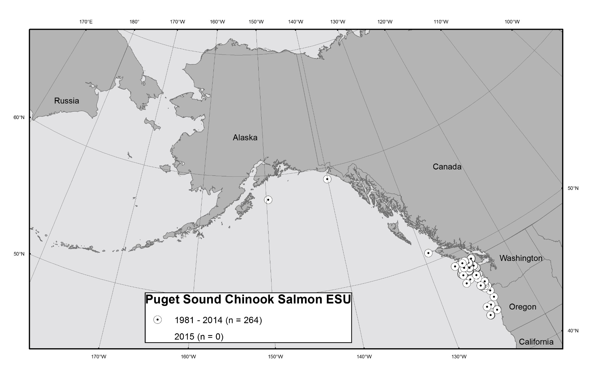

> {width="8.5in" height="5.483333333333333in"}**U.S. DEPARTMENT OF COMMERCE**
>
> **National Oceanic and Atmospheric Administration**
>
> **National Marine Fisheries Service**
>
> Please cite this document as:
>
> Krieger, J.R. and Eich, A.M. 2021. Seabird Bycatch Estimates for Alaska Groundfish Fisheries: 2020. U.S.
>
> Department of Commerce, NOAA Technical Memorandum NMFS-F/AKR-25, 40 p.
>
> [10.25923/a0fb-nt02]{.ul}.
>
> [Accessibility of this Document]{.ul}: Every effort has been made to make this document accessible to individuals of all abilities and compliant with Section 508 of the Rehabilitation Act. The complexity of this document may make access difficult for some. If you encounter information that you cannot access or use, please email us at Alaska.webmaster\@noaa.gov or call us at 907-586-7228 so that we may assist you.
>
> Contents

[Figures 3](#figures)

[Tables 4](#tables)

[Introduction 5](#introduction)

[Species of Interest 5](#species-of-interest)

[Groundfish and Halibut Seabird Working Group 6](#groundfish-and-halibut-seabird-working-group)

[Data Sources and Estimation Methods 6](#data-sources-and-estimation-methods)

[Data Sources 6](#data-sources)

[Estimation Methods 7](#estimation-methods)

[Results and Discussion 9](#results-and-discussion)

[All Gear Types and Fisheries 9](#all-gear-types-and-fisheries)

[Albatross 10](#albatross)

[Demersal Longline Gear 11](#demersal-longline-gear)

[Trawl Gear 12](#trawl-gear)

[Pot Gear 13](#pot-gear)

[Annual Variation 13](#annual-variation)

[Fisheries 14](#fisheries)

[Acknowledgments 14](#acknowledgments)

[References 16](#references)

[Figures 19](#figures-1)

[Tables 26](#tables-1)

## Figures 

> **Figure 1** Boundary areas of Bering Sea, Aleutian Islands, and Gulf of Alaska reporting areas. Aleutian
>
> Islands includes areas 541 through 543, Bering Sea includes areas north of the Alaska Peninsula, and Gulf
>
> of Alaska includes areas south of the Alaska Peninsula. \...\...\...\...\...\...\...\...\...\...\...\...\...\...\...\...\...\...\...\...\...\...\...\...\...\..... 19
>
> **Figure 2** Seabird bycatch in Alaska groundfish fisheries (demersal longline, trawl, and pot) from 1993 through 2020 and halibut fisheries from 2013 through 2020, noting bycatch estimates for all birds (left indices; black triangles) and for albatrosses only (right indices; hollow circles). Note the difference in scale. Different data analysis methodologies were used (data from 1993 through 2006 are described in Fitzgerald et al. 2008; data from 2007 through 2020 are from the CAS). The Observer Program was restructured for deployments beginning in 2013 where most C/Ps had 100 percent coverage, most CVs (over 40 ft. length overall) were randomly selected, and the Pacific halibut fleet was incorporated into the program. \...\...\..... 20 **Figure 3** Estimated seabird bycatch in Alaska groundfish and halibut fisheries from 2010 through 2020, separated by region (Aleutian Islands \[AI\], Bering Sea \[BS\], and Gulf of Alaska \[GOA\]; halibut fisheries 2013
>
> through 2020 only). \...\...\...\...\...\...\...\...\...\...\...\...\...\...\...\...\...\...\...\...\...\...\...\...\...\...\...\...\...\...\...\...\...\...\...\...\...\...\...\...\...\...\...\...\.... 21
>
> **Figure 4** Estimated proportions of species / species groups of seabird bycatch in Alaska groundfish and halibut fisheries from 2011 through 2020 (halibut fisheries 2013 through 2020 only). \...\...\...\...\...\...\...\...\...\..... 22 **Figure 5** Estimated albatross bycatch in Alaska groundfish and halibut fisheries from 2011 through 2020 (halibut fisheries 2013 through 2020 only). Blacked-footed albatross denoted by black triangles, Laysan albatross by gray circles, short-tailed albatross by charcoal triangles, and unidentified albatross by charcoal squares. \...\...\...\...\...\...\...\...\...\...\...\...\...\...\...\...\...\...\...\...\...\...\...\...\...\...\...\...\...\...\...\...\...\...\...\...\...\...\...\...\...\...\...\...\...\...\...\...\...\...\.... 23
>
> **Figure 6** Estimated seabird bycatch of Northern fulmar, shearwaters, and gulls in Alaska demersal longline groundfish and halibut fisheries, all fishery management plan areas combined, from 2011 through 2020
>
> (halibut fisheries 2013 through 2020 only). \...\...\...\...\...\...\...\...\...\...\...\...\...\...\...\...\...\...\...\...\...\...\...\...\...\...\...\...\...\...\...\...\... 24
>
> **Figure 7** Estimated seabird bycatch of Northern fulmar, shearwaters, and gulls in Alaska trawl fisheries, all fishery management plan areas combined, from 2011 through 2020. \...\...\...\...\...\...\...\...\...\...\...\...\...\...\...\...\...\...\... 25

## Tables 

> **Table 1** Species and species group categories used in this 2020 annual report^1^ and the individual species
>
> included in the grouping (adapted from Fitzgerald 2011a). \...\...\...\...\...\...\...\...\...\...\...\...\...\...\...\...\...\...\...\...\...\...\...\..... 26 **Table 2** Total estimated seabird bycatch in Alaska Federal groundfish and halibut fisheries, all gear types and fishery management plan areas combined, 2011 through 2020. Halibut fisheries 2013 through 2020
>
> only. The Observer Program was restructured in 2013. \...\...\...\...\...\...\...\...\...\...\...\...\...\...\...\...\...\...\...\...\...\...\...\...\...\..... 27 **Table 3** Summary of estimated seabird bycatch in the Alaska demersal longline groundfish and halibut fisheries, all fishery management plan areas combined, 2011 through 2020. Halibut fisheries 2013 through
>
> 2020 only. \...\...\...\...\...\...\...\...\...\...\...\...\...\...\...\...\...\...\...\...\...\...\...\...\...\...\...\...\...\...\...\...\...\...\...\...\...\...\...\...\...\...\...\...\...\...\...\...\...\.... 28
>
> **Table 4** Estimated seabird bycatch in the Aleutian Islands area demersal longline groundfish and halibut fisheries, 2011 through 2020. Halibut fisheries 2013 through 2020 only. \...\...\...\...\...\...\...\...\...\...\...\...\...\...\...\...\..... 29 **Table 5** Estimated seabird bycatch in the Bering Sea area demersal longline groundfish and halibut
>
> fisheries, 2011 through 2020. Halibut fisheries 2013 through 2020 only. \...\...\...\...\...\...\...\...\...\...\...\...\...\...\...\...\..... 29 **Table 6** Estimated seabird bycatch in the Gulf of Alaska area demersal longline groundfish and halibut fisheries, 2011 through 2020. Halibut fisheries 2013 through 2020 only. \...\...\...\...\...\...\...\...\...\...\...\...\...\...\...\...\.... 30 **Table 7** Estimated seabird bycatch in Alaska demersal longline groundfish and halibut fisheries, by catcher/processors (CP) and catcher vessels (CV), 2011 through 2020. Halibut fisheries 2013 through 2020
>
> only. \...\...\...\...\...\...\...\...\...\...\...\...\...\...\...\...\...\...\...\...\...\...\...\...\...\...\...\...\...\...\...\...\...\...\...\...\...\...\...\...\...\...\...\...\...\...\...\...\...\...\...\...\.... 31
>
> **Table 8** Estimated seabird bycatch for Alaska groundfish fisheries using pelagic and non-pelagic trawl gear combined, all fishery management plan areas combined, 2011 through 2020. \...\...\...\...\...\...\...\...\...\...\...\...\...\.... 33 **Table 9** Estimated seabird bycatch for the Alaska groundfish Bering Sea and Aleutian Islands fishery management plan area, pelagic and non-pelagic trawl gear combined, 2011 through 2020. \...\...\...\...\...\...\.... 34 **Table 10** Estimated seabird bycatch for the Alaska groundfish Gulf of Alaska fishery management plan area, pelagic and non-pelagic trawl gear combined, 2011 through 2020. \...\...\...\...\...\...\...\...\...\...\...\...\...\...\...\...\..... 34 **Table 11** Estimated seabird bycatch for the Alaska groundfish pelagic (P) and non-pelagic (N) trawl gear types across all fishery management plan areas, 2011 through 2020. \...\...\...\...\...\...\...\...\...\...\...\...\...\...\...\...\...\...\.... 35 **Table 12** Estimated seabird bycatch for pot vessels fishing groundfish in Alaska Federal waters, all fishery management plan areas combined, 2011 through 2020. \...\...\...\...\...\...\...\...\...\...\...\...\...\...\...\...\...\...\...\...\...\...\...\...\...\... 36 **Table 13** Estimated seabird bycatch in Alaska by groundfish and halibut fishery target, 2011 through 2020.
>
> Halibut fisheries 2013 through 2020 only. \...\...\...\...\...\...\...\...\...\...\...\...\...\...\...\...\...\...\...\...\...\...\...\...\...\...\...\...\...\...\...\...\..... 37

# Introduction 

> Seabirds are unintentionally caught in commercial fisheries and this unintentional catch is referred to as bycatch. Federal law in the U.S. requires bycatch be minimized to the extent practicable, and specific modifications to fishing gear, deployment of mitigation gear, and practices are required by Federal regulation to reduce seabird bycatch. Off Alaska, most seabird bycatch has historically occurred in fisheries using demersal longline (i.e., hook-and-line) gear. Since 2001, seabird bycatch has decreased in fisheries using demersal longline gear off Alaska as a result of initial volunteer efforts and subsequent good compliance with seabird avoidance regulations established in 2004 (Melvin et al. 2019). While the occurrence of seabird bycatch is now relatively rare given the level of commercial fishing effort off Alaska each year (average of 0.019 birds per 1,000 hooks from 2002 through 2015; Melvin et al. 2019), bycatch of seabirds does occur and remains an issue in the Federal fisheries off Alaska.
>
> NOAA's National Marine Fisheries Service (NMFS) annually updates estimates of seabirds caught as bycatch in commercial groundfish and halibut fisheries operating in Federal waters off Alaska. This annual report details seabird bycatch estimates by gear type for the years 2011 through 2020 and supplements the "Seabird Bycatch and Mitigation Efforts in Alaska Fisheries Summary Report: 2007 through 2015" (Eich et al. 2016), which has been supplemented previously with data through 2018 (Krieger et al. 2019) and
>
> 2019 (Krieger and Eich 2020). The focus of this report is to add and describe seabird bycatch data for 2020. This report presents bycatch estimates from the following gear types: demersal longline, pelagic trawl, non-pelagic trawl, and pot.[^1]

## Species of Interest 

> Albatross are a focal seabird species group for conservation efforts (for more information, see Eich et al.
>
> 2016). Short-tailed albatross (*Phoebastria albatrus*) are listed as endangered under the U.S. Endangered
>
> Species Act (Endangered Species Act). On rare occasion, the fisheries using demersal longline gear off Alaska incidentally catch short-tailed albatross. In 2020, NOAA Fisheries continued to monitor bycatch of short-tailed albatross to assess compliance with the incidental take limit established by the U.S. Fish and Wildlife Service (USFWS) in its 2015 biological opinion on the effects of the groundfish fisheries of Alaska on endangered short-tailed albatross (USFWS 2015). USFWS anticipated up to six short-tailed albatross could be reported taken bi-annually (every 2 years) as a result of groundfish fishing activities using demersal longline or trawl gear in the Bering Sea and Aleutian Islands (BSAI) and Gulf of Alaska (GOA) fishery management plan (FMP) areas (Figure 1).
>
> In addition to the endangered short-tailed albatross, two other species of albatross forage in waters off Alaska: Laysan (*Phoebastria immutabilis*) and black-footed (*Phoebastria nigripes*) albatross. Laysan and black-footed albatross are listed as birds of conservation concern by the USFWS (USFWS 2021), which means that without additional conservation efforts, they are likely to become candidates for listing under the Endangered Species Act.
>
> Aside from the endangered short-tailed albatross, two species of eider are also listed under the Endangered Species Act. These are the threatened spectacled eider (*Somateria fischeri*) and the threatened Alaska-breeding population of Steller's eider (*Polysticta stelleri*). Two other populations of Steller's eider occur in waters off Alaska but only the Alaska-breeding population is listed under the Endangered Species Act. Prior to 2019, there had been no reported takes of either the spectacled eider or the Alaska-breeding population of Steller's eider by vessels operating in Federal fisheries off Alaska. However, in October of 2019, twenty-two spectacled eider fatally collided with a demersal longline vessel. The, in March of 2020, one Steller's eider believed to be from the Alaska-breeding population, fatally collided with a different demersal longline vessel. Both of the vessels involved were from the groundfish fishery of the BSAI. Neither of these vessels were not fishing at the time of the bird strike mortality events.
>
> Since these birds were not taken by fishing gear, they are not included in the bycatch estimates provided in this report.
>
> Because of the take of threatened spectacled and Steller's eider, NMFS reinitiated formal consultation under section 7 of the ESA with USFWS to ensure that the BSAI and GOA groundfish fisheries are not likely to jeopardize the continued existence of either eider or adversely modify their designated critical habitat. In March of 2021, the USFWS finalized a new Biological Opinion (USFWS 2021) which supersedes the 2015 Biological Opinion. In their 2021 Biological Opinion, USFWS concluded that the GOA and BSAI groundfish fisheries are not likely to jeopardize the continued existence of the short-tailed albatross, spectacled eider, or the Alaska-breeding population of Steller's eider; nor are they likely to result in the destruction or adverse modification of critical habitat of the spectacled or Steller's eider. There is no designated critical habitat for the short-tailed albatross. In their 2021 Biological Opinion, USFWS anticipates take of up to six short-tailed albatross bi-annually (every 2 years); up to 25 spectacled eider every 4 years; and up to 3 Steller's eider from the Alaska-breeding population every 4 years in the BSAI and GOA FMP areas. These incidental take limits apply starting in 2021.

## Groundfish and Halibut Seabird Working Group 

> In 2016, NOAA Fisheries established the Alaska Groundfish and Halibut Seabird Working Group to continually review the best available scientific information for methods to reduce bycatch of albatross, eiders, and other seabirds in the Federal fisheries off Alaska. This group continues to meet annually to review seabird bycatch data and trends and to provide recommendations on bycatch mitigation strategies to the North Pacific Fisheries Management Council (NPFMC).
>
> A summary of the Working Group's recommendation is available here: [[https://meetings.npfmc.org/CommentReview/DownloadFile?p=4f99f426-71ac-4b25-8483c60a17b382b5.pdf&fileName=B3%20NMFS%20Seabird%20Report%20to%20Council%202021.pdf]{.ul}](https://meetings.npfmc.org/CommentReview/DownloadFile?p=4f99f426-71ac-4b25-8483-c60a17b382b5.pdf&fileName=B3%20NMFS%20Seabird%20Report%20to%20Council%202021.pdf)

## Data Sources and Estimation Methods 

### Data Sources 

> Total catch estimates in the groundfish and halibut fisheries off Alaska are generated by the NOAA Fisheries Alaska Region Catch Accounting System (CAS) and are used to manage approximately 600 separate groundfish quotas in the BSAI and GOA. The CAS uses information from multiple data sources to estimate total groundfish and halibut catch, including at-sea discards and estimates of bycatch of other species including seabirds. Data from the North Pacific Observer Program (Observer Program), dealer landing reports (also known as fish tickets), and at-sea production reports are combined to provide an integrated data source for fisheries monitoring and within season decision-making. The Observer Program is operated by the NOAA Fisheries Alaska Fisheries Science Center (AFSC), which trains and oversees deployment of NOAA Fisheries-certified observers (observers) to collect scientific information. Starting in 2018, NOAA Fisheries integrated electronic monitoring (EM) into the Observer Program and catcher vessels (CVs) that fish with demersal longline gear were able to request entry into the EM sampling stratum. The total number of CVs allowed into the EM stratum was determined by available funding, and vessels that opted into EM were not required to carry an observer (NMFS 2017a). At-sea monitoring data, from both observers and EM, are a key part of the CAS and allow the agency to gain an independent measurement of the amount and types of species caught in the commercial groundfish and halibut fisheries in the BSAI and GOA. Observer data provide a direct estimate of species composition and weight whereas data from EM provide a direct estimate of species counts that are converted to weight. NMFS uses both of these datasets to calculate catch and bycatch rates for unobserved fishing trips.
>
> Observers collect biological samples and fishery-dependent information on total catch and interactions with protected species (AFSC 2019), including fisheries bycatch of seabirds. The Observer Program structures at-sea observer and EM data collection using a statistically reliable sampling design (NMFS 2017a). The CAS uses these monitoring data to estimate seabird mortality, as described in the next section. Information collected by observers and EM provides the best available scientific information to manage the fisheries and to develop measures to minimize bycatch.
>
> Observers collect data on seabird bycatch as part of their species composition sample. Observers identify each bird in their sample to the most accurate species or species group that they can. Species identification is verified for bird specimens by debriefers and by specialists using a subsample of birds collected through the NOAA Pacific Seabird Necropsy Program (necropsy program). The necropsy program provides birds collected by observers from bycatch and ship strikes to a vendor to necropsy and verify the species identification. This process results in making corrections to misidentifications and also more refined species identifications where the observer used a species group code. NOAA Fisheries is currently revising previous species identifications based on the necropsy verifications. Once updated, future versions of this report will reflect these changes.
>
> As mentioned above, 2018 was the first year that EM was integrated into the Observer Program under regulations. In order to carry an EM system, the vessels must have a NMFS-approved Vessel Monitoring Plan (VMP) that describes how fishing operations on the vessel will be conducted and how the EM system and associated equipment are configured to meet the data collection objectives, including quantification of seabird bycatch. The VMP specifies that if any seabirds are caught, the vessel operators must hold seabirds up to the camera for 2 to 3 seconds and show certain key parts of the animal, such as the beak, to the hauler view camera.[^2] The ability to identify seabird species is similar when using observers and EM. During 2016 trials, experts found that protocols for displaying seabirds to the camera and the camera picture quality were sufficient for accurate seabird identification as long as fishermen adhered to the catch handling protocols (NMFS 2017b).
>
> There are known sampling biases in estimating total seabird mortality in some commercial fisheries off Alaska (Gilman et al. 2013; Fitzgerald et al. in prep; and summarized in Eich et al. 2016). For example, in the fisheries using longline gear, seabirds may fall off a hook underwater without being seen by the observer or camera. Seabirds that fall off the hooks alongside the vessel but are seen by the observer are recorded if they occur within the observer sampling period. On trawl vessels, "cryptic" (i.e., not readily detectable by observers) seabird mortality can occur due to interactions with gear such as the trawl warps, net-monitoring equipment (paravanes or third wires), or when seabirds are caught in the net wings and not landed with the fish catch. These mortalities are not included in the estimates reported below. The AFSC is evaluating these additional sources of mortality on trawl vessels, which can be three times the bycatch recorded in standard sampling, to determine the best method to monitor and include them in annual estimates (Fitzgerald et al. in prep).

### Estimation Methods 

> Since 1993, NOAA Fisheries has used two methods to estimate seabird bycatch for the groundfish fisheries.[^3] From 1993 through 2006, the AFSC produced the seabird bycatch estimates using a ratio estimator (Fitzgerald et al. 2008; AFSC 2014). Since 2007, NOAA Fisheries Alaska Region has produced bycatch estimates using a ratio estimator in the CAS (Cahalan et al. 2014).
>
> In the CAS, NMFS uses observer data to create seabird bycatch rates (a ratio of the estimated bycatch to the estimated total catch in sampled hauls). NMFS uses the observed information from the at-sea samples to create bycatch rates that are applied to unobserved trips. For trips that are unobserved, the bycatch rates are applied to industry supplied landings data of retained catch. Expanding on the observer and EM data that are available, the extrapolation from observed trips to unobserved trips is based on varying levels of aggregated data (post-stratification). NMFS matches data based on processing sector (e.g., catcher/processor \[C/P\] or CV), week, target fishery, gear, and Federal reporting area. Further detail on the estimation procedure, including levels of post-stratification, is available in Cahalan et al. (2014, 2010).
>
> At each data run, the CAS produces estimates based on current data sets, which may have changed over time. Data can be updated as a result of observer debriefing, data quality checks, and analysis. Examples of the possible changes in the underlying data are changes in species identification, deletion of data sets where data collection protocols were not properly followed, and changes in the landing or at-sea production reports where data entry errors were found. The totals in this report include some changes from previous reporting, and reflect the most recent data and estimates of the CAS. Additionally, within this report minor differences in the bycatch numbers may exist due to rounding.
>
> For estimation, analysis, and reporting of seabird bycatch, many of the species categories identified by observers and EM are consolidated into a larger group (Table 1). This includes codes for birds that are not identifiable further than the following species groups: albatross, shearwaters, storm petrel, murre, puffin, murrelet, alcid, and unidentified gulls. For example, in this report the species group "Gull" includes all Laridae except kittiwakes, which are reported separately due to conservation interest (especially for redlegged kittiwakes). Most gulls that observers or the necropsy program identify to a specific code within this group are glaucous, glaucous-winged, or herring gulls. Gulls that observers or the necropsy program could not identify to a specific code are classified as unidentified gulls. Many of the unidentified gulls were juveniles that lack certain distinguishing features present on adults. Other birds are a group of miscellaneous birds that could be identified as loon, grebe, seaduck, jaeger/skua, or tern. Unidentified birds could be any of the seabird species listed in Table 1 that the observer could not identify.
>
> The Observer Program was originally structured as an interim program with coverage requirements based on groundfish vessel overall length and processing volume. In 2013, the program was restructured and changes were implemented regarding the method to deploy observers, how observer coverage is funded, and which vessels and processors must have some or all of their operations observed (77 FR 70062, November 21, 2012).
>
> The restructured Observer Program has two features that affect seabird bycatch estimates. First, the vessel length-based observer coverage requirements were discontinued, and coverage is now based primarily on fishing mode (CV or C/P). Vessels are either in a full coverage category (C/Ps, with some exceptions) and take an observer on all trips, or in the partial coverage category (CVs, with some exceptions) and take observers on a random selection of their fishing trips. This was an important change that increased the statistical reliability of data collected by the program. Second, the restructured program expanded observer coverage to previously unobserved fisheries including the Pacific halibut longline fishery. Seabird bycatch data are now available from this fishery, whereas in previous years, small amounts of halibut fishery information were collected when an operator had both halibut and sablefish individual fishing quota.
>
> The seabird bycatch estimates from the CAS provide information on numbers of seabird bycatch per metric ton of catch, but this metric is different from how seabird bycatch rates are typically reported in other regions and countries. For example, the international reporting standard for fisheries using longline gear is seabird bycatch (number of birds) per 1,000 hooks. NOAA Fisheries is developing procedures that will report total effort and bycatch rates consistent with international reporting standards. Preliminary estimates of seabird bycatch per 1,000 hooks for Federal fisheries off Alaska using longline gear are provided by Melvin et al. (2019) and are also included in the summary bycatch report (Eich et al. 2016).

# Results and Discussion 

> This report estimates seabird mortality associated with Federal groundfish (2011 through 2020) and halibut (2013 through 2020) fisheries off Alaska and provides detailed descriptions of bycatch in 2020. First, seabird bycatch estimates are provided for all gear types (longline, trawl, and pot) in the combined GOA and BSAI FMP reporting areas (Figure 1) and for each year (Table 2). Second, demersal longline bycatch estimates for the combined BSAI and GOA FMP areas (Table 3) are provided, followed by demersal longline bycatch estimates separated by major FMP area (Table 4 through Table 6), and then separated by harvest sector (CVs) and catcher processors (C/Ps), (Table 7). Third, the combined trawl fleet bycatch is shown (Table 8). Fourth, trawl bycatch separated by FMP area (BSAI or GOA) and gear type (pelagic or non-pelagic) is shown (Table 9 through Table 11). Seabird bycatch estimates for the pot fishery are reported in Table 12. Finally, Table 13 provides seabird bycatch estimates by area, gear, target, and species or species group for 2011 through 2020.
>
> The following sections will highlight an overall decline in estimates of seabird bycatch in 2020. While a reduction in seabird bycatch in the Federal fisheries off Alaska is positive, several events occurred during the 2020 fishing seasons which may partially explain this reduction. As with many other things in 2020, the COVID-19 pandemic disrupted normal fishing operations throughout Federal fisheries. In Alaska, such disruptions included lost fishing days due to closures and stand-downs (primarily at the beginning of the pandemic) and reduced market prices for fish as restaurants and other buyers were not operating at normal levels and thus were not purchasing as much fish product. Less fishing effort would reduce the opportunities for interactions with seabirds and less seabird bycatch. Aside from disruptions associated with the COVID-19 pandemic, there was also a major shift in gear usage in the sablefish IFQ fishery that could partially explain the relatively low seabird bycatch estimates in 2020. Many vessels in this fishery shifted from using hook-and-line gear to using pot gear. This was primarily done in an attempt to avoid whale depredation on sablefish catch. Take of seabirds by pot gear is relatively rare compared to take of seabird by hook-and-line gear. If the sablefish IFQ fishery continues to increase its use of pot gear over hook-and-line gear, we would continue to expect to see reduced take of seabirds in this fishery.

## All Gear Types and Fisheries 

> The 2020 estimated seabird bycatch for the combined groundfish and halibut fisheries (3,462 birds) was about half of the 2011 through 2020 annual average of 6,607 birds. Figure 2 depicts estimated seabird bycatch in the groundfish fisheries from 1993 through 2020 using results from the two analytical methods noted above---the AFSC internal analysis for 1993 through 2006 (Fitzgerald et al. 2008) and the CAS for 2007 through 2019. The notable decline in estimated seabird bycatch in 2002 was due to the voluntary deployment of streamer lines as bird deterrents on many demersal longline vessels (Melvin et al. 2001). From 2002 through 2004, staff from NMFS and Washington Sea Grant partnered with commercial fishing vessels (primarily from the freezer longline fleet) to develop best practices and encourage industry buy in on the use of streamer lines as bird deterrents (for further detail, see Eich et al. 2016). Seabird mitigation measures for longline vessels were implemented by regulations in 2004 and required paired or single streamer lines for vessels larger than 55 feet length overall, which accounted for the vast majority of seabird bycatch.[^4] Since then, annual seabird bycatch in the fisheries using demersal longline gear has remained below 10,000 birds, dropping as low as 2,097 birds in 2014 (Table 3).
>
> In an analysis of 2020 seabird bycatch prepared for this paper, 89 percent (3,088 birds) of estimated seabird bycatch occurred in the Bering Sea (BS), 7 percent (249 birds) in the Aleutian Islands (AI), and 4 percent (125 birds) in the GOA. These proportions of seabird bycatch from the AI and GOA are lower compared to their 2011 through 2019 average proportions (AI \[10 percent\]; GOA \[14 percent\]). The proportion of seabird bycatch from the BS is higher than its 2011 through 2019 average (BS \[76 percent\]; Figure 3).
>
> Seabird bycatch estimates in 2020 were dominated by Northern fulmar (*Fulmarus glacialis*; 70 percent;
>
> Table 2; Figure 4). Estimated Northern fulmar bycatch (2,437 birds) decreased by 18 percent compared to 2019 (birds per year) and was 34 percent lower than the 2010 through 2019 average (3,677 birds per year). Fulmar bycatch has ranged from an estimated 33 percent to 70 percent of the total seabird bycatch from 2011 through 2020. Average annual mortality for Northern fulmar since 2011 has been 3,573 birds (2011 through 2020). When compared to the estimated total population size of Northern fulmar in Alaska of 1.4 million birds (Denlinger 2006), observed fisheries account for an annual mortality of 0.25 percent. While this mortality is low, local population depletions could occur if the mortality is colony-specific (Hatch et al. 2010).
>
> In 2020, shearwaters (Family Procellariidae) were the second most frequently occurring birds in the bycatch (10 percent; Table 2; Figure 4). Estimated shearwater bycatch in 2020 (333 birds) was more than 4 times lower than the 2011 through 2020 average (1,465 birds per year) and was 94 percent less compared to 2019 (5,272 birds); although 2019 represents the year with the highest estimated bycatch of shearwaters ever reported in the Federal fisheries off Alaska. The unusually high amount of shearwater bycatch in 2019 corresponds to the shearwater mortality event observed throughout Alaska that year. It is believed that changing ocean conditions have resulted in depleted food resources for shearwaters causing them to more aggressively target fishing vessels and fishing bait (USFWS 2019). Shearwater bycatch increased by an estimated 700 percent from 2018 to 2019. Shearwater bycatch has ranged from 3 percent to 58 percent of the total estimated seabird bycatch from 2011 through 2020. Average annual mortality for shearwaters from 2011 through 2020 has been 1,352 birds. The total worldwide population of shorttailed shearwaters (*Ardenna tenuirostris*) and sooty shearwaters (*Ardenna grisea*) is estimated to be 43 million birds (Denlinger 2006; calculated from Table 2 in Eich et al. 2016).
>
> In 2020, gulls (Family Laridae) were the third most frequently occurring birds in the bycatch (5 percent of total seabird bycatch; Table 2). Gull bycatch in 2020 (180 birds) was 18 percent lower than in 2019 (219 birds) and was 81 percent lower when compared to the 2011 through 2020 average (933 birds per year). Estimated gull bycatch has ranged from 2 percent to 30 percent of the total estimated seabird bycatch from 2011 through 2020. Looking at overall gull bycatch (all gear types, all areas combined) for the last 10 years (2011 through 2020), bycatch levels in 2020 are the lowest during this timeframe (Table 2). Of the various gull species, the estimated total number of breeders in Alaska is roughly 366,100 birds (calculated from Table 1 in Eich et al. 2016 where population numbers were taken from Birds of North America Online -- Species Accounts and Kushlan et al. 2002).

## Albatross 

> Two takes of short-tailed albatross were observed in the groundfish fisheries in 2020. Both takes occurred in the BSAI demersal longline fishery. The incidental take statement in the 2015 biological opinion on the groundfish fisheries, which was the current biological opinion when the takes occurred, anticipated the take of no more than six short-tailed albatross in a 2-year period (either by demersal longline or trawl; USFWS 2015). This was the first observed take of short-tailed albatross in the Alaska groundfish fisheries (either by demersal longline, trawl, or pot) since December 2014.
>
> No takes of short-tailed albatross were observed in the halibut fisheries in 2020. The incidental take statement in the 2018 biological opinion on the halibut fisheries anticipated the take of no more than two short-tailed albatross in a 2-year period (USFWS 2018). No observed take of short-tailed albatross has occurred in the halibut fisheries since 1987. Of note is that prior to the restructuring of the Observer program in 2013, the halibut fisheries had no at-sea coverage. Since 2013, at-sea coverage occurs on halibut vessels greater than or equal to 40 feet length overall.
>
> In addition to the endangered short-tailed albatross, there is also conservation concern for Laysan and black-footed albatross (USFWS 2021). In 2020, 124 albatross (82 black-footed albatross, 31 Laysan albatross, 11 short-tailed albatross; Figure 5) were estimated to have been caught in the fisheries off Alaska; a decrease of 75 percent compared to the 2011 through 2019 average (499 birds per year). Laysan albatross bycatch in 2020 was about 60 percent the bycatch estimated for this species in 2019 (218 birds), and was 80 percent lower than the 2011 through 2019 average (53 birds). Laysan albatross bycatch has ranged from less than 1 percent to 5 percent of total estimated seabird bycatch since 2011.
>
> Black-footed albatross were the fourth most frequently occurring seabird group in the bycatch (2 percent) in 2020. Black-footed albatross bycatch was 68 percent lower in 2020 (82 birds) compared to 2019 (218 birds). The estimated bycatch of black-footed albatross in 2020 was 75 percent less than the 2011 through 2019 average (325 birds per year). Black-footed albatross bycatch has ranged from 1 percent to 9 percent of the total estimated seabird bycatch from 2011 through 2020. The estimated population size of blackfooted albatross is 61,700 breeding pairs (Naughton et al. 2007).
>
> As noted earlier, the 2013 through 2020 bycatch estimates included two sources of seabird mortality that previous years did not include: vessels less than 60 feet length overall in the groundfish fisheries and the entire halibut fishery. Including these smaller vessels and the halibut fishery provides a better estimate of overall albatross bycatch in Alaska. The total estimated 2013 through 2020 albatross bycatch in the sablefish fisheries (3,423 birds) surpassed the estimated bycatch from the halibut fishery (720 birds). Although albatross habitat overlaps with both the sablefish and the halibut fisheries, albatross spend more time over continental shelf break and slope habitat (Fischer et al. 2009; Suryan et al. 2007), which is most commonly associated with the sablefish fishery; the halibut fishery generally occurs in shallower water on the shelf. Thus, more interactions between albatross and sablefish vessels would be expected, unless albatross or fisheries shift their distribution in a given year.

## Demersal Longline Gear 

> Based on standard observer sampling protocols, demersal longline gear in Alaska groundfish fisheries accounted for 75 percent of the estimated seabird mortality in 2020 (2,612 birds), which is comparatively lower than the average estimated seabird mortality from 2011 through 2019 (86 percent; range 76 to 96 percent).
>
> From 2011 through 2020, most of the estimated seabird bycatch from demersal longline gear occurred in the BS (95 percent) when compared to the AI (\< 1 percent) and GOA (4 percent). In fact, most (72 percent) of the total (all gear types) seabird bycatch off Alaska occurred in the BS from fisheries using demersal longline gear (range 55 percent to 86 percent from 2011 through 2020).
>
> Consistent with results for all gear types combined, most 2020 estimated seabird bycatch by demersal longline gear was Northern fulmar (61 percent; 1,599 birds); shearwaters (13 percent; 331 birds); and gulls (7 percent; 180 birds; Table 3; Figure 6). Estimated bycatch of all three species in 2020 was comparatively lower when compared to the 2011 through 2019 times series average.
>
> Estimates of seabird bycatch were also analyzed to compare C/Ps and CVs. In the BSAI, 95 percent of the total estimated seabird bycatch for vessels using demersal longline gear occurred on C/Ps in 2020 (2,469 birds). This is higher than the 2011 through 2019 time series average (81 percent; 6,013 birds; range of 2,097 to 9,491 birds). Northern fulmar, shearwaters, and gulls accounted for 96 percent of total estimated bycatch for C/Ps in 2020 (1,585; 325; 178 birds, respectively). On CVs, Northern fulmar (14 birds), shearwaters (7 birds) and gulls (2 birds) comprised 23 of the 25 total estimated seabirds caught as bycatch in the BSAI in 2020 (Table 7).
>
> In the GOA, 94 percent of total estimated seabird bycatch for vessels using longline gear occurred on CVs in 2020 (110 birds). This proportion is slightly more than the 2011 through 2019 average (776 birds; 89 percent). Black-footed albatross and Laysan albatross were the two most prevalent seabird bycatch species for CVs in 2020 (82 and 17 birds, respectively; Table 7). The difference in proportion of seabird bycatch attributed to CVs and C/Ps in the BSAI and GOA is most likely a reflection of the differences in fleet characteristics between the two regions. In the BSAI, most of the longline effort is by C/Ps targeting Pacific cod, while in the GOA, most of the longline effort is by CVs targeting halibut, sablefish, and Pacific cod. Of the demersal longline fisheries that have seabird bycatch, the bulk of recent fishery effort in the BS occurs in the Pacific cod demersal longline fleet (Eich et al. 2016). While this fishery accounts for the greatest amount of seabird bycatch (2011 through 2020 average of 67 percent), it captures an average of 10 percent of the total albatross bycatch. However, nearly all of the estimated short-tailed albatross takes that have occurred since 2003 have been in the Pacific cod demersal longline fleet (26 of the total 33 birds), while the remainder were taken in the Greenland turbot demersal longline fishery. As noted earlier, two endangered short-tailed albatross takes were reported by vessel using demersal longline gear in 2020 in the Federal fisheries off Alaska.

## Trawl Gear 

> When discussing seabird bycatch attributed to trawl gear, it is important to remember that standard observer sampling does not account for all seabird mortality. This discussion focuses only on the numbers reported, which were generated from the standard observer sample, i.e., birds caught in the codend part of the net and brought aboard the vessel. A number of efforts are underway to better understand the amount of cryptic mortality related to trawl vessels and how to properly extrapolate that to provide a fleet-wide estimate. Those numbers will be provided pending completion of ongoing research and development.
>
> Seabird bycatch related to trawl gear constitutes about 11 percent (range 4 to 24 percent) of the overall estimated 2011 through 2020 seabird bycatch (Table 2 and Table 8). The 2020 proportion of estimated seabird bycatch attributed to the fisheries using trawl gear is near the 2011 through 2020 time series average (12 percent, 403 birds).
>
> Similar to demersal longline gear described above, Northern fulmars dominate the estimated bycatch of seabirds from trawl gear in 2020 (391 birds; Table 8). Aside from Northern fulmar, the rest of the estimated bycatch from trawl gear in 2020 was comprised off 8 Laysan albatross, 3 kittiwake, and 1 shearwater. In general, Northern fulmars and shearwaters constitute the vast majority of the estimated seabird bycatch from trawl gear from 2011 through 2020. There is substantial inter-annual variability in bycatch of Northern fulmars (average of 343; range of 85 to 463 birds) and shearwaters (average of 327 birds; range of 1 to 1,781 birds) from 2011 through 2020 (Figure 7). The year 2019 was the first year in the current time series that kittiwakes (Genus *Rissa*) and puffin (Family Auk) bycatch occurred in this fishery. However, no kittiwakes or puffins were taken from the BSAI pelagic pollock trawl fishery in 2020.
>
> Most estimated seabird bycatch taken by trawl gear occurs in the BSAI, averaging 91 percent of the trawl seabird bycatch from 2011 through 2020 (Table 9). Only a minimal amount of estimated Northern fulmar, black-footed-albatross, and shearwater bycatch is attributed to trawl gear in the GOA from 2011 through 2020 (Table 10).
>
> Albatross bycatch in Alaska groundfish trawl fisheries is generally rare. No endangered short-tailed albatross takes by trawl gear have been observed in the Federal fisheries off Alaska. In 2012, a blackfooted albatross mortality was observed in the trawl fleet for the first time since monitoring started in 1993, extrapolating to an estimated 60 birds taken for the GOA fleet that year. In 2019, an estimated three Laysan albatross were taken in the trawl fishery (Table 13). In 2018, an unprecedented estimate of 93 Laysan albatross were taken in the rockfish fishery in the BSAI. From 2010 through 2017, no Laysan albatross were reported for any trawl fishery. The reasons for this high Laysan albatross estimate in 2018 are unclear. Prior to 2007, only Laysan or unidentified albatross were observed in fisheries using trawl gear (Fitzgerald et al. 2008). However, although not currently captured in the data, at-sea observers have reported Laysan albatross mortalities from gear collisions (primarily third wires) throughout the period reported here (Shannon Fitzgerald, AFSC, unpublished data). The AFSC is designing protocols to capture these reports and extrapolate the mortalities to the fleet.
>
> For 2011 through 2020, non-pelagic gear accounted for 73 percent of trawl seabird mortality. Northern fulmar bycatch was the only non-pelagic trawl gear bycatch in 2020 (295 birds; Table 11). For 2011 through 2020, seabird bycatch in pelagic trawl gear ranged from 41 to 232 birds (average of 116 birds). The first reported take of an albatross from pelagic trawl gear occurred in 2019 (3 Laysan albatross) and 8 more Laysan albatross were estimated to have been taken in 2020. From 2011 through 2020, most bycatch of all albatross, alcids, shearwaters, and gulls occurred in non-pelagic gear.
>
> Less than 3 percent of the total estimated seabird bycatch from trawl fisheries from 2011 through 2020 occurred on CVs (203 birds). As such, a comparison analysis of CVs to C/Ps was not done for this gear type.

## Pot Gear 

> Pot gear remains the gear type with the least amount of estimated seabird bycatch (Table 12),
>
> representing an average of 3.4 percent of the total seabird bycatch from all gear types from 2011 through 2020 (range 0.4 to 13 percent). The 2020 estimated seabird bycatch from pot gear (446 birds) was 13 percent of the total from all gear types, which was the highest in the 2011 through 2020 time series (next highest was 7 percent in 2017). Seabird bycatch in pot fisheries occurs primarily in the BSAI with very little bycatch occurring in the GOA. In 2020, almost all estimated seabird bycatch by pot gear occurred in the BSAI (437 birds). Northern fulmar was the only species of seabird reported as bycatch in 2020.
>
> Only Northern fulmars, shearwaters, gulls, murres, and alcids have been taken as bycatch in pot fisheries. It is likely that the surface and near-surface foragers (Northern fulmars, shearwaters, and gulls) are actually "captured" in pots as a result of collisions with pots on deck during bad weather, or by birds that wander into a pot on deck (as reported by several fisheries observers), and are then in the pot as it is deployed. Diving birds may enter a pot while it is fishing. Some of these birds may be regurgitated from Pacific cod stomachs when the cod are captured. Observers have collected full-sized murres (*Uria* spp.) and tufted puffins (*Fratercula cirrhata*) from Pacific cod stomachs and some seafood processing plants also reported small alcids in cod stomachs (Shannon Fitzgerald, AFSC, unpublished data), so this might be a contributing factor.

## Annual Variation 

> A variety of factors could influence seabird bycatch and our ability to accurately estimate bycatch, including changes in fishing behavior, implementation of seabird avoidance gear, observer coverage, seabird distribution, population trends, prey availability, and other ecosystem changes. Determining how seabird bycatch numbers and trends are linked to changes in ecosystem components is difficult because many covariates affect seabird bycatch rates, and the relative importance of the different factors is difficult to parse. Fishermen have noted in some years that the birds appear "starved" and attacked baited demersal longline gear more aggressively (AFSC 2014). This behavior was again observed in 2019 when large numbers of shearwaters were caught in demersal longline gear. This large uptick in shearwater bycatch corresponded to a large shearwater mortality event that occurred throughout Alaska. Upon examining the carcasses, starvation and possible exposure to saxitoxin (a biotoxin associated with paralytic shellfish poisoning) were determined to be the probable cause of death ([USFWS](https://www.fws.gov/alaska/stories/2019-alaska-seabird-die) 2019). In 2014, seabird bycatch off Alaska was at its lowest levels from 2011 through 2020 (driven by lower Northern fulmar and gull bycatch), and albatross numbers were well below the 2011 through 2019 annual average of 499 birds. This could indicate poor ocean conditions in the North Pacific as albatross traveled from their nesting grounds (Hawaiian Islands for black-footed and Laysan albatross) to Alaska.
>
> The demersal longline fishery off Alaska typically dominates the overall estimated bycatch trends, although we have previously noted the bias in reported trawl-related mortality estimates (for further detail, see Eich et al. 2016). Fishing effort has been known to shift based on market prices for particular fish species, the available harvest levels of target and non-target fish species, prohibited species limits, and weather. These changes in fishing effort can affect bycatch numbers.
>
> Seabird bycatch is best characterized as having a high degree of inter-annual variability (Figure 2). Large variation in overall seabird bycatch occurred between 2011 and 2020, with the largest change from one year to the next totaling 5,512 birds between 2019 and 2020 (Table 2). This variation could indicate changes in food availability rather than drastic changes in how well the fleet employs mitigation gear. A focused investigation of the relationship between food availability and seabird bycatch is needed and could inform management of poor ocean conditions if seabird bycatch rates (reported in real time) were substantially higher than normal.
>
> Variation in seabird bycatch is largely driven by the demersal longline fisheries. Bycatch of Northern fulmar, shearwaters, and gulls in the fisheries using demersal longline gear decreased from 2019 to 2020 (Northern fulmar from 2,636 birds to 1,599 birds, shearwaters from 3,492 birds to 332 birds, and gulls from 219 birds to 180 birds).
>
> An important aspect of these data is that the Observer Program was restructured in 2013 when observers were placed on vessels less than 60 feet length overall (for demersal longline, trawl, and pot gear) for the first time and also first began observing in the previously unobserved halibut fishery. The addition of observers to many vessels in the GOA contributed important data for our understanding of seabird bycatch patterns and quantities.
>
> Further reducing seabird bycatch is quite challenging given the already relatively rare nature of bycatch events. Dietrich and Fitzgerald (2010) found in an analysis of 35,148 Pacific cod demersal longline sets from 2004 to 2007 that the most common species caught as bycatch, the Northern fulmar, only occurred in 2.5 percent of all observed sets. Albatross, a focal species for conservation efforts, occurred in less than 0.1 percent of sets. However, given the vast size of the fishery, the total bycatch can add up to thousands of Northern fulmar or hundreds of albatross.

## Fisheries 

> Examining the three fisheries responsible for the majority of seabird bycatch---Pacific cod, sablefish, and halibut demersal longline---the average annual seabird bycatch for 2011 through 2019 was 5,037, 715, and
>
> 241 birds per year, respectively. In 2020, the Pacific cod, sablefish, and halibut demersal longline estimated seabird bycatch was quite reduced when compared to the 2011 through 2019 averages (2,924, 125, and 22 birds, respectively; Table 13).
>
> Focusing solely on the bycatch of albatross (unidentified, short-tailed, Laysan, and black-footed), the Pacific cod, sablefish, and halibut fisheries using demersal longline gear average 31, 342, and 103 albatross per year, respectively, for 2011 through 2020 (average for halibut fisheries calculated for 2013 through 2020). Seabird bycatch levels and rates are highly variable among years; however, sablefish has higher estimated albatross bycatch relative to other fisheries. Therefore, future conservation efforts for mitigating albatross bycatch should focus on the sablefish fleet for maximum benefit. For endangered species bycatch, the focus should remain on the Pacific cod fleet; however, the average estimated mortality (2011 through 2020) is about 2 short-tailed albatross per year. Takes of short-tailed albatross have not been observed in the sablefish fishery since the mid-1990s. The only other fishery with a shorttailed albatross take is the BSAI Greenland turbot fishery in which 2 short-tailed albatross were recorded taken in 2014 (only 1 bird was in the observer sample). When expanded by the CAS, the average estimated mortality (2011 through 2020) across the Greenland turbot fishery is less than 1 short-tailed albatross per year.

# Acknowledgments 

> Special thanks to the NOAA Fisheries North Pacific Observer Program, especially the observers who collect data on bycatch of marine species, including seabirds and all the staff who train, debrief, and complete quality control measures. In parallel, thanks are also given to the vessel and plant owners, officers, and crew who host observers and who also provide the fishery catch data. Many thanks to the NOAA Fisheries Alaska Regional Office Catch Accounting staff for generating seabird bycatch estimates. Earlier estimates were provided by Michael Perez of the AFSC Marine Mammal Laboratory. Thank you to the Alaska Groundfish and Halibut Seabird Working Group for your comments and insights. Thank you to the AFSC, USFWS, Washington Sea Grant, the commercial demersal longline industry, and other researchers for their seabird and fisheries bycatch mitigation work that has led to lower numbers of seabird bycatch on Alaska fishing grounds. NOAA Fisheries reviewers include Shannon Fitzgerald and Phil Ganz. Thank you to the fishermen, fishing communities, and fishing industry for their continued dedication to minimizing interactions between commercial fisheries and seabirds.

## References 

> Alaska Fisheries Science Center (AFSC). 2020. 2021 Observer Sampling Manual. Fisheries Monitoring and
>
> Analysis Division, North Pacific Groundfish Observer Program. AFSC, 7600 Sand Point Way N.E., Seattle, Washington, 98115. Available at [https://www.fisheries.noaa.gov/resource/document/north-pacificobserver-sampling-manual.](https://www.fisheries.noaa.gov/resource/document/north-pacific-observer-sampling-manual)
>
> AFSC. 2014. Seabird Bycatch Estimates for Alaskan Groundfish Fisheries, 2007--2013. Resource Ecology and
>
> Ecosystem Management Division. Unpublished report. Alaska Fisheries Science Center, 7600 Sand Point

Way N.E., Seattle, Washington, 98115. Available at [http://www.afsc.noaa.gov/REFM/REEM/Seabirds/Seabird%20bycatch%202007%20to%202013_Alaskan%2 0Gndfish_Dec2014.pdf.](http://www.afsc.noaa.gov/REFM/REEM/Seabirds/Seabird%20bycatch%202007%20to%202013_Alaskan%20Gndfish_Dec2014.pdf)

> Birds of North America Online. Accessed September 6, 2016. Species Accounts. Cornell Lab of Ornithology and the American Ornithologists' Union. Available at [http://bna.birds.cornell.edu/bna/species.](http://bna.birds.cornell.edu/bna/species)
>
> Cahalan, J., J. Gasper, and J. Mondragon. 2014. Catch sampling and estimation in the Federal groundfish fisheries off Alaska, 2015 edition. U.S. Dep. Commer., NOAA Tech. Memo. NMFS-AFSC-286, 46 p. Available at [http://www.afsc.noaa.gov/Publications/AFSC-TM/NOAA-TM-AFSC-286.pdf.](http://www.afsc.noaa.gov/Publications/AFSC-TM/NOAA-TM-AFSC-286.pdf)
>
> Cahalan, J., J. Mondragon, and J. Gasper. 2010. Catch sampling and estimation in the Federal groundfish fisheries off Alaska. U.S. Dep. Commer., NOAA Tech. Memo. NMFS-AFSC-205, 42 p. Available at [http://www.afsc.noaa.gov/Publications/AFSC-TM/NOAA-TM-AFSC-205.pdf.](http://www.afsc.noaa.gov/Publications/AFSC-TM/NOAA-TM-AFSC-205.pdf)
>
> Denlinger, L.M. 2006. Alaska Seabird Information Series. Unpubl. Rept., U.S. Fish and Wildlife Service, Migratory Bird Management, Nongame Program, Anchorage, AK. Available at [https://www.fws.gov/alaska/mbsp/mbm/seabirds/pdf/asis_complete.pdf.](https://www.fws.gov/alaska/mbsp/mbm/seabirds/pdf/asis_complete.pdf)
>
> Dietrich, K. S., and S. M. Fitzgerald. 2010. Analysis of 2004--2007 vessel-specific seabird bycatch data in Alaska demersal longline fisheries. AFSC Processed Rep. 2010-04, 52 p. Alaska Fish. Sci. Cent., NOAA, Natl. Mar. Fish. Serv., 7600 Sand Point Way NE, Seattle WA 98115.
>
> Eich, A.M., K.R. Mabry, S.K. Wright, and S.M. Fitzgerald. 2016. Seabird bycatch and mitigation efforts in Alaska fisheries summary report: 2007 through 2015. U.S. Dep. Commer., NOAA Tech. Memo. NMFSF/AKR-12, 47 p. Available at [https://repository.library.noaa.gov/view/noaa/12695.](https://repository.library.noaa.gov/view/noaa/12695)
>
> Fischer, K.N., R.M. Suryan, D.D. Roby, and G.R. Balogh. 2009. Post-breeding season distribution of blackfooted and Laysan albatrosses satellite-tagged in Alaska: Inter-specific differences in spatial overlap with North Pacific fisheries. Biological Conservation 142:751--760.
>
> Fitzgerald, S. 2011a. Preliminary Seabird bycatch Estimates for Alaskan Groundfish Fisheries, 2007--2010.

Available at [https://www.afsc.noaa.gov/refm/reem/Seabirds/Seabird%20bycatch%202007%20to%202010_Alaskan%2 0Gndfish_PrelimReport.pdf.](https://www.afsc.noaa.gov/refm/reem/Seabirds/Seabird%20bycatch%202007%20to%202010_Alaskan%20Gndfish_PrelimReport.pdf)

> Fitzgerald, S. 2011b. Seabird Bycatch Estimation for Alaskan Groundfish Fisheries: Comparative results of two estimation procedures for 2004-2006. Alaska Fisheries Science Center REFM Division, Resource Ecology and Ecosystem Monitoring Program. Unpublished report.
>
> Fitzgerald, S.M., K.D. Dietrich, and A. Wicklund. In prep. Seabird bycatch in Alaska trawl fisheries -- A comparison of observer sampling protocols. Unpublished data available from NOAA Fisheries Alaska Fisheries Science Center, shannon.fitzgerald\@noaa.gov.
>
> Fitzgerald, S.M., M.A. Perez, and K.S. Rivera. 2008. Summary of seabird bycatch in Alaskan groundfish fisheries, 1993 through 2006. In Boldt, J. (Ed). Ecosystem considerations 2009, Appendix C of the Bering Sea/Aleutian Islands and Gulf of Alaska groundfish stock assessment and fishery evaluation report. Anchorage, AK: North Pacific Management Council. pp. 116--141.
>
> Gilman, E., P. Suuronen, M. Hall, and S. Kennelly. 2013. Causes and methods to estimate cryptic sources of fishing mortality. Journal of Fish Biology 83:766--803.
>
> Hatch, S. A., V. A. Gill, and D. M. Mulcahy. 2010. Individual and colony-specific wintering areas of Pacific northern fulmars (*Fulmarus glacialis*). Canadian Journal of Fisheries and Aquatic Sciences 67:386--400.
>
> Krieger, J.R. and Eich, A.M. 2020. Seabird Bycatch Estimates for Alaska Groundfish Fisheries: 2019. U.S.
>
> Department of Commerce, NOAA Technical Memorandum NMFS-F/AKR-24, 40 p. doi:10.25923/jtgr-1595.
>
> Krieger, J.R., Eich, A.M., and S.M. Fitzgerald. 2019. Seabird Bycatch Estimates for Alaska Groundfish Fisheries: 2018. U.S. Department of Commerce, NOAA Technical Memorandum NMFS-F/AKR-20, 41 p.
>
> doi:10.25923/hqft-we56.
>
> Kushlan, J.A., M.J. Steinkamp, K.C. Parsons, J. Capp, M.A. Cruz, M. Coulter, I. Davidson, L. Dickson, N.
>
> Edelson, R. Elliot, R.M. Erwin, S. Hatch, S. Kress, R. Milko, S. Miller, K. Mills, R. Paul, R. Phillips, J. E. Saliva, B.
>
> Sydeman, J. Trapp, J. Wheeler, and K. Wohl. 2002. Waterbird Conservation for the Americas: The North American Waterbird Conservation Plan, version 1. Waterbird Conservation for the Americas, Washington, D.C.
>
> Melvin, E.F., K.S. Dietrich, R.M. Suryan, and S.M. Fitzgerald. 2019. Lessons from seabird conservation in Alaskan longline fisheries. Conservation Biology DOI: 10.1111/cobi.13288.
>
> Melvin, E.F., J.K. Parrish, K.S. Dietrich, and O.S. Hamel. 2001. Solutions to seabird bycatch in Alaska's demersal longline fisheries. Project A/FP-7, WSG-AS 01-01, Washington Sea Grant. Available at [https://wsg.washington.edu/wordpress/wp-content/uploads/publications/Solutions-to-seabird-bycatchin-Alaska\'s-demersal-longline-fisheries.pdf.](https://wsg.washington.edu/wordpress/wp-content/uploads/publications/Solutions-to-seabird-bycatch-in-Alaska's-demersal-longline-fisheries.pdf) Accessed October 31, 2016.
>
> NMFS (National Marine Fisheries Service). 2017a. 2018 Annual Deployment Plan for Observers and
>
> Electronic Monitoring in the Groundfish and Halibut Fisheries off Alaska. National Oceanic and Atmospheric Administration, 709 West 9th Street. Juneau, Alaska 99802. Available at <https://alaskafisheries.noaa.gov/sites/default/files/final_2018_adp.pdf>
>
> NMFS. 2017b. Final Environmental Assessment/ Regulatory Impact Review for Amendment 114 to the
>
> Fishery Management Plan for Groundfish of the Bering Sea and Aleutian Islands Management Area and Amendment 104 to the Fishery Management Plan for Groundfish of the Gulf of Alaska, and Regulatory Amendments: Analysis to Integrate Electronic Monitoring into the North Pacific Observer Program. National Oceanic and Atmospheric Administration, 709 West 9th Street. Juneau, Alaska 99802. Available online at [https://www.fisheries.noaa.gov/resource/document/ea-rir-amendment-114-fmp-groundfishbsai-and-amendment-104-fmp-groundfish-goa-and](https://www.fisheries.noaa.gov/resource/document/ea-rir-amendment-114-fmp-groundfish-bsai-and-amendment-104-fmp-groundfish-goa-and)
>
> Naughton, M.B, M.D. Romano, T.S. Zimmerman. 2007. A Conservation Action Plan for Black-footed Albatross (*Phoebastria nigripes*) and Laysan Albatross (*P. immutabilis*), Ver. 1.0. Available at [https://www.fws.gov/pacific/migratorybirds/pdf/Albatross%20Action%20Plan%20ver.1.0.pdf.](https://www.fws.gov/pacific/migratorybirds/pdf/Albatross%20Action%20Plan%20ver.1.0.pdf)
>
> Suryan, R.M., K.S. Dietrich, E.F. Melvin, G.R. Balogh, F. Sato, and K. Ozaki. 2007. Migratory routes of shorttailed albatrosses: Use of exclusive economic zones of North Pacific Rim countries and spatial overlap with commercial fisheries in Alaska. Biological Conservation 137:450-460.
>
> U.S. Fish and Wildlife Service (USFWS). 2021. Biological Opinion on the Proposed Modification of the EPA General Permit AKG524000 for Offshore Seafood Processors in Alaska and on the NMFS Groundfish Fishery
>
> for the Gulf of Alaska, Bering Sea, and Aleutians Islands. Anchorage, AK: 80 pp. Available at [https://www.fws.gov/alaska/pages/endangered-species-program/consultation-endangered-species.](https://www.fws.gov/alaska/pages/endangered-species-program/consultation-endangered-species)
>
> USFWS. 2021. Birds of Conservation Concern 2021. United States Department of Interior, U.S. Fish and Wildlife Service, Migratory Birds, Falls Church, Virginia. Available at: [[https://www.fws.gov/migratorybirds/pdf/management/birds-of-conservation-concern-2021.pdf]{.ul}.](https://www.fws.gov/migratorybirds/pdf/management/birds-of-conservation-concern-2021.pdf)

USFWS. 2019. 2019 Alaska Seabird Die-Off. Available at [https://www.fws.gov/alaska/stories/2019-alaskaseabird-die](https://www.fws.gov/alaska/stories/2019-alaska-seabird-die)

> USFWS. 2018. Biological Opinion for the Effects of the Pacific Halibut Fisheries in Waters off Alaska on the Endangered Short-tailed Albatross (*Phoebastria albatrus*). Anchorage, AK: 50 pp. Available at [https://www.fws.gov/alaska/pages/endangered-species-program/consultation-endangered-species.](https://www.fws.gov/alaska/pages/endangered-species-program/consultation-endangered-species)
>
> USFWS. 2015. Biological Opinion for the Effects of the Fishery Management Plans for the Gulf of Alaska and Bering Sea/Aleutian Islands Groundfish Fisheries and the State of Alaska Parallel Groundfish Fisheries, December 2015. 49 pp. Available at [https://www.fws.gov/alaska/pages/endangered-speciesprogram/consultation-endangered-species.](https://www.fws.gov/alaska/pages/endangered-species-program/consultation-endangered-species)

## Figures 

{width="6.499998906386701in" height="5.022916666666666in"}

> **Figure 1** Boundary areas of Bering Sea, Aleutian Islands, and Gulf of Alaska reporting areas. Aleutian Islands includes areas 541 through 543, Bering Sea includes areas north of the Alaska Peninsula, and Gulf of Alaska includes areas south of the Alaska Peninsula.
>
> {width="6.666667760279965in" height="4.1466666666666665in"}
>
> **Figure 2** Seabird bycatch in Alaska groundfish fisheries (demersal longline, trawl, and pot) from 1993 through 2020 and halibut fisheries from 2013 through 2020, noting bycatch estimates for all birds (left indices; black triangles) and for albatrosses only (right indices; hollow circles). Note the difference in scale. Different data analysis methodologies were used (data from 1993 through 2006 are described in Fitzgerald et al. 2008; data from 2007 through 2020 are from the CAS). The Observer Program was restructured for deployments beginning in 2013 where most C/Ps had 100 percent coverage, most CVs (over 40 feet length overall) were randomly selected, and the Pacific halibut fleet was incorporated into the program.
>
> **Figure 3** Estimated seabird bycatch in Alaska groundfish and halibut fisheries from 2010 through 2020, separated by region (Aleutian Islands \[AI\], Bering Sea \[BS\], and Gulf of Alaska \[GOA\]; halibut fisheries 2013 through 2020 only).

{width="9.637919947506562in" height="5.312152230971129in"}

> **Figure 4** Estimated proportions of species / species groups of seabird bycatch in Alaska groundfish and halibut fisheries from 2011 through 2020 (halibut fisheries 2013 through 2020 only).

22

> **Figure 5** Estimated albatross bycatch in Alaska groundfish and halibut fisheries from 2011 through 2020 (halibut fisheries 2013 through 2020 only). Blacked-footed albatross denoted by black triangles, Laysan albatross by gray circles, short-tailed albatross by charcoal triangles, and unidentified albatross by charcoal squares.

2011 2012 2013 2014 2015 2016 2017 2018 2019 2020

> **Figure 6** Estimated seabird bycatch of Northern fulmar, shearwaters, and gulls in Alaska demersal longline groundfish and halibut fisheries, all fishery management plan areas combined, from 2011 through 2020 (halibut fisheries 2013 through 2020 only).

2011 2012 2013 2014 2015 2016 2017 2018 2019 2020

> **Figure 7** Estimated seabird bycatch of Northern fulmar, shearwaters, and gulls in Alaska trawl fisheries, all fishery management plan areas combined, from 2011 through 2020.

## Tables 

> **Table 1** Species and species group categories used in this 2020 annual report[^5] and the individual species included in the grouping (adapted from Fitzgerald 2011a).

+-----------------------------+--------------------------------------------+--------------------------------------------------+
| > **Species/species Group** | **Includes**                               | **Classification**                               |
+=============================+============================================+==================================================+
| > Short-tailed Albatross    | n/a                                        | *Phoebastria albatrus*                           |
+-----------------------------+--------------------------------------------+--------------------------------------------------+
| > Laysan Albatross          | n/a                                        | *Phoebastria immutabilis*                        |
+-----------------------------+--------------------------------------------+--------------------------------------------------+
| > Black-footed Albatross    | n/a                                        | *Phoebastria nigripes*                           |
+-----------------------------+--------------------------------------------+--------------------------------------------------+
| > Unidentified Albatross    | Short-tailed, Laysan, or black-footed      | n/a                                              |
+-----------------------------+--------------------------------------------+--------------------------------------------------+
| > Northern Fulmar           | n/a                                        | *Fulmarus glacialis*                             |
+-----------------------------+--------------------------------------------+--------------------------------------------------+
| > Shearwaters               | Unidentified shearwater                    | *Ardenna or Puffinus* spp.                       |
+-----------------------------+--------------------------------------------+--------------------------------------------------+
|                             | Sooty shearwater                           | *Ardenna grisea*                                 |
+-----------------------------+--------------------------------------------+--------------------------------------------------+
|                             | Short-tailed shearwater                    | *Ardenna tenuirostris*                           |
+-----------------------------+--------------------------------------------+--------------------------------------------------+
|                             | Unidentified dark shearwater               | *A. grisea or A. tenuirostris*                   |
+-----------------------------+--------------------------------------------+--------------------------------------------------+
|                             | Unidentified procellarid                   | Procellariiformes                                |
+-----------------------------+--------------------------------------------+--------------------------------------------------+
| > Storm Petrel              | Unidentified storm petrel                  | *Oceanodroma* spp.                               |
+-----------------------------+--------------------------------------------+--------------------------------------------------+
|                             | Fork-tailed storm petrel                   | *O. furcata*                                     |
+-----------------------------+--------------------------------------------+--------------------------------------------------+
|                             | Leach's storm petrel                       | *O. leucorhoa*                                   |
+-----------------------------+--------------------------------------------+--------------------------------------------------+
| > Gull                      | Unidentified gull                          | Family Laridae                                   |
+-----------------------------+--------------------------------------------+--------------------------------------------------+
|                             | Herring gull                               | *Larus argentatus*                               |
+-----------------------------+--------------------------------------------+--------------------------------------------------+
|                             | Glaucous gull                              | *Larus hyperboreus*                              |
+-----------------------------+--------------------------------------------+--------------------------------------------------+
|                             | Glaucous-winged gull                       | *Larus glaucescens*                              |
+-----------------------------+--------------------------------------------+--------------------------------------------------+
|                             | Slaty-backed gull                          | *Larus schistisagus*                             |
+-----------------------------+--------------------------------------------+--------------------------------------------------+
|                             | Gull hybrid                                | Family Laridae                                   |
+-----------------------------+--------------------------------------------+--------------------------------------------------+
| > Kittiwake                 | Black-footed kittiwake                     | *Rissa tridactyla*                               |
+-----------------------------+--------------------------------------------+--------------------------------------------------+
|                             | Red-legged kittiwake                       | *Rissa brevirostris*                             |
+-----------------------------+--------------------------------------------+--------------------------------------------------+
| > Murre                     | Unidentified murre                         | *Uria* spp.                                      |
+-----------------------------+--------------------------------------------+--------------------------------------------------+
|                             | Thick-billed murre                         | *Uria lomvia*                                    |
+-----------------------------+--------------------------------------------+--------------------------------------------------+
|                             | Common murre                               | *Uria aalge*                                     |
+-----------------------------+--------------------------------------------+--------------------------------------------------+
| > Puffin                    | Unidentified puffin                        | *Fratercula* spp.                                |
+-----------------------------+--------------------------------------------+--------------------------------------------------+
|                             | Horned puffin                              | *F. corniculata*                                 |
+-----------------------------+--------------------------------------------+--------------------------------------------------+
|                             | Tufted puffin                              | *F. cirrhata*                                    |
+-----------------------------+--------------------------------------------+--------------------------------------------------+
|                             | Rhinoceros auklet                          | *Cerorhinca monocerata*                          |
+-----------------------------+--------------------------------------------+--------------------------------------------------+
| > Auklet                    | > Unidentified murrelet or auklet murrelet | > Several genera *Brachyramphus* spp. and others |
|                             |                                            |                                                  |
|                             | Auklet                                     | *Aethia* spp. and others                         |
+-----------------------------+--------------------------------------------+--------------------------------------------------+
| > Other Alcid               | Unidentified alcid                         | *Alcidae*                                        |
+-----------------------------+--------------------------------------------+--------------------------------------------------+
|                             | Guillemot, unidentified                    | *Cepphus* spp.                                   |
+-----------------------------+--------------------------------------------+--------------------------------------------------+
| > Cormorant                 | Unidentified cormorant                     | Family Phalacrocoracidae                         |
+-----------------------------+--------------------------------------------+--------------------------------------------------+
|                             | Pelagic cormorant                          | *Phalacrocorax pelagicus*                        |
+-----------------------------+--------------------------------------------+--------------------------------------------------+
|                             | Red-faced cormorant                        | *Phalacrocorax urile*                            |
+-----------------------------+--------------------------------------------+--------------------------------------------------+
| > Other Birds               | Miscellaneous birds -- could include:      | Family Gaviidae                                  |
|                             |                                            |                                                  |
|                             | Loon                                       |                                                  |
+-----------------------------+--------------------------------------------+--------------------------------------------------+
|                             | Grebe                                      | Family Podicipedidae                             |
+-----------------------------+--------------------------------------------+--------------------------------------------------+
|                             | Seaduck                                    | Family Anatidae                                  |
+-----------------------------+--------------------------------------------+--------------------------------------------------+
|                             | Jaeger/skua                                | Family Stercorariidae                            |
+-----------------------------+--------------------------------------------+--------------------------------------------------+
|                             | Tern                                       | Family Sternidae                                 |
+-----------------------------+--------------------------------------------+--------------------------------------------------+
| > Unidentified Seabird      | All of the above                           |                                                  |
+-----------------------------+--------------------------------------------+--------------------------------------------------+

> **Table 2** Total estimated seabird bycatch in Alaska Federal groundfish and halibut fisheries, all gear types and fishery management plan areas combined, 2011 through 2020. Halibut fisheries 2013 through 2020 only. The Observer Program was restructured in 2013.

**Species/ Species Group 2011 2012 2013 2014 2015 2016 2017 2018 2019 2020 Ann Avg.**

<table><thead><tr class="header"><th><blockquote>
Unidentified Albatross
</blockquote></th><th><blockquote>
10
</blockquote></th><th><blockquote>
0
</blockquote></th><th><blockquote>
28
</blockquote></th><th><blockquote>
35
</blockquote></th><th><blockquote>
0
</blockquote></th><th><blockquote>
0
</blockquote></th><th><blockquote>
0
</blockquote></th><th><blockquote>
53
</blockquote></th><th><blockquote>
19
</blockquote></th><th><blockquote>
0
</blockquote></th><th><blockquote>
15
</blockquote></th></tr></thead><tbody><tr class="odd"><td><blockquote>
Short-tailed Albatross
</blockquote></td><td><blockquote>
5
</blockquote></td><td><blockquote>
0
</blockquote></td><td><blockquote>
0
</blockquote></td><td><blockquote>
11
</blockquote></td><td><blockquote>
0
</blockquote></td><td><blockquote>
0
</blockquote></td><td><blockquote>
0
</blockquote></td><td><blockquote>
0
</blockquote></td><td><blockquote>
0
</blockquote></td><td><blockquote>
11
</blockquote></td><td><blockquote>
3
</blockquote></td></tr><tr class="even"><td><blockquote>
Laysan Albatross
</blockquote></td><td><blockquote>
210
</blockquote></td><td><blockquote>
140
</blockquote></td><td><blockquote>
207
</blockquote></td><td><blockquote>
97
</blockquote></td><td><blockquote>
222
</blockquote></td><td><blockquote>
129
</blockquote></td><td><blockquote>
72
</blockquote></td><td><blockquote>
279
</blockquote></td><td><blockquote>
53
</blockquote></td><td><blockquote>
31
</blockquote></td><td><blockquote>
144
</blockquote></td></tr><tr class="odd"><td><blockquote>
Black-footed Albatross
</blockquote></td><td><blockquote>
221
</blockquote></td><td><blockquote>
142
</blockquote></td><td><blockquote>
449
</blockquote></td><td><blockquote>
283
</blockquote></td><td><blockquote>
363
</blockquote></td><td><blockquote>
200
</blockquote></td><td><blockquote>
733
</blockquote></td><td><blockquote>
312
</blockquote></td><td><blockquote>
218
</blockquote></td><td><blockquote>
82
</blockquote></td><td><blockquote>
300
</blockquote></td></tr><tr class="even"><td><blockquote>
Northern Fulmars
</blockquote></td><td><blockquote>
6,347
</blockquote></td><td>3,149</td><td>3,196</td><td><blockquote>
822
</blockquote></td><td>3,547</td><td><blockquote>
5,455
</blockquote></td><td>4,443</td><td>3,359</td><td>2,975</td><td>2,437</td><td><blockquote>
3,573
</blockquote></td></tr><tr class="odd"><td><blockquote>
Shearwaters
</blockquote></td><td><blockquote>
265
</blockquote></td><td><blockquote>
575
</blockquote></td><td><blockquote>
253
</blockquote></td><td><blockquote>
187
</blockquote></td><td><blockquote>
392
</blockquote></td><td><blockquote>
3,416
</blockquote></td><td>2,102</td><td><blockquote>
726
</blockquote></td><td>5,272</td><td><blockquote>
333
</blockquote></td><td><blockquote>
1,352
</blockquote></td></tr><tr class="even"><td><blockquote>
Storm Petrels
</blockquote></td><td><blockquote>
0
</blockquote></td><td><blockquote>
0
</blockquote></td><td><blockquote>
0
</blockquote></td><td><blockquote>
0
</blockquote></td><td><blockquote>
0
</blockquote></td><td><blockquote>
0
</blockquote></td><td><blockquote>
0
</blockquote></td><td><blockquote>
177
</blockquote></td><td><blockquote>
0
</blockquote></td><td><blockquote>
0
</blockquote></td><td><blockquote>
18
</blockquote></td></tr><tr class="odd"><td><blockquote>
Gulls
</blockquote></td><td><blockquote>
2,264
</blockquote></td><td><blockquote>
899
</blockquote></td><td><blockquote>
639
</blockquote></td><td><blockquote>
742
</blockquote></td><td>1,258</td><td><blockquote>
762
</blockquote></td><td><blockquote>
858
</blockquote></td><td><blockquote>
753
</blockquote></td><td><blockquote>
219
</blockquote></td><td><blockquote>
180
</blockquote></td><td><blockquote>
857
</blockquote></td></tr><tr class="even"><td><blockquote>
Kittiwakes
</blockquote></td><td><blockquote>
6
</blockquote></td><td><blockquote>
5
</blockquote></td><td><blockquote>
3
</blockquote></td><td><blockquote>
4
</blockquote></td><td><blockquote>
12
</blockquote></td><td><blockquote>
5
</blockquote></td><td><blockquote>
22
</blockquote></td><td><blockquote>
37
</blockquote></td><td><blockquote>
18
</blockquote></td><td><blockquote>
24
</blockquote></td><td><blockquote>
14
</blockquote></td></tr><tr class="odd"><td><blockquote>
Murres
</blockquote></td><td><blockquote>
14
</blockquote></td><td><blockquote>
6
</blockquote></td><td><blockquote>
3
</blockquote></td><td><blockquote>
47
</blockquote></td><td><blockquote>
0
</blockquote></td><td><blockquote>
58
</blockquote></td><td><blockquote>
10
</blockquote></td><td><blockquote>
0
</blockquote></td><td><blockquote>
0
</blockquote></td><td><blockquote>
6
</blockquote></td><td><blockquote>
14
</blockquote></td></tr><tr class="even"><td><blockquote>
Puffins
</blockquote></td><td><blockquote>
0
</blockquote></td><td><blockquote>
0
</blockquote></td><td><blockquote>
0
</blockquote></td><td><blockquote>
0
</blockquote></td><td><blockquote>
0
</blockquote></td><td><blockquote>
10
</blockquote></td><td><blockquote>
0
</blockquote></td><td><blockquote>
0
</blockquote></td><td><blockquote>
0
</blockquote></td><td><blockquote>
0
</blockquote></td><td><blockquote>
1
</blockquote></td></tr><tr class="odd"><td><blockquote>
Auklets
</blockquote></td><td><blockquote>
0
</blockquote></td><td><blockquote>
7
</blockquote></td><td><blockquote>
4
</blockquote></td><td><blockquote>
107
</blockquote></td><td><blockquote>
69
</blockquote></td><td><blockquote>
29
</blockquote></td><td><blockquote>
36
</blockquote></td><td><blockquote>
102
</blockquote></td><td><blockquote>
0
</blockquote></td><td><blockquote>
0
</blockquote></td><td><blockquote>
35
</blockquote></td></tr><tr class="even"><td><blockquote>
Other Alcids
</blockquote></td><td><blockquote>
0
</blockquote></td><td><blockquote>
0
</blockquote></td><td><blockquote>
0
</blockquote></td><td><blockquote>
39
</blockquote></td><td><blockquote>
0
</blockquote></td><td><blockquote>
0
</blockquote></td><td><blockquote>
0
</blockquote></td><td><blockquote>
6
</blockquote></td><td><blockquote>
6
</blockquote></td><td><blockquote>
0
</blockquote></td><td><blockquote>
5
</blockquote></td></tr><tr class="odd"><td><blockquote>
Cormorants
</blockquote></td><td><blockquote>
0
</blockquote></td><td><blockquote>
0
</blockquote></td><td><blockquote>
0
</blockquote></td><td><blockquote>
0
</blockquote></td><td><blockquote>
31
</blockquote></td><td><blockquote>
0
</blockquote></td><td><blockquote>
0
</blockquote></td><td><blockquote>
0
</blockquote></td><td><blockquote>
0
</blockquote></td><td><blockquote>
0
</blockquote></td><td><blockquote>
3
</blockquote></td></tr><tr class="even"><td><blockquote>
Other Birds
</blockquote></td><td><blockquote>
0
</blockquote></td><td><blockquote>
0
</blockquote></td><td><blockquote>
0
</blockquote></td><td><blockquote>
0
</blockquote></td><td><blockquote>
0
</blockquote></td><td><blockquote>
0
</blockquote></td><td><blockquote>
63
</blockquote></td><td><blockquote>
0
</blockquote></td><td><blockquote>
0
</blockquote></td><td><blockquote>
8
</blockquote></td><td><blockquote>
7
</blockquote></td></tr><tr class="odd"><td><blockquote>
Unidentified Birds
</blockquote></td><td><blockquote>
387
</blockquote></td><td><blockquote>
343
</blockquote></td><td><blockquote>
293
</blockquote></td><td><blockquote>
78
</blockquote></td><td><blockquote>
193
</blockquote></td><td></td><td><blockquote>
292
</blockquote></td><td><blockquote>
221
</blockquote></td><td><blockquote>
193
</blockquote></td><td><blockquote>
350
</blockquote></td><td><blockquote>
265
</blockquote></td></tr></tbody></table>

Grand Total 9,729 5,267 5,075 2,452 6,087 {width="0.6666666666666666in" height="0.3433333333333333in"} 8,631 6,025 8,974 3,462 6,607

27

> **Table 3** Summary of estimated seabird bycatch in the Alaska demersal longline groundfish and halibut fisheries, all fishery management plan areas combined, 2011 through 2020. Halibut fisheries 2013 through 2020 only.

**Species/ Species Group 2011 2012 2013 2014 2015 2016 2017 2018 2019 2020 Ann Avg.**

<table><thead><tr class="header"><th><blockquote>
Unidentified Albatross
</blockquote></th><th><blockquote>
10
</blockquote></th><th><blockquote>
0
</blockquote></th><th><blockquote>
28
</blockquote></th><th><blockquote>
35
</blockquote></th><th><blockquote>
0
</blockquote></th><th><blockquote>
0
</blockquote></th><th><blockquote>
0
</blockquote></th><th><blockquote>
53
</blockquote></th><th><blockquote>
19
</blockquote></th><th><blockquote>
0
</blockquote></th><th>15</th></tr></thead><tbody><tr class="odd"><td><blockquote>
Short-tailed Albatross
</blockquote></td><td><blockquote>
5
</blockquote></td><td><blockquote>
0
</blockquote></td><td><blockquote>
0
</blockquote></td><td><blockquote>
11
</blockquote></td><td><blockquote>
0
</blockquote></td><td><blockquote>
0
</blockquote></td><td><blockquote>
0
</blockquote></td><td><blockquote>
0
</blockquote></td><td><blockquote>
0
</blockquote></td><td><blockquote>
11
</blockquote></td><td>3</td></tr><tr class="even"><td><blockquote>
Laysan Albatross
</blockquote></td><td><blockquote>
210
</blockquote></td><td><blockquote>
140
</blockquote></td><td><blockquote>
207
</blockquote></td><td><blockquote>
97
</blockquote></td><td><blockquote>
222
</blockquote></td><td><blockquote>
129
</blockquote></td><td><blockquote>
72
</blockquote></td><td><blockquote>
199
</blockquote></td><td><blockquote>
50
</blockquote></td><td><blockquote>
23
</blockquote></td><td>135</td></tr><tr class="odd"><td><blockquote>
Black-footed Albatross
</blockquote></td><td><blockquote>
221
</blockquote></td><td><blockquote>
82
</blockquote></td><td><blockquote>
449
</blockquote></td><td><blockquote>
283
</blockquote></td><td><blockquote>
363
</blockquote></td><td><blockquote>
200
</blockquote></td><td><blockquote>
733
</blockquote></td><td><blockquote>
312
</blockquote></td><td><blockquote>
218
</blockquote></td><td><blockquote>
82
</blockquote></td><td>294</td></tr><tr class="even"><td><blockquote>
Northern Fulmar
</blockquote></td><td><blockquote>
5,981
</blockquote></td><td>2,852</td><td>2,713</td><td><blockquote>
726
</blockquote></td><td>2,887</td><td>4,914</td><td>3,477</td><td>2,885</td><td>2,636</td><td>1,599</td><td><blockquote>
3,067
</blockquote></td></tr><tr class="odd"><td><blockquote>
Shearwaters
</blockquote></td><td><blockquote>
262
</blockquote></td><td><blockquote>
519
</blockquote></td><td><blockquote>
195
</blockquote></td><td><blockquote>
115
</blockquote></td><td><blockquote>
330
</blockquote></td><td>3,178</td><td>1,174</td><td><blockquote>
594
</blockquote></td><td>3,492</td><td><blockquote>
332
</blockquote></td><td><blockquote>
1,019
</blockquote></td></tr><tr class="even"><td><blockquote>
Gulls
</blockquote></td><td><blockquote>
2,263
</blockquote></td><td><blockquote>
899
</blockquote></td><td><blockquote>
636
</blockquote></td><td><blockquote>
742
</blockquote></td><td>1,258</td><td><blockquote>
759
</blockquote></td><td><blockquote>
858
</blockquote></td><td><blockquote>
752
</blockquote></td><td><blockquote>
219
</blockquote></td><td><blockquote>
180
</blockquote></td><td>857</td></tr><tr class="odd"><td><blockquote>
Kittiwakes
</blockquote></td><td><blockquote>
6
</blockquote></td><td><blockquote>
5
</blockquote></td><td><blockquote>
3
</blockquote></td><td><blockquote>
4
</blockquote></td><td><blockquote>
12
</blockquote></td><td><blockquote>
5
</blockquote></td><td><blockquote>
22
</blockquote></td><td><blockquote>
37
</blockquote></td><td><blockquote>
5
</blockquote></td><td><blockquote>
21
</blockquote></td><td>12</td></tr><tr class="even"><td><blockquote>
Murres
</blockquote></td><td><blockquote>
0
</blockquote></td><td><blockquote>
6
</blockquote></td><td><blockquote>
0
</blockquote></td><td><blockquote>
0
</blockquote></td><td><blockquote>
0
</blockquote></td><td><blockquote>
0
</blockquote></td><td><blockquote>
9
</blockquote></td><td><blockquote>
0
</blockquote></td><td><blockquote>
0
</blockquote></td><td><blockquote>
6
</blockquote></td><td>2</td></tr><tr class="odd"><td><blockquote>
Puffins
</blockquote></td><td><blockquote>
0
</blockquote></td><td><blockquote>
0
</blockquote></td><td><blockquote>
0
</blockquote></td><td><blockquote>
0
</blockquote></td><td><blockquote>
0
</blockquote></td><td><blockquote>
10
</blockquote></td><td><blockquote>
0
</blockquote></td><td><blockquote>
0
</blockquote></td><td><blockquote>
0
</blockquote></td><td><blockquote>
0
</blockquote></td><td>1</td></tr><tr class="even"><td><blockquote>
Auklets
</blockquote></td><td><blockquote>
0
</blockquote></td><td><blockquote>
7
</blockquote></td><td><blockquote>
0
</blockquote></td><td><blockquote>
6
</blockquote></td><td><blockquote>
11
</blockquote></td><td><blockquote>
0
</blockquote></td><td><blockquote>
0
</blockquote></td><td><blockquote>
0
</blockquote></td><td><blockquote>
0
</blockquote></td><td><blockquote>
0
</blockquote></td><td>2</td></tr><tr class="odd"><td><blockquote>
Other Alcids
</blockquote></td><td><blockquote>
0
</blockquote></td><td><blockquote>
0
</blockquote></td><td><blockquote>
0
</blockquote></td><td><blockquote>
0
</blockquote></td><td><blockquote>
0
</blockquote></td><td><blockquote>
0
</blockquote></td><td><blockquote>
0
</blockquote></td><td><blockquote>
6
</blockquote></td><td><blockquote>
0
</blockquote></td><td><blockquote>
0
</blockquote></td><td>1</td></tr><tr class="even"><td><blockquote>
Cormorants
</blockquote></td><td><blockquote>
0
</blockquote></td><td><blockquote>
0
</blockquote></td><td><blockquote>
0
</blockquote></td><td><blockquote>
0
</blockquote></td><td><blockquote>
28
</blockquote></td><td><blockquote>
0
</blockquote></td><td><blockquote>
0
</blockquote></td><td><blockquote>
0
</blockquote></td><td><blockquote>
0
</blockquote></td><td><blockquote>
0
</blockquote></td><td>3</td></tr><tr class="odd"><td><blockquote>
Other Birds
</blockquote></td><td><blockquote>
0
</blockquote></td><td><blockquote>
0
</blockquote></td><td><blockquote>
0
</blockquote></td><td><blockquote>
0
</blockquote></td><td><blockquote>
0
</blockquote></td><td><blockquote>
0
</blockquote></td><td><blockquote>
0
</blockquote></td><td><blockquote>
0
</blockquote></td><td><blockquote>
0
</blockquote></td><td><blockquote>
8
</blockquote></td><td>1</td></tr><tr class="even"><td><blockquote>
Unidentified Birds
</blockquote></td><td><blockquote>
387
</blockquote></td><td><blockquote>
323
</blockquote></td><td><blockquote>
293
</blockquote></td><td><blockquote>
78
</blockquote></td><td><blockquote>
187
</blockquote></td><td><blockquote>
295
</blockquote></td><td><blockquote>
292
</blockquote></td><td><blockquote>
221
</blockquote></td><td><blockquote>
190
</blockquote></td><td><blockquote>
350
</blockquote></td><td>262</td></tr></tbody></table>

Grand Total 9,345 4,834 4,525 2,097 5,299 9,491 6,638 5,059 6,830 2,612 5,673

> **Table 4** Estimated seabird bycatch in the Aleutian Islands area demersal longline groundfish and halibut fisheries, 2011 through 2020. Halibut fisheries 2013 through 2020 only.

**Species/ Species Group 2011 2012 2013 2014 2015 2016 2017 2018 2019 2020 Ann Avg.**

<table><thead><tr class="header"><th><blockquote>
Unidentified Albatross
</blockquote></th><th><blockquote>
0
</blockquote></th><th><blockquote>
0
</blockquote></th><th><blockquote>
0
</blockquote></th><th><blockquote>
22
</blockquote></th><th><blockquote>
0
</blockquote></th><th><blockquote>
0
</blockquote></th><th><blockquote>
0
</blockquote></th><th><blockquote>
0
</blockquote></th><th><blockquote>
0
</blockquote></th><th><blockquote>
0
</blockquote></th><th>2</th></tr></thead><tbody><tr class="odd"><td><blockquote>
Laysan Albatross
</blockquote></td><td><blockquote>
12
</blockquote></td><td><blockquote>
76
</blockquote></td><td>118</td><td><blockquote>
48
</blockquote></td><td><blockquote>
150
</blockquote></td><td><blockquote>
68
</blockquote></td><td><blockquote>
14
</blockquote></td><td><blockquote>
58
</blockquote></td><td><blockquote>
0
</blockquote></td><td><blockquote>
0
</blockquote></td><td><blockquote>
54
</blockquote></td></tr><tr class="even"><td><blockquote>
Black-footed Albatross
</blockquote></td><td><blockquote>
5
</blockquote></td><td><blockquote>
0
</blockquote></td><td><blockquote>
12
</blockquote></td><td><blockquote>
9
</blockquote></td><td><blockquote>
19
</blockquote></td><td><blockquote>
0
</blockquote></td><td><blockquote>
0
</blockquote></td><td><blockquote>
0
</blockquote></td><td><blockquote>
0
</blockquote></td><td><blockquote>
0
</blockquote></td><td>5</td></tr><tr class="odd"><td><blockquote>
Northern Fulmars
</blockquote></td><td><blockquote>
21
</blockquote></td><td><blockquote>
7
</blockquote></td><td><blockquote>
31
</blockquote></td><td><blockquote>
55
</blockquote></td><td><blockquote>
882
</blockquote></td><td><blockquote>
17
</blockquote></td><td>167</td><td><blockquote>
2
</blockquote></td><td><blockquote>
7
</blockquote></td><td><blockquote>
2
</blockquote></td><td><blockquote>
119
</blockquote></td></tr><tr class="even"><td><blockquote>
Shearwaters
</blockquote></td><td><blockquote>
43
</blockquote></td><td><blockquote>
16
</blockquote></td><td><blockquote>
0
</blockquote></td><td><blockquote>
68
</blockquote></td><td><blockquote>
23
</blockquote></td><td><blockquote>
0
</blockquote></td><td>128</td><td><blockquote>
0
</blockquote></td><td>260</td><td><blockquote>
1
</blockquote></td><td><blockquote>
54
</blockquote></td></tr><tr class="odd"><td><blockquote>
Gulls
</blockquote></td><td><blockquote>
22
</blockquote></td><td><blockquote>
12
</blockquote></td><td><blockquote>
29
</blockquote></td><td><blockquote>
0
</blockquote></td><td><blockquote>
37
</blockquote></td><td><blockquote>
4
</blockquote></td><td><blockquote>
0
</blockquote></td><td><blockquote>
0
</blockquote></td><td><blockquote>
5
</blockquote></td><td><blockquote>
4
</blockquote></td><td><blockquote>
11
</blockquote></td></tr><tr class="even"><td><blockquote>
Unidentified Birds
</blockquote></td><td><blockquote>
0
</blockquote></td><td><blockquote>
0
</blockquote></td><td><blockquote>
9
</blockquote></td><td><blockquote>
0
</blockquote></td><td><blockquote>
0
</blockquote></td><td><blockquote>
0
</blockquote></td><td><blockquote>
10
</blockquote></td><td><blockquote>
5
</blockquote></td><td><blockquote>
0
</blockquote></td><td><blockquote>
0
</blockquote></td><td>2</td></tr></tbody></table>

Grand Total 103 111 199 202 1,111 89 319 65 272 7 248

> **Table 5** Estimated seabird bycatch in the Bering Sea area demersal longline groundfish and halibut fisheries, 2011 through 2020. Halibut fisheries 2013 through 2020 only.

**Species/ Species Group 2011 2012 2013 2014 2015 2016 2017 2018 2019 2020 Ann Avg.**

<table><thead><tr class="header"><th><blockquote>
Unidentified
</blockquote></th><th><blockquote>
377
</blockquote></th><th><blockquote>
290
</blockquote></th><th><blockquote>
277
</blockquote></th><th><blockquote>
78
</blockquote></th><th><blockquote>
154
</blockquote></th><th><blockquote>
277
</blockquote></th><th><blockquote>
268
</blockquote></th><th><blockquote>
78
</blockquote></th><th><blockquote>
190
</blockquote></th><th><blockquote>
339
</blockquote></th><th><blockquote>
233
</blockquote></th></tr></thead><tbody><tr class="odd"><td><blockquote>
Unidentified Albatross
</blockquote></td><td><blockquote>
0
</blockquote></td><td><blockquote>
0
</blockquote></td><td><blockquote>
0
</blockquote></td><td><blockquote>
13
</blockquote></td><td><blockquote>
0
</blockquote></td><td><blockquote>
0
</blockquote></td><td><blockquote>
0
</blockquote></td><td><blockquote>
0
</blockquote></td><td><blockquote>
0
</blockquote></td><td><blockquote>
0
</blockquote></td><td>1</td></tr><tr class="even"><td><blockquote>
Short-tailed Albatross
</blockquote></td><td><blockquote>
5
</blockquote></td><td><blockquote>
0
</blockquote></td><td><blockquote>
0
</blockquote></td><td><blockquote>
11
</blockquote></td><td><blockquote>
0
</blockquote></td><td><blockquote>
0
</blockquote></td><td><blockquote>
0
</blockquote></td><td><blockquote>
0
</blockquote></td><td><blockquote>
0
</blockquote></td><td><blockquote>
11
</blockquote></td><td>3</td></tr><tr class="odd"><td><blockquote>
Laysan Albatross
</blockquote></td><td><blockquote>
30
</blockquote></td><td><blockquote>
48
</blockquote></td><td><blockquote>
20
</blockquote></td><td><blockquote>
17
</blockquote></td><td><blockquote>
31
</blockquote></td><td><blockquote>
18
</blockquote></td><td><blockquote>
33
</blockquote></td><td><blockquote>
113
</blockquote></td><td><blockquote>
11
</blockquote></td><td><blockquote>
0
</blockquote></td><td>32</td></tr><tr class="even"><td><blockquote>
Black-footed Albatross
</blockquote></td><td><blockquote>
2
</blockquote></td><td><blockquote>
0
</blockquote></td><td><blockquote>
1
</blockquote></td><td><blockquote>
9
</blockquote></td><td><blockquote>
2
</blockquote></td><td><blockquote>
0
</blockquote></td><td><blockquote>
0
</blockquote></td><td><blockquote>
0
</blockquote></td><td><blockquote>
0
</blockquote></td><td><blockquote>
0
</blockquote></td><td>1</td></tr><tr class="odd"><td><blockquote>
Northern Fulmars
</blockquote></td><td><blockquote>
5,131
</blockquote></td><td>2,827</td><td>2,565</td><td><blockquote>
641
</blockquote></td><td>1,917</td><td>4,793</td><td>2,978</td><td>2,739</td><td>2,526</td><td>1,597</td><td><blockquote>
2,771
</blockquote></td></tr><tr class="even"><td><blockquote>
Shearwaters
</blockquote></td><td><blockquote>
157
</blockquote></td><td><blockquote>
504
</blockquote></td><td><blockquote>
195
</blockquote></td><td><blockquote>
47
</blockquote></td><td><blockquote>
301
</blockquote></td><td>3,158</td><td><blockquote>
997
</blockquote></td><td><blockquote>
547
</blockquote></td><td>3,192</td><td><blockquote>
331
</blockquote></td><td><blockquote>
943
</blockquote></td></tr><tr class="odd"><td><blockquote>
Gulls
</blockquote></td><td><blockquote>
1,650
</blockquote></td><td><blockquote>
835
</blockquote></td><td><blockquote>
467
</blockquote></td><td><blockquote>
584
</blockquote></td><td><blockquote>
941
</blockquote></td><td><blockquote>
602
</blockquote></td><td><blockquote>
373
</blockquote></td><td><blockquote>
512
</blockquote></td><td><blockquote>
157
</blockquote></td><td><blockquote>
175
</blockquote></td><td><blockquote>
630
</blockquote></td></tr><tr class="even"><td><blockquote>
Kittiwakes
</blockquote></td><td><blockquote>
6
</blockquote></td><td><blockquote>
5
</blockquote></td><td><blockquote>
3
</blockquote></td><td><blockquote>
4
</blockquote></td><td><blockquote>
12
</blockquote></td><td><blockquote>
5
</blockquote></td><td><blockquote>
22
</blockquote></td><td><blockquote>
37
</blockquote></td><td><blockquote>
5
</blockquote></td><td><blockquote>
21
</blockquote></td><td>12</td></tr><tr class="odd"><td><blockquote>
Murres
</blockquote></td><td><blockquote>
0
</blockquote></td><td><blockquote>
6
</blockquote></td><td><blockquote>
0
</blockquote></td><td><blockquote>
0
</blockquote></td><td><blockquote>
0
</blockquote></td><td><blockquote>
0
</blockquote></td><td><blockquote>
9
</blockquote></td><td><blockquote>
0
</blockquote></td><td><blockquote>
0
</blockquote></td><td><blockquote>
6
</blockquote></td><td>2</td></tr><tr class="even"><td><blockquote>
Puffins
</blockquote></td><td><blockquote>
0
</blockquote></td><td><blockquote>
0
</blockquote></td><td><blockquote>
0
</blockquote></td><td><blockquote>
0
</blockquote></td><td><blockquote>
0
</blockquote></td><td><blockquote>
10
</blockquote></td><td><blockquote>
0
</blockquote></td><td><blockquote>
0
</blockquote></td><td><blockquote>
0
</blockquote></td><td><blockquote>
0
</blockquote></td><td>1</td></tr><tr class="odd"><td><blockquote>
Auklets
</blockquote></td><td><blockquote>
0
</blockquote></td><td><blockquote>
7
</blockquote></td><td><blockquote>
0
</blockquote></td><td><blockquote>
0
</blockquote></td><td><blockquote>
0
</blockquote></td><td><blockquote>
0
</blockquote></td><td><blockquote>
0
</blockquote></td><td><blockquote>
0
</blockquote></td><td><blockquote>
0
</blockquote></td><td><blockquote>
0
</blockquote></td><td>1</td></tr><tr class="even"><td><blockquote>
Other Alcids
</blockquote></td><td><blockquote>
0
</blockquote></td><td><blockquote>
0
</blockquote></td><td><blockquote>
0
</blockquote></td><td><blockquote>
0
</blockquote></td><td><blockquote>
0
</blockquote></td><td><blockquote>
0
</blockquote></td><td><blockquote>
0
</blockquote></td><td><blockquote>
6
</blockquote></td><td><blockquote>
0
</blockquote></td><td><blockquote>
0
</blockquote></td><td>1</td></tr><tr class="odd"><td><blockquote>
Other Birds
</blockquote></td><td><blockquote>
0
</blockquote></td><td><blockquote>
0
</blockquote></td><td><blockquote>
0
</blockquote></td><td><blockquote>
0
</blockquote></td><td><blockquote>
0
</blockquote></td><td><blockquote>
0
</blockquote></td><td><blockquote>
0
</blockquote></td><td><blockquote>
0
</blockquote></td><td><blockquote>
0
</blockquote></td><td><blockquote>
8
</blockquote></td><td>1</td></tr></tbody></table>

Grand Total 7,358 4,522 3,528 1,404 3,358 8,863 4,680 4,032 6,081 2,488 4,631

> **Table 6** Estimated seabird bycatch in the Gulf of Alaska area demersal longline groundfish and halibut fisheries, 2011 through 2020. Halibut fisheries 2013 through 2020 only.

**Species/ Species Group 2011 2012 2013 2014 2015 2016 2017 2018 2019 2020 Ann Avg.**

<table><thead><tr class="header"><th><blockquote>
Unidentified Albatross
</blockquote></th><th><blockquote>
10
</blockquote></th><th><blockquote>
0
</blockquote></th><th><blockquote>
28
</blockquote></th><th><blockquote>
0
</blockquote></th><th><blockquote>
0
</blockquote></th><th><blockquote>
0
</blockquote></th><th><blockquote>
0
</blockquote></th><th><blockquote>
53
</blockquote></th><th><blockquote>
19
</blockquote></th><th><blockquote>
0
</blockquote></th><th><blockquote>
11
</blockquote></th></tr></thead><tbody><tr class="odd"><td><blockquote>
Laysan Albatross
</blockquote></td><td><blockquote>
168
</blockquote></td><td><blockquote>
17
</blockquote></td><td><blockquote>
69
</blockquote></td><td><blockquote>
32
</blockquote></td><td><blockquote>
41
</blockquote></td><td><blockquote>
44
</blockquote></td><td><blockquote>
25
</blockquote></td><td><blockquote>
27
</blockquote></td><td><blockquote>
39
</blockquote></td><td><blockquote>
23
</blockquote></td><td><blockquote>
49
</blockquote></td></tr><tr class="even"><td><blockquote>
Black-footed Albatross
</blockquote></td><td><blockquote>
214
</blockquote></td><td><blockquote>
82
</blockquote></td><td>436</td><td>265</td><td>342</td><td>200</td><td><blockquote>
733
</blockquote></td><td>312</td><td>218</td><td><blockquote>
82
</blockquote></td><td><blockquote>
288
</blockquote></td></tr><tr class="odd"><td><blockquote>
Northern Fulmar
</blockquote></td><td><blockquote>
829
</blockquote></td><td><blockquote>
19
</blockquote></td><td>117</td><td><blockquote>
31
</blockquote></td><td><blockquote>
88
</blockquote></td><td>104</td><td><blockquote>
332
</blockquote></td><td>145</td><td>103</td><td><blockquote>
0
</blockquote></td><td><blockquote>
177
</blockquote></td></tr><tr class="even"><td><blockquote>
Shearwaters
</blockquote></td><td><blockquote>
63
</blockquote></td><td><blockquote>
0
</blockquote></td><td><blockquote>
0
</blockquote></td><td><blockquote>
0
</blockquote></td><td><blockquote>
5
</blockquote></td><td><blockquote>
19
</blockquote></td><td><blockquote>
48
</blockquote></td><td><blockquote>
46
</blockquote></td><td><blockquote>
40
</blockquote></td><td><blockquote>
0
</blockquote></td><td><blockquote>
22
</blockquote></td></tr><tr class="odd"><td><blockquote>
Gull
</blockquote></td><td><blockquote>
591
</blockquote></td><td><blockquote>
52
</blockquote></td><td>140</td><td>158</td><td>280</td><td>152</td><td><blockquote>
485
</blockquote></td><td>241</td><td><blockquote>
57
</blockquote></td><td><blockquote>
0
</blockquote></td><td><blockquote>
216
</blockquote></td></tr><tr class="even"><td><blockquote>
Auklets
</blockquote></td><td><blockquote>
0
</blockquote></td><td><blockquote>
0
</blockquote></td><td><blockquote>
0
</blockquote></td><td><blockquote>
6
</blockquote></td><td><blockquote>
11
</blockquote></td><td><blockquote>
0
</blockquote></td><td><blockquote>
0
</blockquote></td><td><blockquote>
0
</blockquote></td><td><blockquote>
0
</blockquote></td><td><blockquote>
0
</blockquote></td><td>2</td></tr><tr class="odd"><td><blockquote>
Cormorant
</blockquote></td><td><blockquote>
0
</blockquote></td><td><blockquote>
0
</blockquote></td><td><blockquote>
0
</blockquote></td><td><blockquote>
0
</blockquote></td><td><blockquote>
28
</blockquote></td><td><blockquote>
0
</blockquote></td><td><blockquote>
0
</blockquote></td><td><blockquote>
0
</blockquote></td><td><blockquote>
0
</blockquote></td><td><blockquote>
0
</blockquote></td><td>3</td></tr><tr class="even"><td><blockquote>
Unidentified Birds
</blockquote></td><td><blockquote>
9
</blockquote></td><td><blockquote>
33
</blockquote></td><td><blockquote>
7
</blockquote></td><td><blockquote>
0
</blockquote></td><td><blockquote>
34
</blockquote></td><td><blockquote>
18
</blockquote></td><td><blockquote>
14
</blockquote></td><td>139</td><td><blockquote>
0
</blockquote></td><td><blockquote>
11
</blockquote></td><td><blockquote>
27
</blockquote></td></tr></tbody></table>

Grand Total 1,884 203 797 492 829 537 1,637 963 476 116 793

> **Table 7** Estimated seabird bycatch in Alaska demersal longline groundfish and halibut fisheries, by catcher/processors (C/P) and catcher vessels (CV), 2011 through 2020. Halibut fisheries 2013 through 2020 only.

<table><thead><tr class="header"><th><strong>Region</strong></th><th><blockquote>
<strong>Harvest Sector</strong>
</blockquote></th><th><strong>Species/ Species Group</strong></th><th><strong>2011 2012 2013 2014 2015 2016 2017 2018 2019 2020 Ann Avg.</strong></th><th></th><th></th><th></th><th></th><th></th><th></th><th></th><th></th><th></th><th></th></tr></thead><tbody><tr class="odd"><td><strong>BSAI</strong></td><td><strong>C/P</strong></td><td><blockquote>
Unidentified Albatrosses
</blockquote></td><td>0</td><td>0</td><td>0</td><td>17</td><td>0</td><td>0</td><td>0</td><td>0</td><td>0</td><td>0</td><td>2</td></tr><tr class="even"><td></td><td></td><td>Short-tailed Albatross</td><td>5</td><td>0</td><td>0</td><td>11</td><td>0</td><td>0</td><td>0</td><td>0</td><td>0</td><td>11</td><td>3</td></tr><tr class="odd"><td></td><td></td><td><blockquote>
Laysan Albatross
</blockquote></td><td>39</td><td>87</td><td>86</td><td>30</td><td>95</td><td>52</td><td>9</td><td>41</td><td>11</td><td>0</td><td>45</td></tr><tr class="even"><td></td><td></td><td>Black-footed Albatross</td><td>4</td><td>0</td><td>12</td><td>0</td><td>8</td><td>0</td><td>0</td><td>0</td><td>0</td><td>0</td><td>2</td></tr><tr class="odd"><td></td><td></td><td><blockquote>
Northern Fulmar
</blockquote></td><td><blockquote>
5,129
</blockquote></td><td>2,828</td><td>2,571</td><td><blockquote>
646
</blockquote></td><td>2,713</td><td>4,740</td><td>2,676</td><td>2,738</td><td>2,497</td><td>1,585</td><td>2,812</td></tr><tr class="even"><td></td><td></td><td><blockquote>
Shearwaters
</blockquote></td><td>175</td><td><blockquote>
518
</blockquote></td><td><blockquote>
195
</blockquote></td><td>64</td><td><blockquote>
309
</blockquote></td><td>3,158</td><td>1,082</td><td><blockquote>
547
</blockquote></td><td>3,434</td><td><blockquote>
325
</blockquote></td><td>981</td></tr><tr class="odd"><td></td><td></td><td><blockquote>
Gulls
</blockquote></td><td><blockquote>
1,657
</blockquote></td><td><blockquote>
837
</blockquote></td><td><blockquote>
424
</blockquote></td><td><blockquote>
578
</blockquote></td><td><blockquote>
951
</blockquote></td><td><blockquote>
589
</blockquote></td><td><blockquote>
373
</blockquote></td><td><blockquote>
505
</blockquote></td><td><blockquote>
161
</blockquote></td><td><blockquote>
178
</blockquote></td><td>625</td></tr><tr class="even"><td></td><td></td><td><blockquote>
Kittiwakes
</blockquote></td><td>6</td><td>5</td><td>3</td><td>4</td><td>12</td><td>5</td><td>22</td><td>37</td><td>5</td><td>21</td><td>12</td></tr><tr class="odd"><td></td><td></td><td><blockquote>
Murres
</blockquote></td><td>0</td><td>6</td><td>0</td><td>0</td><td>0</td><td>0</td><td>9</td><td>0</td><td>0</td><td>6</td><td>2</td></tr><tr class="even"><td></td><td></td><td><blockquote>
Puffins
</blockquote></td><td>0</td><td>0</td><td>0</td><td>0</td><td>0</td><td>10</td><td>0</td><td>0</td><td>0</td><td>0</td><td>1</td></tr><tr class="odd"><td></td><td></td><td><blockquote>
Auklets
</blockquote></td><td>0</td><td>7</td><td>0</td><td>0</td><td>0</td><td>0</td><td>0</td><td>0</td><td>0</td><td>0</td><td>1</td></tr><tr class="even"><td></td><td></td><td><blockquote>
Other Alcids
</blockquote></td><td>0</td><td>0</td><td>0</td><td>0</td><td>0</td><td>0</td><td>0</td><td>6</td><td>0</td><td>0</td><td>1</td></tr><tr class="odd"><td></td><td></td><td><blockquote>
Other Bird
</blockquote></td><td>0</td><td>0</td><td>0</td><td>0</td><td>0</td><td>0</td><td>0</td><td>0</td><td>0</td><td>7</td><td>1</td></tr><tr class="even"><td></td><td></td><td><blockquote>
Unidentified Birds
</blockquote></td><td>377</td><td><blockquote>
289
</blockquote></td><td><blockquote>
270
</blockquote></td><td>76</td><td><blockquote>
153
</blockquote></td><td><blockquote>
277
</blockquote></td><td><blockquote>
246
</blockquote></td><td>82</td><td><blockquote>
189
</blockquote></td><td><blockquote>
336
</blockquote></td><td>230</td></tr><tr class="odd"><td></td><td></td><td><blockquote>
Total
</blockquote></td><td><blockquote>
7,392
</blockquote></td><td>4,577</td><td>3,561</td><td>1,426</td><td>4,241</td><td>8,831</td><td>4,417</td><td>3,956</td><td>6,297</td><td>2,469</td><td>4,717</td></tr><tr class="even"><td></td><td><strong>CV</strong></td><td><blockquote>
Unidentified Albatrosses
</blockquote></td><td>0</td><td>0</td><td>0</td><td>18</td><td>0</td><td>0</td><td>0</td><td>0</td><td>0</td><td>0</td><td>2</td></tr><tr class="odd"><td></td><td></td><td><blockquote>
Laysan Albatross
</blockquote></td><td>3</td><td>37</td><td>52</td><td>35</td><td>85</td><td>33</td><td>38</td><td><blockquote>
131
</blockquote></td><td>0</td><td>0</td><td>41</td></tr><tr class="even"><td></td><td></td><td>Black-footed Albatross</td><td>3</td><td>0</td><td>1</td><td>18</td><td>13</td><td>0</td><td>0</td><td>0</td><td>0</td><td>0</td><td>4</td></tr><tr class="odd"><td></td><td></td><td><blockquote>
Northern Fulmar
</blockquote></td><td>23</td><td>6</td><td>25</td><td>49</td><td>85</td><td>70</td><td><blockquote>
469
</blockquote></td><td>3</td><td>36</td><td>14</td><td>78</td></tr><tr class="even"><td></td><td></td><td><blockquote>
Shearwaters
</blockquote></td><td>25</td><td>1</td><td>1</td><td>51</td><td>16</td><td>0</td><td>43</td><td>1</td><td>18</td><td>7</td><td>16</td></tr><tr class="odd"><td></td><td></td><td><blockquote>
Gulls
</blockquote></td><td>15</td><td>10</td><td>71</td><td>7</td><td>27</td><td>17</td><td>0</td><td>7</td><td>1</td><td>2</td><td>16</td></tr><tr class="even"><td></td><td></td><td><blockquote>
Unidentified Birds
</blockquote></td><td>1</td><td>1</td><td>16</td><td>1</td><td>0</td><td>0</td><td>32</td><td>0</td><td>1</td><td>2</td><td>5</td></tr><tr class="odd"><td></td><td></td><td><blockquote>
Total
</blockquote></td><td>70</td><td>55</td><td><blockquote>
166
</blockquote></td><td><blockquote>
179
</blockquote></td><td><blockquote>
226
</blockquote></td><td><blockquote>
120
</blockquote></td><td><blockquote>
582
</blockquote></td><td><blockquote>
142
</blockquote></td><td>56</td><td>25</td><td>162</td></tr><tr class="even"><td><strong>GOA</strong></td><td><strong>C/P</strong></td><td><blockquote>
Unidentified Albatrosses
</blockquote></td><td>6</td><td>0</td><td>0</td><td>0</td><td>0</td><td>0</td><td>0</td><td>0</td><td>0</td><td>0</td><td>1</td></tr><tr class="odd"><td></td><td></td><td><blockquote>
Laysan Albatross
</blockquote></td><td>80</td><td>6</td><td>0</td><td>9</td><td>5</td><td>1</td><td>0</td><td>4</td><td>3</td><td>7</td><td>12</td></tr><tr class="even"><td></td><td></td><td>Black-footed Albatross</td><td>3</td><td>0</td><td>14</td><td>7</td><td>3</td><td>28</td><td>31</td><td>7</td><td>19</td><td>0</td><td>11</td></tr><tr class="odd"><td><strong>Region</strong></td><td><blockquote>
<strong>Harvest Sector</strong>
</blockquote></td><td><strong>Species/ Species Group</strong></td><td><blockquote>
<strong>2011</strong>
</blockquote></td><td><blockquote>
<strong>2012</strong>
</blockquote></td><td><blockquote>
<strong>2013</strong>
</blockquote></td><td><blockquote>
<strong>2014</strong>
</blockquote></td><td><blockquote>
<strong>2015</strong>
</blockquote></td><td><blockquote>
<strong>2016</strong>
</blockquote></td><td><blockquote>
<strong>2017</strong>
</blockquote></td><td><blockquote>
<strong>2018</strong>
</blockquote></td><td><blockquote>
<strong>2019</strong>
</blockquote></td><td><blockquote>
<strong>2020</strong>
</blockquote></td><td><blockquote>
<strong>Ann Avg.</strong>
</blockquote></td></tr><tr class="even"><td><strong>GOA</strong></td><td><strong>C/P</strong></td><td><blockquote>
Northern Fulmar
</blockquote></td><td>103</td><td>9</td><td>6</td><td>7</td><td>14</td><td>20</td><td><blockquote>
127
</blockquote></td><td>5</td><td>18</td><td>0</td><td>31</td></tr><tr class="odd"><td></td><td></td><td><blockquote>
Shearwaters
</blockquote></td><td>32</td><td>0</td><td>0</td><td>0</td><td>3</td><td>0</td><td>0</td><td>6</td><td>0</td><td>0</td><td>4</td></tr><tr class="even"><td></td><td></td><td><blockquote>
Gulls
</blockquote></td><td>33</td><td>12</td><td>18</td><td>9</td><td>27</td><td>14</td><td>52</td><td>26</td><td>22</td><td>0</td><td>21</td></tr><tr class="odd"><td></td><td></td><td><blockquote>
Auklets
</blockquote></td><td>0</td><td>0</td><td>0</td><td>4</td><td>9</td><td>0</td><td>0</td><td>0</td><td>0</td><td>0</td><td>1</td></tr><tr class="even"><td></td><td></td><td><blockquote>
Cormorants
</blockquote></td><td>0</td><td>0</td><td>0</td><td>0</td><td>8</td><td>0</td><td>0</td><td>0</td><td>0</td><td>0</td><td>1</td></tr><tr class="odd"><td></td><td></td><td><blockquote>
Unidentified Birds
</blockquote></td><td>4</td><td>13</td><td>5</td><td>0</td><td>4</td><td>0</td><td>0</td><td>0</td><td>0</td><td>0</td><td>3</td></tr><tr class="even"><td></td><td></td><td><blockquote>
Total
</blockquote></td><td>261</td><td>40</td><td>43</td><td>36</td><td>73</td><td>63</td><td><blockquote>
210
</blockquote></td><td>48</td><td>62</td><td>7</td><td>84</td></tr><tr class="odd"><td></td><td><strong>CV</strong></td><td><blockquote>
Unidentified Albatrosses
</blockquote></td><td>3</td><td>0</td><td>28</td><td>0</td><td>0</td><td>0</td><td>0</td><td>53</td><td>19</td><td>0</td><td>10</td></tr><tr class="even"><td></td><td></td><td><blockquote>
Laysan Albatross
</blockquote></td><td>88</td><td>11</td><td>69</td><td>23</td><td>36</td><td>43</td><td>25</td><td>23</td><td>37</td><td>17</td><td>37</td></tr><tr class="odd"><td></td><td></td><td>Black-footed Albatross</td><td>211</td><td>82</td><td><blockquote>
422
</blockquote></td><td><blockquote>
258
</blockquote></td><td><blockquote>
339
</blockquote></td><td><blockquote>
172
</blockquote></td><td><blockquote>
702
</blockquote></td><td><blockquote>
305
</blockquote></td><td><blockquote>
199
</blockquote></td><td>82</td><td>277</td></tr><tr class="even"><td></td><td></td><td><blockquote>
Northern Fulmar
</blockquote></td><td>726</td><td>10</td><td><blockquote>
110
</blockquote></td><td>24</td><td>74</td><td>85</td><td><blockquote>
206
</blockquote></td><td><blockquote>
140
</blockquote></td><td>85</td><td>0</td><td>146</td></tr><tr class="odd"><td></td><td></td><td><blockquote>
Shearwaters
</blockquote></td><td>30</td><td>0</td><td>0</td><td>0</td><td>2</td><td>19</td><td>48</td><td>40</td><td>39</td><td>0</td><td>18</td></tr><tr class="even"><td></td><td></td><td><blockquote>
Gulls
</blockquote></td><td>557</td><td>40</td><td><blockquote>
123
</blockquote></td><td><blockquote>
148
</blockquote></td><td><blockquote>
253
</blockquote></td><td><blockquote>
138
</blockquote></td><td><blockquote>
433
</blockquote></td><td><blockquote>
215
</blockquote></td><td>35</td><td>0</td><td>194</td></tr><tr class="odd"><td></td><td></td><td><blockquote>
Auklets
</blockquote></td><td>0</td><td>0</td><td>0</td><td>2</td><td>2</td><td>0</td><td>0</td><td>0</td><td>0</td><td>0</td><td>0</td></tr><tr class="even"><td></td><td></td><td><blockquote>
Cormorants
</blockquote></td><td>0</td><td>0</td><td>0</td><td>0</td><td>20</td><td>0</td><td>0</td><td>0</td><td>0</td><td>0</td><td>2</td></tr><tr class="odd"><td></td><td></td><td><blockquote>
Unidentified Birds
</blockquote></td><td>6</td><td>20</td><td>2</td><td>0</td><td>29</td><td>18</td><td>14</td><td><blockquote>
139
</blockquote></td><td>0</td><td>11</td><td>24</td></tr><tr class="even"><td></td><td></td><td><blockquote>
Total
</blockquote></td><td><blockquote>
1,621
</blockquote></td><td><blockquote>
163
</blockquote></td><td><blockquote>
754
</blockquote></td><td><blockquote>
455
</blockquote></td><td><blockquote>
755
</blockquote></td><td><blockquote>
475
</blockquote></td><td>1,428</td><td><blockquote>
915
</blockquote></td><td><blockquote>
414
</blockquote></td><td><blockquote>
110
</blockquote></td><td>776</td></tr></tbody></table>

> **Table 8** Estimated seabird bycatch for Alaska groundfish fisheries using pelagic and non-pelagic trawl gear combined, all fishery management plan areas combined, 2011 through 2020.

**Species/ Species Group 2011 2012 2013 2014 2015 2016 2017 2018 2019 2020 Ann Avg.**

<table><thead><tr class="header"><th><blockquote>
Laysan Albatross
</blockquote></th><th><blockquote>
0
</blockquote></th><th><blockquote>
0
</blockquote></th><th><blockquote>
0
</blockquote></th><th><blockquote>
0
</blockquote></th><th><blockquote>
0
</blockquote></th><th><blockquote>
0
</blockquote></th><th><blockquote>
0
</blockquote></th><th><blockquote>
80
</blockquote></th><th><blockquote>
3
</blockquote></th><th><blockquote>
8
</blockquote></th><th>9</th></tr></thead><tbody><tr class="odd"><td><blockquote>
Black-footed Albatross
</blockquote></td><td><blockquote>
0
</blockquote></td><td><blockquote>
60
</blockquote></td><td><blockquote>
0
</blockquote></td><td><blockquote>
0
</blockquote></td><td><blockquote>
0
</blockquote></td><td><blockquote>
0
</blockquote></td><td><blockquote>
0
</blockquote></td><td><blockquote>
0
</blockquote></td><td><blockquote>
0
</blockquote></td><td><blockquote>
0
</blockquote></td><td>6</td></tr><tr class="even"><td><blockquote>
Northern Fulmars
</blockquote></td><td><blockquote>
329
</blockquote></td><td><blockquote>
297
</blockquote></td><td><blockquote>
463
</blockquote></td><td><blockquote>
85
</blockquote></td><td><blockquote>
463
</blockquote></td><td><blockquote>
307
</blockquote></td><td><blockquote>
372
</blockquote></td><td><blockquote>
418
</blockquote></td><td><blockquote>
306
</blockquote></td><td><blockquote>
391
</blockquote></td><td><blockquote>
343
</blockquote></td></tr><tr class="odd"><td><blockquote>
Shearwaters
</blockquote></td><td><blockquote>
3
</blockquote></td><td><blockquote>
56
</blockquote></td><td><blockquote>
1
</blockquote></td><td><blockquote>
72
</blockquote></td><td><blockquote>
62
</blockquote></td><td><blockquote>
238
</blockquote></td><td><blockquote>
928
</blockquote></td><td><blockquote>
132
</blockquote></td><td>1,781</td><td><blockquote>
1
</blockquote></td><td><blockquote>
327
</blockquote></td></tr><tr class="even"><td><blockquote>
Storm Petrels
</blockquote></td><td><blockquote>
0
</blockquote></td><td><blockquote>
0
</blockquote></td><td><blockquote>
0
</blockquote></td><td><blockquote>
0
</blockquote></td><td><blockquote>
0
</blockquote></td><td><blockquote>
0
</blockquote></td><td><blockquote>
0
</blockquote></td><td><blockquote>
177
</blockquote></td><td><blockquote>
0
</blockquote></td><td><blockquote>
0
</blockquote></td><td><blockquote>
18
</blockquote></td></tr><tr class="odd"><td><blockquote>
Gulls
</blockquote></td><td><blockquote>
1
</blockquote></td><td><blockquote>
0
</blockquote></td><td><blockquote>
3
</blockquote></td><td><blockquote>
0
</blockquote></td><td><blockquote>
0
</blockquote></td><td><blockquote>
3
</blockquote></td><td><blockquote>
0
</blockquote></td><td><blockquote>
1
</blockquote></td><td><blockquote>
0
</blockquote></td><td><blockquote>
0
</blockquote></td><td>1</td></tr><tr class="even"><td><blockquote>
Kittiwakes
</blockquote></td><td><blockquote>
0
</blockquote></td><td><blockquote>
0
</blockquote></td><td><blockquote>
0
</blockquote></td><td><blockquote>
0
</blockquote></td><td><blockquote>
0
</blockquote></td><td><blockquote>
0
</blockquote></td><td><blockquote>
0
</blockquote></td><td><blockquote>
0
</blockquote></td><td><blockquote>
13
</blockquote></td><td><blockquote>
3
</blockquote></td><td>2</td></tr><tr class="odd"><td><blockquote>
Murres
</blockquote></td><td><blockquote>
14
</blockquote></td><td><blockquote>
0
</blockquote></td><td><blockquote>
3
</blockquote></td><td><blockquote>
47
</blockquote></td><td><blockquote>
0
</blockquote></td><td><blockquote>
45
</blockquote></td><td><blockquote>
1
</blockquote></td><td><blockquote>
0
</blockquote></td><td><blockquote>
0
</blockquote></td><td><blockquote>
0
</blockquote></td><td><blockquote>
11
</blockquote></td></tr><tr class="even"><td><blockquote>
Auklets
</blockquote></td><td><blockquote>
0
</blockquote></td><td><blockquote>
0
</blockquote></td><td><blockquote>
4
</blockquote></td><td><blockquote>
66
</blockquote></td><td><blockquote>
0
</blockquote></td><td><blockquote>
0
</blockquote></td><td><blockquote>
0
</blockquote></td><td><blockquote>
102
</blockquote></td><td><blockquote>
0
</blockquote></td><td><blockquote>
0
</blockquote></td><td><blockquote>
17
</blockquote></td></tr><tr class="odd"><td><blockquote>
Cormorants
</blockquote></td><td><blockquote>
0
</blockquote></td><td><blockquote>
0
</blockquote></td><td><blockquote>
0
</blockquote></td><td><blockquote>
0
</blockquote></td><td><blockquote>
3
</blockquote></td><td><blockquote>
0
</blockquote></td><td><blockquote>
0
</blockquote></td><td><blockquote>
0
</blockquote></td><td><blockquote>
0
</blockquote></td><td><blockquote>
0
</blockquote></td><td>0</td></tr><tr class="even"><td><blockquote>
Other Alcids
</blockquote></td><td><blockquote>
0
</blockquote></td><td><blockquote>
0
</blockquote></td><td><blockquote>
0
</blockquote></td><td><blockquote>
0
</blockquote></td><td><blockquote>
0
</blockquote></td><td><blockquote>
0
</blockquote></td><td><blockquote>
0
</blockquote></td><td><blockquote>
0
</blockquote></td><td><blockquote>
6
</blockquote></td><td><blockquote>
0
</blockquote></td><td>1</td></tr><tr class="odd"><td><blockquote>
Other Birds
</blockquote></td><td><blockquote>
0
</blockquote></td><td><blockquote>
0
</blockquote></td><td><blockquote>
0
</blockquote></td><td><blockquote>
0
</blockquote></td><td><blockquote>
0
</blockquote></td><td><blockquote>
0
</blockquote></td><td><blockquote>
63
</blockquote></td><td><blockquote>
0
</blockquote></td><td><blockquote>
0
</blockquote></td><td><blockquote>
0
</blockquote></td><td>6</td></tr><tr class="even"><td><blockquote>
Unidentified Birds
</blockquote></td><td><blockquote>
0
</blockquote></td><td><blockquote>
0
</blockquote></td><td><blockquote>
0
</blockquote></td><td><blockquote>
0
</blockquote></td><td><blockquote>
6
</blockquote></td><td><blockquote>
6
</blockquote></td><td><blockquote>
0
</blockquote></td><td><blockquote>
0
</blockquote></td><td><blockquote>
3
</blockquote></td><td><blockquote>
0
</blockquote></td><td>2</td></tr></tbody></table>

Grand Total 347 413 474 270 534 599 1,364 910 2,112 403 743

> **Table 9** Estimated seabird bycatch for the Alaska groundfish Bering Sea and Aleutian Islands fishery management plan area, pelagic and non-pelagic trawl gear combined, 2011 through 2020.

**Species/ Species Group 2011 2012 2013 2014 2015 2016 2017 2018 2019 2020 Ann Avg.**

<table><thead><tr class="header"><th><blockquote>
Laysan Albatross
</blockquote></th><th><blockquote>
0
</blockquote></th><th><blockquote>
0
</blockquote></th><th><blockquote>
0
</blockquote></th><th><blockquote>
0
</blockquote></th><th><blockquote>
0
</blockquote></th><th><blockquote>
0
</blockquote></th><th><blockquote>
0
</blockquote></th><th><blockquote>
80
</blockquote></th><th><blockquote>
3
</blockquote></th><th><blockquote>
8
</blockquote></th><th>9</th></tr></thead><tbody><tr class="odd"><td><blockquote>
Northern Fulmars
</blockquote></td><td><blockquote>
302
</blockquote></td><td><blockquote>
297
</blockquote></td><td><blockquote>
320
</blockquote></td><td><blockquote>
65
</blockquote></td><td><blockquote>
463
</blockquote></td><td><blockquote>
307
</blockquote></td><td><blockquote>
328
</blockquote></td><td><blockquote>
251
</blockquote></td><td><blockquote>
250
</blockquote></td><td><blockquote>
391
</blockquote></td><td><blockquote>
297
</blockquote></td></tr><tr class="even"><td><blockquote>
Shearwaters
</blockquote></td><td><blockquote>
3
</blockquote></td><td><blockquote>
56
</blockquote></td><td><blockquote>
1
</blockquote></td><td><blockquote>
72
</blockquote></td><td><blockquote>
62
</blockquote></td><td><blockquote>
238
</blockquote></td><td><blockquote>
928
</blockquote></td><td><blockquote>
132
</blockquote></td><td>1,668</td><td><blockquote>
1
</blockquote></td><td><blockquote>
316
</blockquote></td></tr><tr class="odd"><td><blockquote>
Storm Petrels
</blockquote></td><td><blockquote>
0
</blockquote></td><td><blockquote>
0
</blockquote></td><td><blockquote>
0
</blockquote></td><td><blockquote>
0
</blockquote></td><td><blockquote>
0
</blockquote></td><td><blockquote>
0
</blockquote></td><td><blockquote>
0
</blockquote></td><td><blockquote>
177
</blockquote></td><td><blockquote>
0
</blockquote></td><td><blockquote>
0
</blockquote></td><td><blockquote>
18
</blockquote></td></tr><tr class="even"><td><blockquote>
Gulls
</blockquote></td><td><blockquote>
1
</blockquote></td><td><blockquote>
0
</blockquote></td><td><blockquote>
3
</blockquote></td><td><blockquote>
0
</blockquote></td><td><blockquote>
0
</blockquote></td><td><blockquote>
3
</blockquote></td><td><blockquote>
0
</blockquote></td><td><blockquote>
1
</blockquote></td><td><blockquote>
0
</blockquote></td><td><blockquote>
0
</blockquote></td><td>1</td></tr><tr class="odd"><td><blockquote>
Kittiwakes
</blockquote></td><td><blockquote>
0
</blockquote></td><td><blockquote>
0
</blockquote></td><td><blockquote>
0
</blockquote></td><td><blockquote>
0
</blockquote></td><td><blockquote>
0
</blockquote></td><td><blockquote>
0
</blockquote></td><td><blockquote>
0
</blockquote></td><td><blockquote>
0
</blockquote></td><td><blockquote>
13
</blockquote></td><td><blockquote>
3
</blockquote></td><td>2</td></tr><tr class="even"><td><blockquote>
Murres
</blockquote></td><td><blockquote>
14
</blockquote></td><td><blockquote>
0
</blockquote></td><td><blockquote>
3
</blockquote></td><td><blockquote>
47
</blockquote></td><td><blockquote>
0
</blockquote></td><td><blockquote>
45
</blockquote></td><td><blockquote>
1
</blockquote></td><td><blockquote>
0
</blockquote></td><td><blockquote>
0
</blockquote></td><td><blockquote>
0
</blockquote></td><td><blockquote>
11
</blockquote></td></tr><tr class="odd"><td><blockquote>
Auklets
</blockquote></td><td><blockquote>
0
</blockquote></td><td><blockquote>
0
</blockquote></td><td><blockquote>
4
</blockquote></td><td><blockquote>
66
</blockquote></td><td><blockquote>
0
</blockquote></td><td><blockquote>
0
</blockquote></td><td><blockquote>
0
</blockquote></td><td><blockquote>
102
</blockquote></td><td><blockquote>
0
</blockquote></td><td><blockquote>
0
</blockquote></td><td><blockquote>
17
</blockquote></td></tr><tr class="even"><td><blockquote>
Cormorants
</blockquote></td><td><blockquote>
0
</blockquote></td><td><blockquote>
0
</blockquote></td><td><blockquote>
0
</blockquote></td><td><blockquote>
0
</blockquote></td><td><blockquote>
3
</blockquote></td><td><blockquote>
0
</blockquote></td><td><blockquote>
0
</blockquote></td><td><blockquote>
0
</blockquote></td><td><blockquote>
0
</blockquote></td><td><blockquote>
0
</blockquote></td><td>0</td></tr><tr class="odd"><td><blockquote>
Other Alcid
</blockquote></td><td><blockquote>
0
</blockquote></td><td><blockquote>
0
</blockquote></td><td><blockquote>
0
</blockquote></td><td><blockquote>
0
</blockquote></td><td><blockquote>
0
</blockquote></td><td><blockquote>
0
</blockquote></td><td><blockquote>
0
</blockquote></td><td><blockquote>
0
</blockquote></td><td><blockquote>
6
</blockquote></td><td><blockquote>
0
</blockquote></td><td>1</td></tr><tr class="even"><td><blockquote>
Other Birds
</blockquote></td><td><blockquote>
0
</blockquote></td><td><blockquote>
0
</blockquote></td><td><blockquote>
0
</blockquote></td><td><blockquote>
0
</blockquote></td><td><blockquote>
0
</blockquote></td><td><blockquote>
0
</blockquote></td><td><blockquote>
63
</blockquote></td><td><blockquote>
0
</blockquote></td><td><blockquote>
0
</blockquote></td><td><blockquote>
0
</blockquote></td><td>6</td></tr><tr class="odd"><td><blockquote>
Unidentified Birds
</blockquote></td><td><blockquote>
0
</blockquote></td><td><blockquote>
0
</blockquote></td><td><blockquote>
0
</blockquote></td><td><blockquote>
0
</blockquote></td><td><blockquote>
6
</blockquote></td><td><blockquote>
6
</blockquote></td><td><blockquote>
0
</blockquote></td><td><blockquote>
0
</blockquote></td><td><blockquote>
3
</blockquote></td><td><blockquote>
0
</blockquote></td><td>2</td></tr></tbody></table>

Grand Total 320 353 331 250 534 599 1,320 743 1,943 403 680

> **Table 10** Estimated seabird bycatch for the Alaska groundfish Gulf of Alaska fishery management plan area, pelagic and non-pelagic trawl gear combined, 2011 through 2020.

<table><thead><tr class="header"><th><strong>Species/ Species Group 2011</strong></th><th><strong>2012</strong></th><th><strong>2013</strong></th><th><strong>2014</strong></th><th><strong>2015</strong></th><th><strong>2016</strong></th><th><strong>2017</strong></th><th><strong>2018</strong></th><th><strong>2019</strong></th><th><strong>2020</strong></th><th><strong>Ann Avg.</strong></th><th></th></tr></thead><tbody><tr class="odd"><td><blockquote>
Black-footed Albatross
</blockquote></td><td><blockquote>
0
</blockquote></td><td><blockquote>
60
</blockquote></td><td><blockquote>
0
</blockquote></td><td><blockquote>
0
</blockquote></td><td><blockquote>
0
</blockquote></td><td><blockquote>
0
</blockquote></td><td><blockquote>
0
</blockquote></td><td><blockquote>
0
</blockquote></td><td><blockquote>
0
</blockquote></td><td><blockquote>
0
</blockquote></td><td>6</td></tr><tr class="even"><td><blockquote>
Northern Fulmars
</blockquote></td><td><blockquote>
27
</blockquote></td><td><blockquote>
0
</blockquote></td><td><blockquote>
143
</blockquote></td><td><blockquote>
20
</blockquote></td><td><blockquote>
0
</blockquote></td><td><blockquote>
0
</blockquote></td><td><blockquote>
44
</blockquote></td><td><blockquote>
167
</blockquote></td><td><blockquote>
56
</blockquote></td><td><blockquote>
0
</blockquote></td><td><blockquote>
46
</blockquote></td></tr><tr class="odd"><td><blockquote>
Shearwaters
</blockquote></td><td><blockquote>
0
</blockquote></td><td><blockquote>
0
</blockquote></td><td><blockquote>
0
</blockquote></td><td><blockquote>
0
</blockquote></td><td><blockquote>
0
</blockquote></td><td><blockquote>
0
</blockquote></td><td><blockquote>
0
</blockquote></td><td><blockquote>
0
</blockquote></td><td><blockquote>
112
</blockquote></td><td><blockquote>
0
</blockquote></td><td><blockquote>
11
</blockquote></td></tr><tr class="even"><td>Grand Total 27</td><td><blockquote>
60
</blockquote></td><td><blockquote>
143
</blockquote></td><td><blockquote>
20
</blockquote></td><td><blockquote>
0
</blockquote></td><td><blockquote>
0
</blockquote></td><td><blockquote>
44
</blockquote></td><td><blockquote>
167
</blockquote></td><td><blockquote>
168
</blockquote></td><td><blockquote>
0
</blockquote></td><td><blockquote>
63
</blockquote></td><td></td></tr></tbody></table>

> **Table 11** Estimated seabird bycatch for the Alaska groundfish pelagic (P) and non-pelagic (N) trawl gear types across all fishery management plan areas, 2011 through 2020.

**Species/ Species Group** **2011 2012 2013 2014 2015 2016 2017 2018 2019 2020 Ann Avg.**

<table><thead><tr class="header"><th><blockquote>
Laysan Albatross
</blockquote></th><th><blockquote>
N
</blockquote></th><th><blockquote>
0
</blockquote></th><th><blockquote>
0
</blockquote></th><th><blockquote>
0
</blockquote></th><th><blockquote>
0
</blockquote></th><th><blockquote>
0
</blockquote></th><th><blockquote>
0
</blockquote></th><th><blockquote>
0
</blockquote></th><th><blockquote>
80
</blockquote></th><th><blockquote>
0
</blockquote></th><th><blockquote>
0
</blockquote></th><th>8</th></tr></thead><tbody><tr class="odd"><td><blockquote>
Laysan Albatross
</blockquote></td><td><blockquote>
P
</blockquote></td><td><blockquote>
0
</blockquote></td><td><blockquote>
0
</blockquote></td><td><blockquote>
0
</blockquote></td><td><blockquote>
0
</blockquote></td><td><blockquote>
0
</blockquote></td><td><blockquote>
0
</blockquote></td><td><blockquote>
0
</blockquote></td><td><blockquote>
0
</blockquote></td><td><blockquote>
3
</blockquote></td><td><blockquote>
8
</blockquote></td><td>1</td></tr><tr class="even"><td><blockquote>
Black-footed Albatross
</blockquote></td><td><blockquote>
N
</blockquote></td><td><blockquote>
0
</blockquote></td><td><blockquote>
60
</blockquote></td><td><blockquote>
0
</blockquote></td><td><blockquote>
0
</blockquote></td><td><blockquote>
0
</blockquote></td><td><blockquote>
0
</blockquote></td><td><blockquote>
0
</blockquote></td><td><blockquote>
0
</blockquote></td><td><blockquote>
0
</blockquote></td><td><blockquote>
0
</blockquote></td><td>6</td></tr><tr class="odd"><td><blockquote>
Black-footed Albatross
</blockquote></td><td><blockquote>
P
</blockquote></td><td><blockquote>
0
</blockquote></td><td><blockquote>
0
</blockquote></td><td><blockquote>
0
</blockquote></td><td><blockquote>
0
</blockquote></td><td><blockquote>
0
</blockquote></td><td><blockquote>
0
</blockquote></td><td><blockquote>
0
</blockquote></td><td><blockquote>
0
</blockquote></td><td><blockquote>
0
</blockquote></td><td><blockquote>
0
</blockquote></td><td>0</td></tr><tr class="even"><td><blockquote>
Northern Fulmar
</blockquote></td><td><blockquote>
N
</blockquote></td><td><blockquote>
115
</blockquote></td><td><blockquote>
207
</blockquote></td><td><blockquote>
340
</blockquote></td><td><blockquote>
34
</blockquote></td><td><blockquote>
351
</blockquote></td><td><blockquote>
223
</blockquote></td><td><blockquote>
263
</blockquote></td><td><blockquote>
377
</blockquote></td><td><blockquote>
201
</blockquote></td><td><blockquote>
295
</blockquote></td><td><blockquote>
241
</blockquote></td></tr><tr class="odd"><td><blockquote>
Northern Fulmar
</blockquote></td><td><blockquote>
P
</blockquote></td><td><blockquote>
214
</blockquote></td><td><blockquote>
90
</blockquote></td><td><blockquote>
123
</blockquote></td><td><blockquote>
51
</blockquote></td><td><blockquote>
112
</blockquote></td><td><blockquote>
84
</blockquote></td><td><blockquote>
109
</blockquote></td><td><blockquote>
41
</blockquote></td><td><blockquote>
105
</blockquote></td><td><blockquote>
96
</blockquote></td><td><blockquote>
103
</blockquote></td></tr><tr class="even"><td><blockquote>
Shearwaters
</blockquote></td><td><blockquote>
N
</blockquote></td><td><blockquote>
0
</blockquote></td><td><blockquote>
44
</blockquote></td><td><blockquote>
0
</blockquote></td><td><blockquote>
69
</blockquote></td><td><blockquote>
56
</blockquote></td><td><blockquote>
229
</blockquote></td><td><blockquote>
928
</blockquote></td><td><blockquote>
132
</blockquote></td><td>1,770</td><td><blockquote>
0
</blockquote></td><td><blockquote>
323
</blockquote></td></tr><tr class="odd"><td><blockquote>
Shearwaters
</blockquote></td><td><blockquote>
P
</blockquote></td><td><blockquote>
3
</blockquote></td><td><blockquote>
12
</blockquote></td><td><blockquote>
1
</blockquote></td><td><blockquote>
3
</blockquote></td><td><blockquote>
6
</blockquote></td><td><blockquote>
9
</blockquote></td><td><blockquote>
0
</blockquote></td><td><blockquote>
0
</blockquote></td><td><blockquote>
11
</blockquote></td><td><blockquote>
1
</blockquote></td><td>5</td></tr><tr class="even"><td><blockquote>
Storm Petrels
</blockquote></td><td><blockquote>
N
</blockquote></td><td><blockquote>
0
</blockquote></td><td><blockquote>
0
</blockquote></td><td><blockquote>
0
</blockquote></td><td><blockquote>
0
</blockquote></td><td><blockquote>
0
</blockquote></td><td><blockquote>
0
</blockquote></td><td><blockquote>
177
</blockquote></td><td><blockquote>
0
</blockquote></td><td><blockquote>
0
</blockquote></td><td><blockquote>
0
</blockquote></td><td>18</td></tr><tr class="odd"><td><blockquote>
Storm Petrels
</blockquote></td><td><blockquote>
P
</blockquote></td><td><blockquote>
0
</blockquote></td><td><blockquote>
0
</blockquote></td><td><blockquote>
0
</blockquote></td><td><blockquote>
0
</blockquote></td><td><blockquote>
0
</blockquote></td><td><blockquote>
0
</blockquote></td><td><blockquote>
0
</blockquote></td><td><blockquote>
0
</blockquote></td><td><blockquote>
0
</blockquote></td><td><blockquote>
0
</blockquote></td><td>0</td></tr><tr class="even"><td><blockquote>
Gull
</blockquote></td><td><blockquote>
N
</blockquote></td><td><blockquote>
0
</blockquote></td><td><blockquote>
0
</blockquote></td><td><blockquote>
0
</blockquote></td><td><blockquote>
0
</blockquote></td><td><blockquote>
0
</blockquote></td><td><blockquote>
0
</blockquote></td><td><blockquote>
0
</blockquote></td><td><blockquote>
1
</blockquote></td><td><blockquote>
0
</blockquote></td><td><blockquote>
0
</blockquote></td><td>0</td></tr><tr class="odd"><td><blockquote>
Gull
</blockquote></td><td><blockquote>
P
</blockquote></td><td><blockquote>
1
</blockquote></td><td><blockquote>
0
</blockquote></td><td><blockquote>
3
</blockquote></td><td><blockquote>
0
</blockquote></td><td><blockquote>
0
</blockquote></td><td><blockquote>
3
</blockquote></td><td><blockquote>
0
</blockquote></td><td><blockquote>
0
</blockquote></td><td><blockquote>
0
</blockquote></td><td><blockquote>
0
</blockquote></td><td>1</td></tr><tr class="even"><td><blockquote>
Kittiwake
</blockquote></td><td><blockquote>
N
</blockquote></td><td><blockquote>
0
</blockquote></td><td><blockquote>
0
</blockquote></td><td><blockquote>
0
</blockquote></td><td><blockquote>
0
</blockquote></td><td><blockquote>
0
</blockquote></td><td><blockquote>
0
</blockquote></td><td><blockquote>
0
</blockquote></td><td><blockquote>
0
</blockquote></td><td><blockquote>
0
</blockquote></td><td><blockquote>
0
</blockquote></td><td>0</td></tr><tr class="odd"><td><blockquote>
Kittiwake
</blockquote></td><td><blockquote>
P
</blockquote></td><td><blockquote>
0
</blockquote></td><td><blockquote>
0
</blockquote></td><td><blockquote>
0
</blockquote></td><td><blockquote>
0
</blockquote></td><td><blockquote>
0
</blockquote></td><td><blockquote>
0
</blockquote></td><td><blockquote>
0
</blockquote></td><td><blockquote>
0
</blockquote></td><td><blockquote>
13
</blockquote></td><td><blockquote>
3
</blockquote></td><td>2</td></tr><tr class="even"><td><blockquote>
Murre
</blockquote></td><td><blockquote>
N
</blockquote></td><td><blockquote>
0
</blockquote></td><td><blockquote>
0
</blockquote></td><td><blockquote>
0
</blockquote></td><td><blockquote>
44
</blockquote></td><td><blockquote>
0
</blockquote></td><td><blockquote>
39
</blockquote></td><td><blockquote>
0
</blockquote></td><td><blockquote>
0
</blockquote></td><td><blockquote>
0
</blockquote></td><td><blockquote>
0
</blockquote></td><td>8</td></tr><tr class="odd"><td><blockquote>
Murre
</blockquote></td><td><blockquote>
P
</blockquote></td><td><blockquote>
14
</blockquote></td><td><blockquote>
0
</blockquote></td><td><blockquote>
3
</blockquote></td><td><blockquote>
3
</blockquote></td><td><blockquote>
0
</blockquote></td><td><blockquote>
6
</blockquote></td><td><blockquote>
1
</blockquote></td><td><blockquote>
0
</blockquote></td><td><blockquote>
0
</blockquote></td><td><blockquote>
0
</blockquote></td><td>3</td></tr><tr class="even"><td><blockquote>
Auklets
</blockquote></td><td><blockquote>
N
</blockquote></td><td><blockquote>
0
</blockquote></td><td><blockquote>
0
</blockquote></td><td><blockquote>
0
</blockquote></td><td><blockquote>
66
</blockquote></td><td><blockquote>
0
</blockquote></td><td><blockquote>
0
</blockquote></td><td><blockquote>
0
</blockquote></td><td><blockquote>
102
</blockquote></td><td><blockquote>
0
</blockquote></td><td><blockquote>
0
</blockquote></td><td>17</td></tr><tr class="odd"><td><blockquote>
Auklets
</blockquote></td><td><blockquote>
P
</blockquote></td><td><blockquote>
0
</blockquote></td><td><blockquote>
0
</blockquote></td><td><blockquote>
4
</blockquote></td><td><blockquote>
0
</blockquote></td><td><blockquote>
0
</blockquote></td><td><blockquote>
0
</blockquote></td><td><blockquote>
0
</blockquote></td><td><blockquote>
0
</blockquote></td><td><blockquote>
0
</blockquote></td><td><blockquote>
0
</blockquote></td><td>0</td></tr><tr class="even"><td><blockquote>
Cormorant
</blockquote></td><td><blockquote>
N
</blockquote></td><td><blockquote>
0
</blockquote></td><td><blockquote>
0
</blockquote></td><td><blockquote>
0
</blockquote></td><td><blockquote>
0
</blockquote></td><td><blockquote>
0
</blockquote></td><td><blockquote>
0
</blockquote></td><td><blockquote>
0
</blockquote></td><td><blockquote>
0
</blockquote></td><td><blockquote>
0
</blockquote></td><td><blockquote>
0
</blockquote></td><td>0</td></tr><tr class="odd"><td><blockquote>
Cormorant
</blockquote></td><td><blockquote>
P
</blockquote></td><td><blockquote>
0
</blockquote></td><td><blockquote>
0
</blockquote></td><td><blockquote>
0
</blockquote></td><td><blockquote>
0
</blockquote></td><td><blockquote>
3
</blockquote></td><td><blockquote>
0
</blockquote></td><td><blockquote>
0
</blockquote></td><td><blockquote>
0
</blockquote></td><td><blockquote>
0
</blockquote></td><td><blockquote>
0
</blockquote></td><td>0</td></tr><tr class="even"><td><blockquote>
Other Alcid
</blockquote></td><td><blockquote>
N
</blockquote></td><td><blockquote>
0
</blockquote></td><td><blockquote>
0
</blockquote></td><td><blockquote>
0
</blockquote></td><td><blockquote>
0
</blockquote></td><td><blockquote>
0
</blockquote></td><td><blockquote>
0
</blockquote></td><td><blockquote>
0
</blockquote></td><td><blockquote>
0
</blockquote></td><td><blockquote>
0
</blockquote></td><td><blockquote>
0
</blockquote></td><td>0</td></tr><tr class="odd"><td><blockquote>
Other Alcid
</blockquote></td><td><blockquote>
P
</blockquote></td><td><blockquote>
0
</blockquote></td><td><blockquote>
0
</blockquote></td><td><blockquote>
0
</blockquote></td><td><blockquote>
0
</blockquote></td><td><blockquote>
0
</blockquote></td><td><blockquote>
0
</blockquote></td><td><blockquote>
0
</blockquote></td><td><blockquote>
0
</blockquote></td><td><blockquote>
6
</blockquote></td><td><blockquote>
0
</blockquote></td><td>1</td></tr><tr class="even"><td><blockquote>
Other Birds
</blockquote></td><td><blockquote>
N
</blockquote></td><td><blockquote>
0
</blockquote></td><td><blockquote>
0
</blockquote></td><td><blockquote>
0
</blockquote></td><td><blockquote>
0
</blockquote></td><td><blockquote>
0
</blockquote></td><td><blockquote>
0
</blockquote></td><td><blockquote>
63
</blockquote></td><td><blockquote>
0
</blockquote></td><td><blockquote>
0
</blockquote></td><td><blockquote>
0
</blockquote></td><td>6</td></tr><tr class="odd"><td><blockquote>
Other Birds
</blockquote></td><td><blockquote>
P
</blockquote></td><td><blockquote>
0
</blockquote></td><td><blockquote>
0
</blockquote></td><td><blockquote>
0
</blockquote></td><td><blockquote>
0
</blockquote></td><td><blockquote>
0
</blockquote></td><td><blockquote>
0
</blockquote></td><td><blockquote>
0
</blockquote></td><td><blockquote>
0
</blockquote></td><td><blockquote>
0
</blockquote></td><td><blockquote>
0
</blockquote></td><td>0</td></tr><tr class="even"><td><blockquote>
Unidentified Birds
</blockquote></td><td><blockquote>
N
</blockquote></td><td><blockquote>
0
</blockquote></td><td><blockquote>
0
</blockquote></td><td><blockquote>
0
</blockquote></td><td><blockquote>
0
</blockquote></td><td><blockquote>
0
</blockquote></td><td><blockquote>
0
</blockquote></td><td><blockquote>
0
</blockquote></td><td><blockquote>
0
</blockquote></td><td><blockquote>
0
</blockquote></td><td><blockquote>
0
</blockquote></td><td>0</td></tr><tr class="odd"><td><blockquote>
Unidentified Birds
</blockquote></td><td><blockquote>
P
</blockquote></td><td><blockquote>
0
</blockquote></td><td><blockquote>
0
</blockquote></td><td><blockquote>
0
</blockquote></td><td><blockquote>
0
</blockquote></td><td><blockquote>
6
</blockquote></td><td><blockquote>
6
</blockquote></td><td><blockquote>
0
</blockquote></td><td><blockquote>
0
</blockquote></td><td><blockquote>
3
</blockquote></td><td><blockquote>
0
</blockquote></td><td>2</td></tr><tr class="even"><td><blockquote>
Total
</blockquote></td><td><blockquote>
N
</blockquote></td><td><blockquote>
115
</blockquote></td><td><blockquote>
311
</blockquote></td><td><blockquote>
340
</blockquote></td><td><blockquote>
213
</blockquote></td><td><blockquote>
407
</blockquote></td><td><blockquote>
491
</blockquote></td><td>1,431</td><td><blockquote>
692
</blockquote></td><td>1,971</td><td><blockquote>
295
</blockquote></td><td><blockquote>
627
</blockquote></td></tr><tr class="odd"><td><blockquote>
Total
</blockquote></td><td><blockquote>
P
</blockquote></td><td><blockquote>
232
</blockquote></td><td><blockquote>
102
</blockquote></td><td><blockquote>
134
</blockquote></td><td><blockquote>
57
</blockquote></td><td><blockquote>
127
</blockquote></td><td><blockquote>
108
</blockquote></td><td><blockquote>
110
</blockquote></td><td><blockquote>
41
</blockquote></td><td><blockquote>
141
</blockquote></td><td><blockquote>
108
</blockquote></td><td><blockquote>
116
</blockquote></td></tr></tbody></table>

Grand Total 347 413 474 270 534 599 1,541 733 2,112 403 743

> **Table 12** Estimated seabird bycatch for pot vessels fishing groundfish in Alaska Federal waters, all fishery management plan areas combined, 2011 through 2020.

<table><thead><tr class="header"><th><blockquote>
<strong>Species/ Species Group</strong>
</blockquote></th><th><strong>2011</strong></th><th><strong>2012</strong></th><th><strong>2013</strong></th><th><strong>2014</strong></th><th><strong>2015</strong></th><th><strong>2016</strong></th><th><strong>2017</strong></th><th><strong>2018</strong></th><th><strong>2019</strong></th><th><strong>2020</strong></th><th><strong>Ann Avg.</strong></th></tr></thead><tbody><tr class="odd"><td><blockquote>
Northern Fulmars
</blockquote></td><td><blockquote>
37
</blockquote></td><td><blockquote>
0
</blockquote></td><td><blockquote>
20
</blockquote></td><td><blockquote>
11
</blockquote></td><td><blockquote>
197
</blockquote></td><td><blockquote>
234
</blockquote></td><td><blockquote>
593
</blockquote></td><td><blockquote>
55
</blockquote></td><td><blockquote>
33
</blockquote></td><td><blockquote>
446
</blockquote></td><td><blockquote>
163
</blockquote></td></tr><tr class="even"><td><blockquote>
Shearwaters
</blockquote></td><td><blockquote>
0
</blockquote></td><td><blockquote>
0
</blockquote></td><td><blockquote>
57
</blockquote></td><td><blockquote>
0
</blockquote></td><td><blockquote>
0
</blockquote></td><td><blockquote>
0
</blockquote></td><td><blockquote>
0
</blockquote></td><td><blockquote>
0
</blockquote></td><td><blockquote>
0
</blockquote></td><td><blockquote>
0
</blockquote></td><td>6</td></tr><tr class="odd"><td><blockquote>
Murres
</blockquote></td><td><blockquote>
0
</blockquote></td><td><blockquote>
0
</blockquote></td><td><blockquote>
0
</blockquote></td><td><blockquote>
0
</blockquote></td><td><blockquote>
0
</blockquote></td><td><blockquote>
13
</blockquote></td><td><blockquote>
0
</blockquote></td><td><blockquote>
0
</blockquote></td><td><blockquote>
0
</blockquote></td><td><blockquote>
0
</blockquote></td><td>1</td></tr><tr class="even"><td><blockquote>
Auklets
</blockquote></td><td><blockquote>
0
</blockquote></td><td><blockquote>
0
</blockquote></td><td><blockquote>
0
</blockquote></td><td><blockquote>
35
</blockquote></td><td><blockquote>
58
</blockquote></td><td><blockquote>
29
</blockquote></td><td><blockquote>
36
</blockquote></td><td><blockquote>
0
</blockquote></td><td><blockquote>
0
</blockquote></td><td><blockquote>
0
</blockquote></td><td><blockquote>
16
</blockquote></td></tr><tr class="odd"><td><blockquote>
Other Alcids
</blockquote></td><td><blockquote>
0
</blockquote></td><td><blockquote>
0
</blockquote></td><td><blockquote>
0
</blockquote></td><td><blockquote>
39
</blockquote></td><td><blockquote>
0
</blockquote></td><td><blockquote>
0
</blockquote></td><td><blockquote>
0
</blockquote></td><td><blockquote>
0
</blockquote></td><td><blockquote>
0
</blockquote></td><td><blockquote>
0
</blockquote></td><td>4</td></tr><tr class="even"><td><blockquote>
Unidentified Birds
</blockquote></td><td><blockquote>
0
</blockquote></td><td><blockquote>
20
</blockquote></td><td><blockquote>
0
</blockquote></td><td><blockquote>
0
</blockquote></td><td><blockquote>
0
</blockquote></td><td><blockquote>
0
</blockquote></td><td><blockquote>
0
</blockquote></td><td><blockquote>
0
</blockquote></td><td><blockquote>
0
</blockquote></td><td><blockquote>
0
</blockquote></td><td>2</td></tr><tr class="odd"><td><blockquote>
Grand Total
</blockquote></td><td><blockquote>
37
</blockquote></td><td><blockquote>
20
</blockquote></td><td><blockquote>
77
</blockquote></td><td><blockquote>
85
</blockquote></td><td><blockquote>
255
</blockquote></td><td><blockquote>
276
</blockquote></td><td><blockquote>
629
</blockquote></td><td><blockquote>
55
</blockquote></td><td><blockquote>
33
</blockquote></td><td><blockquote>
446
</blockquote></td><td><blockquote>
191
</blockquote></td></tr></tbody></table>

> **Table 13** Estimated seabird bycatch in Alaska by groundfish and halibut fishery target, 2011 through 2020. Halibut fisheries 2013 through 2020 only.

<table><thead><tr class="header"><th><strong>Region</strong></th><th><blockquote>
<strong>Gear</strong>
</blockquote></th><th><strong>Target</strong></th><th><strong>Species/Species Group</strong></th><th><blockquote>
<strong>2011</strong>
</blockquote></th><th><blockquote>
<strong>2012</strong>
</blockquote></th><th><blockquote>
<strong>2013</strong>
</blockquote></th><th><blockquote>
<strong>2014</strong>
</blockquote></th><th><blockquote>
<strong>2015</strong>
</blockquote></th><th><blockquote>
<strong>2016</strong>
</blockquote></th><th><blockquote>
<strong>2017</strong>
</blockquote></th><th><blockquote>
<strong>2018</strong>
</blockquote></th><th><blockquote>
<strong>2019</strong>
</blockquote></th><th><blockquote>
<strong>2020</strong>
</blockquote></th><th><blockquote>
<strong>Grand Total</strong>
</blockquote></th><th><blockquote>
<strong>Ann Avg.</strong>
</blockquote></th></tr></thead><tbody><tr class="odd"><td></td><td></td><td>Greenland Turbot</td><td><blockquote>
Short-tailed Albatross
</blockquote></td><td>0</td><td>0</td><td>0</td><td>6</td><td>0</td><td>0</td><td>0</td><td>0</td><td>0</td><td>0</td><td>6</td><td>1</td></tr><tr class="even"><td></td><td></td><td></td><td><blockquote>
Laysan Albatross
</blockquote></td><td>5</td><td>0</td><td>0</td><td>0</td><td>0</td><td>0</td><td>0</td><td>1</td><td>0</td><td>0</td><td>6</td><td>1</td></tr><tr class="odd"><td></td><td></td><td></td><td><blockquote>
Northern Fulmars
</blockquote></td><td><blockquote>
504
</blockquote></td><td>356</td><td>65</td><td>55</td><td>17</td><td>82</td><td><blockquote>
130
</blockquote></td><td>38</td><td>0</td><td>1</td><td>1,248</td><td>125</td></tr><tr class="even"><td></td><td></td><td></td><td><blockquote>
Shearwaters
</blockquote></td><td>41</td><td>40</td><td>60</td><td>0</td><td>55</td><td><blockquote>
174
</blockquote></td><td>14</td><td>0</td><td>11</td><td>3</td><td>398</td><td>40</td></tr><tr class="odd"><td></td><td></td><td></td><td><blockquote>
Kittiwakes
</blockquote></td><td>0</td><td>0</td><td>0</td><td>0</td><td>0</td><td>0</td><td>9</td><td>0</td><td>0</td><td>0</td><td>9</td><td>1</td></tr><tr class="even"><td></td><td></td><td></td><td><blockquote>
Unidentified Birds
</blockquote></td><td>0</td><td>15</td><td>5</td><td>0</td><td>0</td><td>0</td><td>0</td><td>0</td><td>0</td><td>0</td><td>20</td><td>2</td></tr><tr class="odd"><td></td><td></td><td></td><td><blockquote>
Total
</blockquote></td><td><blockquote>
550
</blockquote></td><td>411</td><td>130</td><td>61</td><td>72</td><td><blockquote>
256
</blockquote></td><td><blockquote>
153
</blockquote></td><td>39</td><td>11</td><td>4</td><td>1,687</td><td>169</td></tr><tr class="even"><td></td><td></td><td>Halibut</td><td><blockquote>
Laysan Albatross
</blockquote></td><td>0</td><td>0</td><td>16</td><td>0</td><td>19</td><td>0</td><td>38</td><td><blockquote>
131
</blockquote></td><td>0</td><td>0</td><td>204</td><td>29</td></tr><tr class="odd"><td></td><td></td><td></td><td><blockquote>
Black-footed Albatross
</blockquote></td><td>0</td><td>0</td><td>0</td><td>18</td><td>0</td><td>0</td><td>0</td><td>0</td><td>0</td><td>0</td><td>18</td><td>3</td></tr><tr class="even"><td></td><td></td><td></td><td><blockquote>
Northern Fulmars
</blockquote></td><td>0</td><td>0</td><td>0</td><td>0</td><td>0</td><td>70</td><td><blockquote>
468
</blockquote></td><td>0</td><td>23</td><td>0</td><td>561</td><td>80</td></tr><tr class="odd"><td></td><td></td><td></td><td><blockquote>
Shearwaters
</blockquote></td><td>0</td><td>0</td><td>0</td><td>0</td><td>0</td><td>0</td><td>43</td><td>0</td><td>0</td><td>4</td><td>47</td><td>7</td></tr><tr class="even"><td></td><td></td><td></td><td><blockquote>
Gulls
</blockquote></td><td>0</td><td>0</td><td>71</td><td>0</td><td>0</td><td>17</td><td>0</td><td>0</td><td>0</td><td>0</td><td>88</td><td>13</td></tr><tr class="odd"><td></td><td></td><td></td><td><blockquote>
Unidentified Birds
</blockquote></td><td>0</td><td>0</td><td>18</td><td>0</td><td>0</td><td>0</td><td>32</td><td>0</td><td>0</td><td>0</td><td>50</td><td>7</td></tr><tr class="even"><td></td><td></td><td></td><td><blockquote>
Total
</blockquote></td><td>0</td><td>0</td><td>105</td><td>18</td><td>19</td><td>87</td><td><blockquote>
581
</blockquote></td><td><blockquote>
131
</blockquote></td><td>23</td><td>22</td><td>964</td><td>138</td></tr><tr class="odd"><td></td><td></td><td><blockquote>
Pacific Cod
</blockquote></td><td><blockquote>
Unidentified Albatross
</blockquote></td><td>0</td><td>0</td><td>0</td><td>12</td><td>0</td><td>0</td><td>0</td><td>0</td><td>0</td><td>0</td><td>12</td><td>1</td></tr><tr class="even"><td></td><td></td><td></td><td><blockquote>
Short-tailed Albatross
</blockquote></td><td>5</td><td>0</td><td>0</td><td>5</td><td>0</td><td>0</td><td>0</td><td>0</td><td>0</td><td>11</td><td>21</td><td>2</td></tr><tr class="odd"><td></td><td></td><td></td><td><blockquote>
Laysan Albatross
</blockquote></td><td>28</td><td>34</td><td>4</td><td>12</td><td>38</td><td>12</td><td>9</td><td>39</td><td>11</td><td>0</td><td>187</td><td>19</td></tr><tr class="even"><td></td><td></td><td></td><td><blockquote>
Northern Fulmars
</blockquote></td><td>4,627</td><td><blockquote>
2,478
</blockquote></td><td><blockquote>
2,501
</blockquote></td><td>582</td><td><blockquote>
2,690
</blockquote></td><td>4,658</td><td>2,544</td><td>2,683</td><td>2,511</td><td>1,598</td><td>26,872</td><td>2,687</td></tr><tr class="odd"><td></td><td></td><td></td><td><blockquote>
Shearwaters
</blockquote></td><td><blockquote>
122
</blockquote></td><td>479</td><td>135</td><td>44</td><td>243</td><td>2,984</td><td>1,069</td><td><blockquote>
548
</blockquote></td><td>3,441</td><td><blockquote>
324
</blockquote></td><td>9,389</td><td>939</td></tr><tr class="even"><td></td><td></td><td></td><td><blockquote>
Gulls
</blockquote></td><td>1,644</td><td>834</td><td>413</td><td>584</td><td>941</td><td><blockquote>
589
</blockquote></td><td><blockquote>
373
</blockquote></td><td><blockquote>
512
</blockquote></td><td><blockquote>
162
</blockquote></td><td><blockquote>
180
</blockquote></td><td>6,232</td><td>623</td></tr><tr class="odd"><td></td><td></td><td></td><td><blockquote>
Kittiwakes
</blockquote></td><td>6</td><td>5</td><td>3</td><td>4</td><td>12</td><td>5</td><td>13</td><td>37</td><td>5</td><td>21</td><td>111</td><td>11</td></tr><tr class="even"><td></td><td></td><td></td><td><blockquote>
Murres
</blockquote></td><td>0</td><td>6</td><td>0</td><td>0</td><td>0</td><td>0</td><td>9</td><td>0</td><td>0</td><td>6</td><td>21</td><td>2</td></tr><tr class="odd"><td></td><td></td><td></td><td><blockquote>
Other Birds
</blockquote></td><td>0</td><td>0</td><td>0</td><td>0</td><td>0</td><td>0</td><td>0</td><td>0</td><td>0</td><td>8</td><td>8</td><td>1</td></tr><tr class="even"><td></td><td></td><td></td><td><blockquote>
Puffins
</blockquote></td><td>0</td><td>0</td><td>0</td><td>0</td><td>0</td><td>10</td><td>0</td><td>0</td><td>0</td><td>0</td><td>10</td><td>1</td></tr><tr class="odd"><td></td><td></td><td></td><td><blockquote>
Auklets
</blockquote></td><td>0</td><td>7</td><td>0</td><td>0</td><td>0</td><td>0</td><td>0</td><td>0</td><td>0</td><td>0</td><td>7</td><td>1</td></tr><tr class="even"><td></td><td></td><td></td><td><blockquote>
Other Alcids
</blockquote></td><td>0</td><td>0</td><td>0</td><td>0</td><td>0</td><td>0</td><td>0</td><td>6</td><td>0</td><td>0</td><td>6</td><td>1</td></tr><tr class="odd"><td></td><td></td><td></td><td><blockquote>
Unidentified Birds
</blockquote></td><td><blockquote>
378
</blockquote></td><td>275</td><td>263</td><td>78</td><td>151</td><td><blockquote>
277
</blockquote></td><td><blockquote>
247
</blockquote></td><td>82</td><td><blockquote>
190
</blockquote></td><td><blockquote>
339
</blockquote></td><td>2,280</td><td>228</td></tr><tr class="even"><td></td><td></td><td></td><td><blockquote>
Total
</blockquote></td><td>6,810</td><td><blockquote>
4,118
</blockquote></td><td><blockquote>
3,319
</blockquote></td><td><blockquote>
1,321
</blockquote></td><td><blockquote>
4,075
</blockquote></td><td>8,535</td><td>4,264</td><td>3,907</td><td>6,320</td><td>2,487</td><td>45,156</td><td>4,516</td></tr></tbody></table>

<table><thead><tr class="header"><th><strong>Region</strong></th><th><blockquote>
<strong>Gear</strong>
</blockquote></th><th><strong>Target</strong></th><th><strong>Species/Species Group</strong></th><th><blockquote>
<strong>2011</strong>
</blockquote></th><th><blockquote>
<strong>2012</strong>
</blockquote></th><th><blockquote>
<strong>2013</strong>
</blockquote></th><th><blockquote>
<strong>2014</strong>
</blockquote></th><th><blockquote>
<strong>2015</strong>
</blockquote></th><th><blockquote>
<strong>2016</strong>
</blockquote></th><th><blockquote>
<strong>2017</strong>
</blockquote></th><th><blockquote>
<strong>2018</strong>
</blockquote></th><th><blockquote>
<strong>2019</strong>
</blockquote></th><th><blockquote>
<strong>2020</strong>
</blockquote></th><th><blockquote>
<strong>Grand Total</strong>
</blockquote></th><th><blockquote>
<strong>Ann Avg.</strong>
</blockquote></th></tr></thead><tbody><tr class="odd"><td></td><td></td><td>Sablefish</td><td><blockquote>
Unidentified Albatross
</blockquote></td><td>0</td><td>0</td><td>0</td><td>23</td><td>0</td><td>0</td><td>0</td><td>0</td><td>0</td><td>0</td><td>23</td><td>2</td></tr><tr class="even"><td></td><td></td><td></td><td><blockquote>
Laysan Albatross
</blockquote></td><td>9</td><td>90</td><td>118</td><td>53</td><td>123</td><td>73</td><td>0</td><td>1</td><td>0</td><td>0</td><td>467</td><td>47</td></tr><tr class="odd"><td></td><td></td><td></td><td><blockquote>
Black-footed Albatross
</blockquote></td><td>7</td><td>0</td><td>13</td><td>0</td><td>21</td><td>0</td><td>0</td><td>0</td><td>0</td><td>0</td><td>41</td><td>4</td></tr><tr class="even"><td></td><td></td><td></td><td><blockquote>
Northern Fulmars
</blockquote></td><td>21</td><td>0</td><td>30</td><td>58</td><td>92</td><td>0</td><td>0</td><td>20</td><td>0</td><td>0</td><td>221</td><td>22</td></tr><tr class="odd"><td></td><td></td><td></td><td><blockquote>
Shearwaters
</blockquote></td><td>36</td><td>0</td><td>0</td><td>71</td><td>27</td><td>0</td><td>0</td><td>0</td><td>0</td><td>0</td><td>134</td><td>13</td></tr><tr class="even"><td></td><td></td><td></td><td><blockquote>
Gulls
</blockquote></td><td>28</td><td>13</td><td>12</td><td>0</td><td>37</td><td>0</td><td>0</td><td>0</td><td>0</td><td>0</td><td>90</td><td>9</td></tr><tr class="odd"><td></td><td></td><td></td><td><blockquote>
Total
</blockquote></td><td><blockquote>
101
</blockquote></td><td>103</td><td>173</td><td>205</td><td>300</td><td>73</td><td>0</td><td>21</td><td>0</td><td>0</td><td>976</td><td>98</td></tr><tr class="even"><td></td><td></td><td>Other Species</td><td><blockquote>
Northern Fulmars
</blockquote></td><td>0</td><td>0</td><td>0</td><td>0</td><td>0</td><td>0</td><td>3</td><td>0</td><td>0</td><td>0</td><td>3</td><td>0</td></tr><tr class="odd"><td></td><td></td><td></td><td><blockquote>
Unidentified Birds
</blockquote></td><td>0</td><td>0</td><td>0</td><td>0</td><td>3</td><td>0</td><td>0</td><td>0</td><td>0</td><td>0</td><td>3</td><td>0</td></tr><tr class="even"><td></td><td></td><td></td><td><blockquote>
Total
</blockquote></td><td>0</td><td>0</td><td>0</td><td>0</td><td>3</td><td>0</td><td>3</td><td>0</td><td>0</td><td>0</td><td>6</td><td>1</td></tr><tr class="odd"><td></td><td></td><td>Arrowtooth Flounder</td><td><blockquote>
Northern Fulmars
</blockquote></td><td>0</td><td>150</td><td>8</td><td>0</td><td>221</td><td>0</td><td>0</td><td>0</td><td>0</td><td>0</td><td>379</td><td>38</td></tr><tr class="even"><td></td><td></td><td></td><td><blockquote>
Total
</blockquote></td><td>0</td><td>150</td><td>8</td><td>0</td><td>221</td><td>0</td><td>0</td><td>0</td><td>0</td><td>0</td><td>379</td><td>38</td></tr><tr class="odd"><td></td><td></td><td>Atka Mackerel</td><td><blockquote>
Northern Fulmars
</blockquote></td><td>29</td><td>8</td><td>0</td><td>0</td><td>92</td><td>0</td><td>0</td><td><blockquote>
210
</blockquote></td><td>95</td><td><blockquote>
195
</blockquote></td><td>629</td><td>63</td></tr><tr class="even"><td></td><td></td><td></td><td><blockquote>
Shearwaters
</blockquote></td><td>0</td><td>44</td><td>0</td><td>0</td><td>0</td><td><blockquote>
184
</blockquote></td><td><blockquote>
156
</blockquote></td><td><blockquote>
132
</blockquote></td><td><blockquote>
796
</blockquote></td><td>0</td><td>1,312</td><td>131</td></tr><tr class="odd"><td></td><td></td><td></td><td><blockquote>
Storm Petrels
</blockquote></td><td>0</td><td>0</td><td>0</td><td>0</td><td>0</td><td>0</td><td>0</td><td><blockquote>
160
</blockquote></td><td>0</td><td>0</td><td>160</td><td>16</td></tr><tr class="even"><td></td><td></td><td></td><td><blockquote>
Auklets
</blockquote></td><td>0</td><td>0</td><td>0</td><td>0</td><td>0</td><td>0</td><td>0</td><td>51</td><td>0</td><td>0</td><td>51</td><td>5</td></tr><tr class="odd"><td></td><td></td><td></td><td><blockquote>
Total
</blockquote></td><td>29</td><td>52</td><td>0</td><td>0</td><td>92</td><td><blockquote>
184
</blockquote></td><td><blockquote>
156
</blockquote></td><td><blockquote>
553
</blockquote></td><td><blockquote>
891
</blockquote></td><td><blockquote>
195
</blockquote></td><td>2,152</td><td>215</td></tr><tr class="even"><td></td><td></td><td><blockquote>
Pacific Cod
</blockquote></td><td><blockquote>
Northern Fulmars
</blockquote></td><td>0</td><td>0</td><td>0</td><td>0</td><td>0</td><td>57</td><td>0</td><td>0</td><td>0</td><td>60</td><td>117</td><td>12</td></tr><tr class="odd"><td></td><td></td><td></td><td><blockquote>
Total
</blockquote></td><td>0</td><td>0</td><td>0</td><td>0</td><td>0</td><td>57</td><td>0</td><td>0</td><td>0</td><td>0</td><td>57</td><td>6</td></tr><tr class="even"><td></td><td></td><td>Pollock</td><td><blockquote>
Laysan Albatross
</blockquote></td><td>0</td><td>0</td><td>0</td><td>0</td><td>0</td><td>0</td><td>0</td><td>0</td><td>3</td><td>8</td><td>11</td><td>1</td></tr><tr class="odd"><td></td><td></td><td></td><td><blockquote>
Northern Fulmars
</blockquote></td><td><blockquote>
214
</blockquote></td><td>90</td><td>123</td><td>51</td><td>112</td><td>84</td><td><blockquote>
109
</blockquote></td><td>41</td><td><blockquote>
105
</blockquote></td><td>96</td><td>1,025</td><td>103</td></tr><tr class="even"><td></td><td></td><td></td><td><blockquote>
Shearwaters
</blockquote></td><td>3</td><td>12</td><td>1</td><td>3</td><td>6</td><td>9</td><td>0</td><td>0</td><td>11</td><td>1</td><td>46</td><td>5</td></tr><tr class="odd"><td></td><td></td><td></td><td><blockquote>
Gulls
</blockquote></td><td>1</td><td>0</td><td>3</td><td>0</td><td>0</td><td>3</td><td>0</td><td>0</td><td>0</td><td>0</td><td>7</td><td>1</td></tr><tr class="even"><td></td><td></td><td></td><td><blockquote>
Kittiwakes
</blockquote></td><td>0</td><td>0</td><td>0</td><td>0</td><td>0</td><td>0</td><td>0</td><td>0</td><td>13</td><td>3</td><td>16</td><td>2</td></tr><tr class="odd"><td></td><td></td><td></td><td><blockquote>
Murres
</blockquote></td><td>14</td><td>0</td><td>3</td><td>3</td><td>0</td><td>6</td><td>1</td><td>0</td><td>0</td><td>0</td><td>27</td><td>3</td></tr><tr class="even"><td></td><td></td><td></td><td><blockquote>
Auklets
</blockquote></td><td>0</td><td>0</td><td>4</td><td>0</td><td>0</td><td>0</td><td>0</td><td>0</td><td>0</td><td>0</td><td>4</td><td>0</td></tr><tr class="odd"><td></td><td></td><td></td><td><blockquote>
Other Alcids
</blockquote></td><td>0</td><td>0</td><td>0</td><td>0</td><td>0</td><td>0</td><td>0</td><td>0</td><td>6</td><td>0</td><td>6</td><td>1</td></tr><tr class="even"><td></td><td></td><td></td><td><blockquote>
Cormorants
</blockquote></td><td>0</td><td>0</td><td>0</td><td>0</td><td>3</td><td>0</td><td>0</td><td>0</td><td>0</td><td>0</td><td>3</td><td>0</td></tr><tr class="odd"><td></td><td></td><td></td><td><blockquote>
Unidentified Birds
</blockquote></td><td>0</td><td>0</td><td>0</td><td>0</td><td>6</td><td>6</td><td>0</td><td>0</td><td>3</td><td>0</td><td>15</td><td>2</td></tr><tr class="even"><td></td><td></td><td></td><td><blockquote>
Total
</blockquote></td><td><blockquote>
232
</blockquote></td><td>102</td><td>134</td><td>57</td><td>127</td><td><blockquote>
108
</blockquote></td><td><blockquote>
110
</blockquote></td><td>41</td><td><blockquote>
141
</blockquote></td><td><blockquote>
108
</blockquote></td><td>1,160</td><td>116</td></tr><tr class="odd"><td></td><td></td><td>Rock Sole</td><td><blockquote>
Northern Fulmars
</blockquote></td><td>0</td><td>49</td><td>112</td><td>0</td><td>0</td><td>92</td><td>0</td><td>0</td><td>0</td><td>6</td><td>259</td><td>26</td></tr></tbody></table>

<table><thead><tr class="header"><th><strong>Region</strong></th><th><blockquote>
<strong>Gear</strong>
</blockquote></th><th><strong>Target</strong></th><th><strong>Species/Species Group</strong></th><th><blockquote>
<strong>2011</strong>
</blockquote></th><th><blockquote>
<strong>2012</strong>
</blockquote></th><th><blockquote>
<strong>2013</strong>
</blockquote></th><th><blockquote>
<strong>2014</strong>
</blockquote></th><th><blockquote>
<strong>2015</strong>
</blockquote></th><th><blockquote>
<strong>2016</strong>
</blockquote></th><th><blockquote>
<strong>2017</strong>
</blockquote></th><th><blockquote>
<strong>2018</strong>
</blockquote></th><th><blockquote>
<strong>2019</strong>
</blockquote></th><th><blockquote>
<strong>2020</strong>
</blockquote></th><th><blockquote>
<strong>Grand Total</strong>
</blockquote></th><th><blockquote>
<strong>Ann Avg.</strong>
</blockquote></th></tr></thead><tbody><tr class="odd"><td></td><td></td><td>Rock Sole</td><td><blockquote>
Gulls
</blockquote></td><td>0</td><td>0</td><td>0</td><td>0</td><td>0</td><td>0</td><td>0</td><td>1</td><td>0</td><td>0</td><td>1</td><td>0</td></tr><tr class="even"><td></td><td></td><td></td><td><blockquote>
Auklets
</blockquote></td><td>0</td><td>0</td><td>0</td><td>66</td><td>0</td><td>0</td><td>0</td><td>0</td><td>0</td><td>0</td><td>66</td><td>7</td></tr><tr class="odd"><td></td><td></td><td></td><td><blockquote>
Other Birds
</blockquote></td><td>0</td><td>0</td><td>0</td><td>0</td><td>0</td><td>0</td><td>63</td><td>0</td><td>0</td><td>0</td><td>63</td><td>6</td></tr><tr class="even"><td></td><td></td><td></td><td><blockquote>
Total
</blockquote></td><td>0</td><td>49</td><td>112</td><td>66</td><td>0</td><td>92</td><td>63</td><td>1</td><td>0</td><td>0</td><td>389</td><td>39</td></tr><tr class="odd"><td></td><td></td><td>Rockfish</td><td><blockquote>
Laysan Albatross
</blockquote></td><td>0</td><td>0</td><td>0</td><td>0</td><td>0</td><td>0</td><td>0</td><td>80</td><td>0</td><td>0</td><td>80</td><td>8</td></tr><tr class="even"><td></td><td></td><td></td><td><blockquote>
Northern Fulmars
</blockquote></td><td>0</td><td>0</td><td>0</td><td>0</td><td>38</td><td>0</td><td>0</td><td>0</td><td>0</td><td>0</td><td>38</td><td>4</td></tr><tr class="odd"><td></td><td></td><td></td><td><blockquote>
Shearwaters
</blockquote></td><td>0</td><td>0</td><td>0</td><td>0</td><td>0</td><td>0</td><td><blockquote>
772
</blockquote></td><td>0</td><td><blockquote>
861
</blockquote></td><td>0</td><td>1,633</td><td>163</td></tr><tr class="even"><td></td><td></td><td></td><td><blockquote>
Storm Petrels
</blockquote></td><td>0</td><td>0</td><td>0</td><td>0</td><td>0</td><td>0</td><td>0</td><td>17</td><td>0</td><td>0</td><td>17</td><td>2</td></tr><tr class="odd"><td></td><td></td><td></td><td><blockquote>
Auklets
</blockquote></td><td>0</td><td>0</td><td>0</td><td>0</td><td>0</td><td>0</td><td>0</td><td>51</td><td>0</td><td>0</td><td>51</td><td>5</td></tr><tr class="even"><td></td><td></td><td></td><td><blockquote>
Total
</blockquote></td><td>0</td><td>0</td><td>0</td><td>0</td><td>38</td><td>0</td><td><blockquote>
772
</blockquote></td><td><blockquote>
148
</blockquote></td><td><blockquote>
861
</blockquote></td><td>0</td><td>1,819</td><td>182</td></tr><tr class="odd"><td></td><td></td><td>Yellowfin Sole</td><td><blockquote>
Murres
</blockquote></td><td>59</td><td>0</td><td>77</td><td>14</td><td>0</td><td>74</td><td><blockquote>
219
</blockquote></td><td>0</td><td>0</td><td>34</td><td>477</td><td>48</td></tr><tr class="even"><td></td><td></td><td></td><td><blockquote>
Northern Fulmars
</blockquote></td><td>0</td><td>0</td><td>0</td><td>69</td><td>56</td><td>45</td><td>0</td><td>0</td><td>0</td><td>0</td><td>170</td><td>17</td></tr><tr class="odd"><td></td><td></td><td></td><td><blockquote>
Shearwaters
</blockquote></td><td>0</td><td>0</td><td>0</td><td>44</td><td>0</td><td>39</td><td>0</td><td>0</td><td>0</td><td>0</td><td>83</td><td>8</td></tr><tr class="even"><td></td><td></td><td></td><td><blockquote>
Total
</blockquote></td><td>59</td><td>0</td><td>77</td><td>127</td><td>56</td><td><blockquote>
158
</blockquote></td><td><blockquote>
219
</blockquote></td><td>0</td><td>0</td><td>34</td><td>730</td><td>73</td></tr><tr class="odd"><td></td><td></td><td><blockquote>
Pacific Cod
</blockquote></td><td><blockquote>
Northern Fulmars
</blockquote></td><td>0</td><td>0</td><td>20</td><td>11</td><td>197</td><td><blockquote>
139
</blockquote></td><td><blockquote>
580
</blockquote></td><td>55</td><td>33</td><td><blockquote>
437
</blockquote></td><td>1,472</td><td>147</td></tr><tr class="even"><td></td><td></td><td></td><td><blockquote>
Murres
</blockquote></td><td>0</td><td>0</td><td>0</td><td>0</td><td>0</td><td>13</td><td>0</td><td>0</td><td>0</td><td>0</td><td>13</td><td>1</td></tr><tr class="odd"><td></td><td></td><td></td><td><blockquote>
Auklets
</blockquote></td><td>0</td><td>0</td><td>0</td><td>35</td><td>19</td><td>29</td><td>36</td><td>0</td><td>0</td><td>0</td><td>119</td><td>12</td></tr><tr class="even"><td></td><td></td><td></td><td><blockquote>
Unidentified Birds
</blockquote></td><td>0</td><td>20</td><td>0</td><td>0</td><td>0</td><td>0</td><td>0</td><td>0</td><td>0</td><td>0</td><td>20</td><td>2</td></tr><tr class="odd"><td></td><td></td><td></td><td><blockquote>
Total
</blockquote></td><td>0</td><td>20</td><td>20</td><td>46</td><td>216</td><td><blockquote>
181
</blockquote></td><td><blockquote>
616
</blockquote></td><td>55</td><td>33</td><td><blockquote>
437
</blockquote></td><td>1,624</td><td>162</td></tr><tr class="even"><td></td><td></td><td>Sablefish</td><td><blockquote>
Northern Fulmar
</blockquote></td><td>0</td><td>0</td><td>0</td><td>0</td><td>0</td><td>0</td><td>13</td><td>0</td><td>0</td><td>0</td><td>13</td><td>1</td></tr><tr class="odd"><td></td><td></td><td></td><td><blockquote>
Total
</blockquote></td><td>0</td><td>0</td><td>0</td><td>0</td><td>0</td><td>0</td><td>13</td><td>0</td><td>0</td><td>0</td><td>13</td><td>1</td></tr><tr class="even"><td></td><td></td><td>Halibut</td><td><blockquote>
Laysan Albatross
</blockquote></td><td>0</td><td>0</td><td>0</td><td>0</td><td>19</td><td>0</td><td>0</td><td>5</td><td>5</td><td>0</td><td>29</td><td>4</td></tr><tr class="odd"><td></td><td></td><td></td><td><blockquote>
Black-footed Albatross
</blockquote></td><td>0</td><td>0</td><td>51</td><td>34</td><td>0</td><td>0</td><td><blockquote>
309
</blockquote></td><td>76</td><td>0</td><td>0</td><td>470</td><td>67</td></tr><tr class="even"><td></td><td></td><td></td><td><blockquote>
Northern Fulmars
</blockquote></td><td>0</td><td>0</td><td>0</td><td>19</td><td>41</td><td>60</td><td><blockquote>
118
</blockquote></td><td>0</td><td>20</td><td>0</td><td>259</td><td>37</td></tr><tr class="odd"><td></td><td></td><td></td><td><blockquote>
Shearwaters
</blockquote></td><td>0</td><td>0</td><td>0</td><td>0</td><td>0</td><td>0</td><td>25</td><td>39</td><td>0</td><td>0</td><td>64</td><td>9</td></tr><tr class="even"><td></td><td></td><td></td><td><blockquote>
Gulls
</blockquote></td><td>0</td><td>0</td><td>79</td><td>100</td><td>131</td><td>44</td><td>30</td><td>0</td><td>3</td><td>0</td><td>388</td><td>55</td></tr><tr class="odd"><td></td><td></td><td></td><td><blockquote>
Total
</blockquote></td><td>0</td><td>0</td><td>130</td><td>153</td><td>192</td><td><blockquote>
104
</blockquote></td><td><blockquote>
482
</blockquote></td><td><blockquote>
120
</blockquote></td><td>28</td><td>0</td><td>1,209</td><td>173</td></tr><tr class="even"><td></td><td></td><td><blockquote>
Pacific Cod
</blockquote></td><td><blockquote>
Unidentified Albatross
</blockquote></td><td>10</td><td>0</td><td>0</td><td>0</td><td>0</td><td>0</td><td>0</td><td>0</td><td>0</td><td>0</td><td>10</td><td>1</td></tr><tr class="odd"><td></td><td></td><td></td><td><blockquote>
Laysan Albatross
</blockquote></td><td>0</td><td>0</td><td>0</td><td>8</td><td>0</td><td>0</td><td>0</td><td>0</td><td>0</td><td>0</td><td>8</td><td>1</td></tr><tr class="even"><td></td><td></td><td></td><td><blockquote>
Black-footed Albatross
</blockquote></td><td>0</td><td>0</td><td>0</td><td>8</td><td>0</td><td>30</td><td>34</td><td>0</td><td>0</td><td>0</td><td>72</td><td>7</td></tr><tr class="odd"><td></td><td></td><td></td><td><blockquote>
Northern Fulmars
</blockquote></td><td>8</td><td>19</td><td>8</td><td>11</td><td>11</td><td>25</td><td><blockquote>
150
</blockquote></td><td>13</td><td>0</td><td>0</td><td>245</td><td>25</td></tr><tr class="even"><td><strong>Region</strong></td><td><blockquote>
<strong>Gear</strong>
</blockquote></td><td><strong>Target</strong></td><td><strong>Species/Species Group</strong></td><td><blockquote>
<strong>2011</strong>
</blockquote></td><td><blockquote>
<strong>2012</strong>
</blockquote></td><td><blockquote>
<strong>2013</strong>
</blockquote></td><td><blockquote>
<strong>2014</strong>
</blockquote></td><td><blockquote>
<strong>2015</strong>
</blockquote></td><td><blockquote>
<strong>2016</strong>
</blockquote></td><td><blockquote>
<strong>2017</strong>
</blockquote></td><td><blockquote>
<strong>2018</strong>
</blockquote></td><td><blockquote>
<strong>2019</strong>
</blockquote></td><td><blockquote>
<strong>2020</strong>
</blockquote></td><td><blockquote>
<strong>Grand Total</strong>
</blockquote></td><td><blockquote>
<strong>Ann Avg.</strong>
</blockquote></td></tr><tr class="odd"><td></td><td></td><td>Pacific Cod</td><td><blockquote>
Shearwaters
</blockquote></td><td>0</td><td>0</td><td>0</td><td>0</td><td>0</td><td>0</td><td>0</td><td>8</td><td>0</td><td>0</td><td>8</td><td>1</td></tr><tr class="even"><td></td><td></td><td></td><td><blockquote>
Gulls
</blockquote></td><td>36</td><td>25</td><td>27</td><td>49</td><td>32</td><td>17</td><td><blockquote>
203
</blockquote></td><td><blockquote>
185
</blockquote></td><td>35</td><td>0</td><td>609</td><td>61</td></tr><tr class="odd"><td></td><td></td><td></td><td><blockquote>
Auklets
</blockquote></td><td>0</td><td>0</td><td>0</td><td>6</td><td>11</td><td>0</td><td>0</td><td>0</td><td>0</td><td>0</td><td>17</td><td>2</td></tr><tr class="even"><td></td><td></td><td></td><td><blockquote>
Unidentified Birds
</blockquote></td><td>0</td><td>33</td><td>7</td><td>0</td><td>5</td><td>0</td><td>0</td><td><blockquote>
139
</blockquote></td><td>0</td><td>0</td><td>184</td><td>18</td></tr><tr class="odd"><td></td><td></td><td></td><td><blockquote>
Total
</blockquote></td><td>54</td><td>77</td><td>42</td><td>82</td><td>59</td><td>72</td><td><blockquote>
387
</blockquote></td><td><blockquote>
345
</blockquote></td><td>35</td><td>0</td><td>1,153</td><td>115</td></tr><tr class="even"><td></td><td></td><td>Sablefish</td><td><blockquote>
Unidentified Albatross
</blockquote></td><td>0</td><td>0</td><td>28</td><td>0</td><td>0</td><td>0</td><td>0</td><td>53</td><td>19</td><td>0</td><td>100</td><td>10</td></tr><tr class="odd"><td></td><td></td><td></td><td><blockquote>
Laysan Albatross
</blockquote></td><td><blockquote>
168
</blockquote></td><td>17</td><td>69</td><td>24</td><td>22</td><td>44</td><td>25</td><td>22</td><td>35</td><td>23</td><td>449</td><td>45</td></tr><tr class="even"><td></td><td></td><td></td><td><blockquote>
Black-footed Albatross
</blockquote></td><td><blockquote>
214
</blockquote></td><td>82</td><td>385</td><td>223</td><td>342</td><td><blockquote>
170
</blockquote></td><td><blockquote>
391
</blockquote></td><td><blockquote>
236
</blockquote></td><td><blockquote>
218
</blockquote></td><td>82</td><td>2,343</td><td>234</td></tr><tr class="odd"><td></td><td></td><td></td><td><blockquote>
Northern Fulmars
</blockquote></td><td><blockquote>
821
</blockquote></td><td>0</td><td>108</td><td>0</td><td>36</td><td>18</td><td>64</td><td><blockquote>
132
</blockquote></td><td>83</td><td>0</td><td>1,262</td><td>126</td></tr><tr class="even"><td></td><td></td><td></td><td><blockquote>
Shearwaters
</blockquote></td><td>63</td><td>0</td><td>0</td><td>0</td><td>5</td><td>19</td><td>23</td><td>0</td><td>40</td><td>0</td><td>150</td><td>15</td></tr><tr class="odd"><td></td><td></td><td></td><td><blockquote>
Gulls
</blockquote></td><td><blockquote>
554
</blockquote></td><td>27</td><td>34</td><td>8</td><td>116</td><td>92</td><td><blockquote>
251
</blockquote></td><td>55</td><td>19</td><td>0</td><td>1,156</td><td>116</td></tr><tr class="even"><td></td><td></td><td></td><td><blockquote>
Cormorants
</blockquote></td><td>0</td><td>0</td><td>0</td><td>0</td><td>28</td><td>0</td><td>0</td><td>0</td><td>0</td><td>0</td><td>28</td><td>3</td></tr><tr class="odd"><td></td><td></td><td></td><td><blockquote>
Unidentified Birds
</blockquote></td><td>9</td><td>0</td><td>0</td><td>0</td><td>28</td><td>18</td><td>14</td><td>0</td><td>0</td><td>11</td><td>80</td><td>8</td></tr><tr class="even"><td></td><td></td><td></td><td><blockquote>
Total
</blockquote></td><td>1,829</td><td>126</td><td>624</td><td>255</td><td>577</td><td><blockquote>
361
</blockquote></td><td><blockquote>
768
</blockquote></td><td><blockquote>
498
</blockquote></td><td><blockquote>
414
</blockquote></td><td><blockquote>
116
</blockquote></td><td>5,568</td><td>557</td></tr><tr class="odd"><td></td><td></td><td>Arrowtooth Flounder</td><td><blockquote>
Northern Fulmars
</blockquote></td><td>0</td><td>0</td><td>142</td><td>143</td><td>0</td><td>0</td><td>0</td><td><blockquote>
104
</blockquote></td><td>0</td><td>0</td><td>389</td><td>39</td></tr><tr class="even"><td></td><td></td><td></td><td><blockquote>
Total
</blockquote></td><td>0</td><td>0</td><td>142</td><td>143</td><td>0</td><td>0</td><td>0</td><td><blockquote>
104
</blockquote></td><td>0</td><td>0</td><td>389</td><td>39</td></tr><tr class="odd"><td></td><td></td><td>Rockfish</td><td><blockquote>
Black-footed Albatross
</blockquote></td><td>0</td><td>60</td><td>0</td><td>0</td><td>0</td><td>0</td><td>0</td><td>0</td><td>0</td><td>0</td><td>60</td><td>6</td></tr><tr class="even"><td></td><td></td><td></td><td><blockquote>
Northern Fulmars
</blockquote></td><td>27</td><td>0</td><td>0</td><td>20</td><td>0</td><td>0</td><td>44</td><td>63</td><td>56</td><td>0</td><td>210</td><td>21</td></tr><tr class="odd"><td></td><td></td><td></td><td><blockquote>
Shearwaters
</blockquote></td><td>0</td><td>0</td><td>0</td><td>0</td><td>0</td><td>0</td><td>0</td><td>0</td><td><blockquote>
112
</blockquote></td><td>0</td><td>112</td><td>11</td></tr><tr class="even"><td></td><td></td><td></td><td><blockquote>
Total
</blockquote></td><td>27</td><td>60</td><td>0</td><td>20</td><td>0</td><td>0</td><td>44</td><td>63</td><td><blockquote>
168
</blockquote></td><td>0</td><td>382</td><td>38</td></tr><tr class="odd"><td></td><td></td><td><blockquote>
Pacific Cod
</blockquote></td><td><blockquote>
Northern Fulmars
</blockquote></td><td>37</td><td>0</td><td>0</td><td>0</td><td>0</td><td>95</td><td>0</td><td>0</td><td>0</td><td>0</td><td>132</td><td>13</td></tr><tr class="even"><td></td><td></td><td></td><td><blockquote>
Shearwaters
</blockquote></td><td>0</td><td>0</td><td>57</td><td>0</td><td>0</td><td>0</td><td>0</td><td>0</td><td>0</td><td>0</td><td>57</td><td>6</td></tr><tr class="odd"><td></td><td></td><td></td><td><blockquote>
Auklets
</blockquote></td><td>0</td><td>0</td><td>0</td><td>0</td><td>38</td><td>0</td><td>0</td><td>0</td><td>0</td><td>0</td><td>38</td><td>4</td></tr><tr class="even"><td></td><td></td><td></td><td><blockquote>
Other Alcids
</blockquote></td><td>0</td><td>0</td><td>0</td><td>39</td><td>0</td><td>0</td><td>0</td><td>0</td><td>0</td><td>0</td><td>39</td><td>4</td></tr><tr class="odd"><td></td><td></td><td></td><td><blockquote>
Total
</blockquote></td><td>37</td><td>0</td><td>57</td><td>39</td><td>38</td><td>95</td><td>0</td><td>0</td><td>0</td><td>0</td><td>266</td><td>27</td></tr><tr class="even"><td></td><td></td><td>Sablefish</td><td><blockquote>
Northern Fulmars
</blockquote></td><td>0</td><td>0</td><td>0</td><td>0</td><td>0</td><td>0</td><td>0</td><td>0</td><td>0</td><td>9</td><td>9</td><td>1</td></tr><tr class="odd"><td></td><td></td><td></td><td><blockquote>
Total
</blockquote></td><td>0</td><td>0</td><td>0</td><td>0</td><td>0</td><td>0</td><td>0</td><td>0</td><td>0</td><td>9</td><td>9</td><td>1</td></tr></tbody></table>

[^1]: This report does not include estimates of seabird bycatch in fisheries using gillnet, seine, troll, or jig gear because NOAA Fisheries does not have independent observer data from these fisheries. These estimates also do not apply to fisheries that are State of Alaska managed.

[^2]: An example VMP template with the specific seabird handling protocols is available at [[https://alaskafisheries.noaa.gov/fisheries/electronic-monitoring]{.ul}](https://alaskafisheries.noaa.gov/fisheries/electronic-monitoring)

[^3]: Seabird estimation methods were similar to those used for marine mammal bycatch estimation

    [(http://www.afsc.noaa.gov/Publications/AFSC-TM/NOAA-TM-AFSC-167.pdf)](http://www.afsc.noaa.gov/Publications/AFSC-TM/NOAA-TM-AFSC-167.pdf). Both methods use the same primary data sources and a ratio estimator; however, the details, including the methods used for post-stratification, varied between the two approaches. To enable a comparison and transition to the CAS, seabird bycatch estimates were produced using both methods for 2004 through 2006 (Fitzgerald 2011a, 2011b). That comparison showed that the CAS seabird bycatch estimates were higher than the previous methods (Fitzgerald et al. in prep) in the fisheries using longline gear by 4.8 percent, 6.1 percent, and 13.6 percent for 2004 through 2006, respectively. For seabird bycatch estimates of fisheries using trawl gear, the CAS was 7.7 percent higher overall than the previous methods. This difference is likely due to improved ability in the CAS to extrapolate to portions of the fishery that are not directly observed.

[^4]: See regulations at 50 CFR part 679.24(e)(2) for more specific requirements.

[^5]: A complete list of the species and species group categories used by the North Pacific Observer Program is available in the

    Observer Sampling Manual (AFSC 2020).
